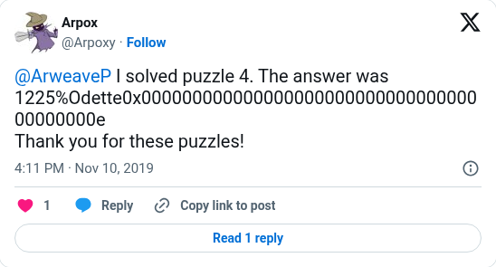

# Weave 4 answer from its solver

[Original post](https://x.com/Arpoxy/status/1193546824289832960). Cited by the [Weave 4 solver record](../../../src/collections/arweave/weave4.ts) as the solver's own claim: a reply to the series account with the answer string, five hours after the claim transaction. The post identifies a handle, not a person.

## Historical provenance

No capture found. The Wayback Machine index was searched on September 25, 2026 for both the `twitter.com` and `x.com` URL, so the transcript below was checked only against the current embed and screenshot.

## Transcript

> @ArweaveP I solved puzzle 4. The answer was 1225%Odette0x00000000000000000000000000000000000000000e
>
> Thank you for these puzzles!

## Screenshot

The displayed 4:11 PM timestamp is local to the capture browser. The frontmatter date is November 10 in UTC. Capture method and limits: [source archive](../README.md).
