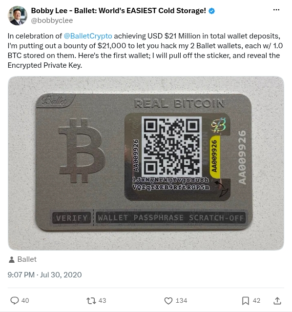

# Ballet wallet bounty announcement

[Original post](https://x.com/bobbyclee/status/1289004702122643456). The collection's three records cite this thread: [AA007448](../../../src/collections/ballet/aa007448.ts), [AA009926](../../../src/collections/ballet/aa009926.ts), [AA012381](../../../src/collections/ballet/aa012381.ts). This capture preserves the opening post, not the later wallet reveals in its replies.

## Historical provenance

[Wayback capture from July 31, 2020, 01:33:27 UTC](https://web.archive.org/web/20200731013327/https://twitter.com/bobbyclee/status/1289004702122643456) preserves the announcement text, about 26 minutes after publication. Its archived text matches the transcript below.

## Transcript

> In celebration of @BalletCrypto achieving USD $21 Million in total wallet deposits, I'm putting out a bounty of $21,000 to let you hack my 2 Ballet wallets, each w/ 1.0 BTC stored on them. Here's the first wallet; I will pull off the sticker, and reveal the Encrypted Private Key.

## Screenshot

The displayed July 30 timestamp is local to the capture browser. The frontmatter date is July 31 in UTC. Capture method and limits: [source archive](../README.md).
