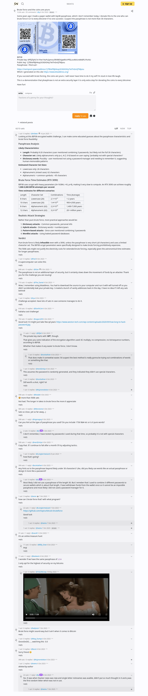

# Brute force and the coins are yours

[Original post](https://stacker.news/items/275973), posted by q on Stacker News at 2023-10-06 11:50:09 UTC. The `sourceUrl` of the [bitaddress record](../../../src/collections/bitaddress.ts), the source of the address, the encrypted key and every hint: the post itself and q's three replies below it. The thread has 35 comments, and every one of them is below.

## Historical provenance

The Wayback Machine holds four captures of the post: September 22, 2024, February 10, 2025, [February 11, 2026](https://web.archive.org/web/20260211205609/https://stacker.news/items/275973) and September 29, 2026. The `id_` body of the February 11, 2026 capture was read on September 29, 2026 with an HTML parser: the post and all 35 comments, each line matching this transcript once whitespace and Markdown markup are normalized. `archive_content: confirmed` on that basis. The 2025 capture predates the latest comment, from June 2025.

The screenshot is a headless Chromium render of the live post on September 29, 2026, 1100 pixels wide and cut above the site footer. The transcript comes from Stacker News' GraphQL API on the same day, one entry per comment with its author, its UTC time, its link and, for a reply, the comment it answers. Comment bodies keep the Markdown the API returns. Six comments read _deleted by author_, and the API keeps nothing else of them.

## Transcript

> Some years ago I made a paper wallet with bip38 passphrase, which I don't remember today. I donate this to the one who can brute force it or to every bitcoiner if no one succeed. I suspect the passphrase is not more than 30 characters.
>
> https://i.imgur.com/3RSb8MH.png
>
> BIP38
> Private key: 6PfQTphCYc1Fee19uPz2pmou5RVBDVgw8VcrPfGLos4ktUnARdiFLYhcNU
> Public key: 1J7BVeP8JK4op2X3GN3Hy7xkTnGnQTMpou
> Passphrase: \<find out\>
>
> https://mempool.space/address/1J7BVeP8JK4op2X3GN3Hy7xkTnGnQTMpou
> Which i generated on this site https://www.bitaddress.org/
>
> If you succeed with brute forcing, the coins are yours. I will never have time to do it my self I'm stuck in love life laugh.
>
> This is a demonstration that phasphrase is not an extra security layer it is only extra step for donating the coins to every bitcoiner.
>
> Have fun!

## Comments

All 35 comments, in the order the post displays them.

**m0wer**, 2025-06-14 08:06:12 UTC, [1006074](https://stacker.news/items/1006074):

> Looking at this BIP38 encrypted wallet challenge, I can make some educated guesses about the passphrase characteristics and brute force feasibility:
>
> ## Passphrase Analysis
>
> **Likely Characteristics:**
>
> - **Length**: Probably 8-20 characters (user mentioned combining 3 passwords, but likely not the full 30 characters)
> - **Character set**: Likely alphanumeric only (a-z, A-Z, 0-9) based on user saying "probably not with special characters"
> - **Dictionary words**: Possibly - user mentioned not using a password manager and needing to remember it, suggesting human-memorable patterns
>
> **Estimated Character Set Sizes:**
>
> - Lowercase only: 26 characters
> - Alphanumeric (mixed case): 62 characters
> - Alphanumeric + common symbols: ~95 characters
>
> ## Brute Force Time Estimates (RTX 3090)
>
> BIP38 uses scrypt with heavy parameters (N=16384, r=8, p=8), making it very slow to compute. An RTX 3090 can achieve roughly **1,000-5,000 BIP38 attempts per second**.
>
> **Time estimates for different scenarios:**
>
> | Length   | Character Set     | Combinations | Time (Average)    |
> | -------- | ----------------- | ------------ | ----------------- |
> | 8 chars  | Lowercase (26)    | 2.1×10¹¹     | 1-2 years         |
> | 10 chars | Lowercase (26)    | 1.4×10¹⁴     | 900-4,500 years   |
> | 8 chars  | Alphanumeric (62) | 2.2×10¹⁴     | 1,400-7,000 years |
> | 12 chars | Alphanumeric (62) | 3.2×10²¹     | 20+ million years |
>
> ## Realistic Attack Strategies
>
> Rather than pure brute force, more practical approaches would be:
>
> 1. **Dictionary attacks** - Common passwords, personal info
> 2. **Hybrid attacks** - Dictionary words + numbers/years
> 3. **Pattern-based attacks** - Since user mentioned combining 3 passwords
> 4. **Wordlist attacks** - Using leaked password databases
>
> ## Verdict
>
> Pure brute force is likely **infeasible** even with a 3090, unless the passphrase is very short (≤8 characters) and uses a limited character set. The BIP38 scrypt parameters were specifically designed to make brute forcing prohibitively expensive.
>
> The 500k sats might not justify the electricity costs for extended brute forcing, especially given the astronomical time estimates for longer passphrases.

**fred**, 2023-10-08 06:12:49 UTC, [277570](https://stacker.news/items/277570):

> A supercomputer can solve this

**Gian**, 2023-10-06 14:27:14 UTC, [276076](https://stacker.news/items/276076):

> The passphrase is not an additional layer of security, but it certainly slows down the movement of funds by an attacker. Thank you for the challenge you are issuing!

**The_Daniel**, 2023-10-06 14:55:29 UTC, [276108](https://stacker.news/items/276108):

> Wow, I remember using bitaddress. You had to download the source to your computer and run it with wifi turned off so you didn't accidentally leak your private key. I created a bunch of vanity addresses back in the day. I have no idea if I left any sats behind!

**ryu**, 2023-10-08 04:27:48 UTC, [277546](https://stacker.news/items/277546):

> Challenge accepted. Have lots of sats in case someone manages to do it.

**DarthCoin**, 2023-10-06 11:54:25 UTC, [275977](https://stacker.news/items/275977):

> hahaha cool challenge!

**sagars209**, 2023-10-06 12:52:09 UTC, [276012](https://stacker.news/items/276012):

> Good luck !! it might just take few qd years https://www.weston-tech.com/wp-content/uploads/2020/09/how-long-to-hack-password.jpg

**0fje0**, 2023-10-06 13:21:29 UTC, [276026](https://stacker.news/items/276026), reply to sagars209 ([276012](https://stacker.news/items/276012)):

> The private key starts with '**6Pf**', though.
>
> That gives you _some_ indication of the encryption algorithm used: EC multiply, no compression, no lot/sequence numbers, according to BIP38.
>
> Whether that makes it any easier to brute force, I don't know.

**scottathan**, 2023-10-06 15:53:24 UTC, [276174](https://stacker.news/items/276174), reply to 0fje0 ([276026](https://stacker.news/items/276026)):

> That does make it somewhat easier. I'd suspect the best method is really gonna be trying out combinations of words or something like that.

**nerd2ninja**, 2023-10-06 15:20:55 UTC, [276129](https://stacker.news/items/276129), reply to sagars209 ([276012](https://stacker.news/items/276012)):

> This assumes the password is randomly generated, and they indicated they didn't use special characters.

**scottathan**, 2023-10-06 13:03:43 UTC, [276020](https://stacker.news/items/276020), reply to sagars209 ([276012](https://stacker.news/items/276012)):

> Still worth a shot, right? lol

**Ksjznxnxkxksn**, 2023-10-06 12:56:45 UTC, [276016](https://stacker.news/items/276016), reply to sagars209 ([276012](https://stacker.news/items/276012)):

> _deleted by author_

**bisdak**, 2023-10-06 13:52:08 UTC, [276045](https://stacker.news/items/276045):

> 🤩 more than 500k sats
>
> Not bad. The longer in takes to brute force the more it appreciate

**Monotone**, 2023-10-06 12:33:49 UTC, [275991](https://stacker.news/items/275991):

> Sats so close, yet so far away...)

**Hypnagog**, 2023-10-06 13:09:54 UTC, [276023](https://stacker.news/items/276023):

> Can you hint at the type of passphrase you used? Do you include 1736 $&# etc or is it pure words?

**q**, 2023-10-06 15:06:20 UTC, [276117](https://stacker.news/items/276117), reply to Hypnagog ([276023](https://stacker.news/items/276023)):

> I don't remember, I have tested my passwords I used during that time, so probably it is not with special characters

**nerd2ninja**, 2023-10-06 12:39:34 UTC, [275998](https://stacker.news/items/275998):

> Copy that. If I continue to fail after a month I'll try adjusting tactics.

**Longtermwizard**, 2024-01-25 19:45:32 UTC, [401082](https://stacker.news/items/401082), reply to nerd2ninja ([275998](https://stacker.news/items/275998)):

> how that's going?

**scottathan**, 2023-10-06 13:03:17 UTC, [276019](https://stacker.news/items/276019):

> Any hints as to the passphrase beyond likely under 30 characters? Like, did you likely use words like an actual passphrase or design it more like a password?

**q**, 2023-10-06 17:42:55 UTC, [276305](https://stacker.news/items/276305), reply to scottathan ([276019](https://stacker.news/items/276019)):

> Most likely I did not use a passphrase of the length 30. But I remeber that I used to combine 3 different passwords to secure wallets which is about that length. I have withdrawn funds from the wallet once so it cannot be an imposible passpharse and most likely I did not used a password manager for it.

**anon**, 2023-10-07 12:17:33 UTC, [276815](https://stacker.news/items/276815):

> how can I brute force that? with what program?

**Longtermwizard**, 2023-10-07 12:28:07 UTC, [276825](https://stacker.news/items/276825), reply to anon ([276815](https://stacker.news/items/276815)):

> https://github.com/topics/bitcoin-bruteforce
>
> Good luck

**nemo**, 2023-10-07 12:32:41 UTC, [276831](https://stacker.news/items/276831), reply to Longtermwizard ([276825](https://stacker.news/items/276825)):

> _deleted by author_

**nemo**, 2023-10-07 12:19:39 UTC, [276819](https://stacker.news/items/276819), reply to anon ([276815](https://stacker.news/items/276815)):

> _deleted by author_

**sarah1**, 2023-10-06 19:58:57 UTC, [276396](https://stacker.news/items/276396):

> It's an online treasure hunt

**Billy_Dow**, 2023-10-06 20:01:18 UTC, [276400](https://stacker.news/items/276400), reply to sarah1 ([276396](https://stacker.news/items/276396)):

> Arg!

**kevkevin**, 2023-10-06 16:51:59 UTC, [276233](https://stacker.news/items/276233):

> I wonder if we have the same passphrase of `1234`
>
> I only opt for the highest of security on my bitcoins

**1GLENCoop**, 2024-05-18 19:24:31 UTC, [543757](https://stacker.news/items/543757), reply to kevkevin ([276233](https://stacker.news/items/276233)):

> https://v.nostr.build/XVA9Z.mp4

**ladyluck**, 2023-10-07 02:53:02 UTC, [276530](https://stacker.news/items/276530):

> Brute force might sound easy but it ain't when it comes to Bitcoin

**Mag_Dumps**, 2023-10-06 21:13:31 UTC, [276428](https://stacker.news/items/276428):

> OoooOoOO.......watching this 0.0

**bzzzt**, 2023-10-06 15:13:43 UTC, [276123](https://stacker.news/items/276123):

> Sorry friend 😔

**Ksjznxnxkxksn**, 2023-10-06 12:37:38 UTC, [275997](https://stacker.news/items/275997):

> _deleted by author_

**nemo**, 2023-10-06 16:57:12 UTC, [276237](https://stacker.news/items/276237):

> _deleted by author_

**q**, 2023-10-06 20:35:46 UTC, [276411](https://stacker.news/items/276411), reply to nemo ([276237](https://stacker.news/items/276237)):

> No, It was when Stacker news was new and single letter nicknames was avaible, didn't put so much thought in it and q was the first random letter which was not in use.

**nemo**, 2023-10-07 12:18:54 UTC, [276817](https://stacker.news/items/276817), reply to q ([276411](https://stacker.news/items/276411)):

> _deleted by author_
