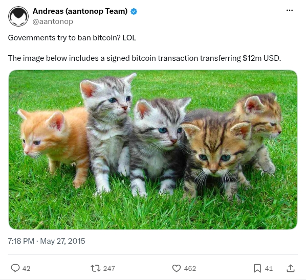

# Kitten image source

[Original post](https://x.com/aantonop/status/603701870482300928). This is the image source cited by [kitten](../../../src/collections/bitimage/kitten.ts) and [kitten-passphrase](../../../src/collections/bitimage/kitten-passphrase.ts), not an announcement of their later bounties. The transaction claim below is the author's statement, not a verification by this archive.

## Historical provenance

[Wayback capture from September 28, 2017, 12:09:11 UTC](https://web.archive.org/web/20170928120911/https://twitter.com/aantonop/status/603701870482300928) preserves the post's text and its attachment link. The wording matches the transcript below. This check did not verify the historical image bytes.

## Transcript

> Governments try to ban bitcoin? LOL
>
> The image below includes a signed bitcoin transaction transferring $12m USD.

## Screenshot

The screenshot is not a substitute for the [puzzle's image file](../../bitimage/kitten/puzzle.jpg). Capture method and limits: [source archive](../README.md).
