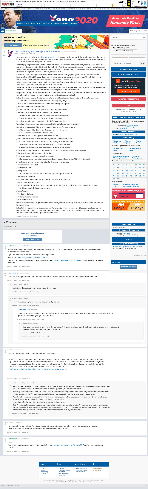

# 7 Million Book Quiz Challenge to This Subreddit

[Original thread](https://www.reddit.com/r/YangForPresidentHQ/comments/b9zg9p/7_million_book_quiz_challenge_to_this_subreddit/). The `sourceUrl` of the [book_quiz record](../../../src/collections/book_quiz.ts) and the source of all six of its hints, the answer key, and the address itself: a commenter linked the block explorer page for `1PLa3c2xjtoP6YE1FvaLhsf4akSxvdv3Ta` on the same thread.

## Historical provenance

The Wayback Machine holds one capture of this thread, taken on June 11, 2023, of both the `www.reddit.com` and the `old.reddit.com` URL. The modern Reddit capture renders the app shell and no post text, so provenance rests on the [old.reddit.com capture](https://web.archive.org/web/20230611183532/https://old.reddit.com/r/YangForPresidentHQ/comments/b9zg9p/7_million_book_quiz_challenge_to_this_subreddit/), whose HTML carries the full post, all three updates, and the ten comments. Its body was read on September 22, 2026 and matches the transcript below word for word, including the answer key and the explorer link. `archive_content: confirmed` on that basis.

Six comments show `[deleted]` as their author in the 2023 capture, including the one that posted the solution. Reddit removes the account name, not the body, so the text survives and the attribution does not. The record names none of them.

## Transcript

> I have some interest in Bitcoin and [did a quiz yesterday](https://www.reddit.com/r/Bitcoin/comments/b9peum/satoshi_birthday_7_million_quiz/), giving away 7 million satoshis in the Bitcoin subreddit at the occasion of Bitcoin's founder's birthday. It took quite a while for someone to claim those funds (about $350). But the experiment worked. I had fun and learned something about this format.
>
> I may be trying it again here now. This time with a quiz about a certain book I bought and read yesterday. Which book? You know already, if you are reading this. Here is the deal. I give 7 multiple choice questions, some of which are factual questions about the book and some of which will require voicing an opinion. The latter category will have no objective correct answer; the correct answer will just be whatever I personally feel is the best.
>
> To claim the funds, paste together all correct answers (omitting the leading a) b) etc) with exactly one space between characters. Take a SHA 256 hash of that, then feed it as entropy in a brain wallet generating tool. This will show you the address I sent 7 million satoshis to as well as the private key needed to sweep it.
>
> I will not explain more about the format and how to sweep the funds after you found the correct answer beyond what I said above in this original post. Navigating this is part of the challenge.
>
> If someone finds the private key and sweeps the address in less than 60 minutes after I post the questions, we have a winner. Else I take back the funds. Either way I explain what I designated as the correct answers.
>
> I will post the 7 multiple choice questions later in an update to this post. However, if I feel that this subreddit is not interested in the challenge, I may cancel this experiment. Anyone want to try to secure this bag?
>
> Update: Challenge accepted. The transaction to the prize address has now 2 confirmations. Here are the questions:
>
> 1. The author discusses AI without mentioning the singularity. Why?
>
> a) He is unable to predict what happens after the superintelligence explosion.
>
> b) He never heard about the singularity.
>
> c) Robots don't vote, so he doesn't need to care about their point of view.
>
> d) He thinks that AI will never vastly exceed human intelligence.
>
> 2. Humanity first means many things, but the most important aspect is
>
> a) American humans' interests come first, before American robots.
>
> b) American normal humans' interest come first, before American elites.
>
> c) American policy success needs to be measured by humanity factors first, not only GDP.
>
> d) American policy needs to think of all of humanity first, not only American citizens.
>
> 3. The discussion of the Green New Deal in the book concludes that
>
> a) This will be an essential part of creating new jobs.
>
> b) What discussion? The book ignores the Green New Deal.
>
> c) The Green New Deal is a socialist conspiracy to come after our hamburgers.
>
> d) The Green New Deal is way too ambitious. It will never gain bipartisan support.
>
> 4. Universal Basic Income almost became law in 1971. It failed because
>
> a) The Republican leader of the Senate refused to call a vote on the legislation.
>
> b) The Republican minority in the Senate blocked a vote on the legislation with the filibuster power.
>
> c) The Republican president vetoed the legislation.
>
> d) The Democrats in the Senate blocked the legislation.
>
> 5. For people paying income tax, the Universal Basic Income will be a tax cut. This will be financed by
>
> a) Introducing a value added tax, shifting taxation from income to spending.
>
> b) Increasing the federal deficit.
>
> c) Printing more dollars.
>
> d) Taxing robots.
>
> 6. If the winner wants to pass on the funds to help the campaign, he should
>
> a) Donate to the campaign.
>
> b) Burn the funds to the AndrewYangForPresident2o2o Bitcoin burn address.
>
> c) Use the funds for local activism.
>
> d) Buy the book in bulk and distribute to friends, to help with the bestseller ranking and with spreading the message.
>
> 7. A different good title for the book would be
>
> a) We're Fucked.
>
> b) The Coming Collapse.
>
> c) Challenge Fucking Accepted.
>
> d) Normal Strikes Back.
>
> Update 2: For some reason all question numbers are displayed as "1". I won't try to fix that now, since it does not influence claiming the prize.
>
> Update 3: I have claimed the funds back just now. Failed to get a winner this time, sorry. Of course it is still possible that someone sweeped the address at the same time as me and gets confirmed earlier. Will update later on correct answers and what I learned from this second experiment with the format.

The numbers 1 through 7 are the reading order of the options, not the markup: Reddit rendered every question as "1", which is what Update 2 is about.

## Comments

All ten comments in the capture, in the order they are displayed, sorted by best.

**AutoModerator**, stickied:

> Please remember we are here as a representation of Andrew Yang. Do your part by being kind, respectful, and considerate of the humanity of your fellow users. If you see comments in violation of our rules, please report them.

**u/AoiNakamoto**, 3 points:

> Looks like challenge accepted to me. I just sent the funds, will post the questions as soon as I see the transaction confirmed.

**[deleted]**, 2 points, reply:

> ah just read that you confirmed this, working on it now haha

**[deleted]**, 2 points, reply:

> Pretty stumped so far, honestly a few of these are pretty subjective.

**u/AoiNakamoto**, 1 point, reply:

> Sorry for that and thanks for your interest. Still just experimenting with the format. May have been not a good idea to include subjective questions. Sorry for not getting a winner this time.

**[deleted]**, 1 point, reply:

> Here were my answers anyway, i know 3-6 are correct, 7 I'm pretty sure I got right, idk really about 1. C or A would be my best guess. 2 also wasn't super clear cut to me either could go C/D.
>
> 1. c 2) c 3) b 4) d 5) a 6) d 7) c

**[deleted]**, 3 points, the solution:

> Well shit I finally found it. Wasn't using the coleman converter right.
>
> He is unable to predict what happens after the superintelligence explosion. American policy needs to think of all of humanity first, not only American citizens. What discussion? The book ignores the Green New Deal. The Democrats in the Senate blocked the legislation. Introducing a value added tax, shifting taxation from income to spending. Buy the book in bulk and distribute to friends, to help with the bestseller ranking and with spreading the message. Challenge Fucking Accepted.
>
> https://www.blockchain.com/btc/address/1PLa3c2xjtoP6YE1FvaLhsf4akSxvdv3Ta

**u/AoiNakamoto**, 1 point, reply, the post-mortem:

> Yes, those are the answers I chose. Questions 1 and 2 were without objective answer. Questions 3 to 5 were easy for anyone who read the book. Question 6 was without objective answer. As was question 7, but that one was easier.
>
> This is my second experiment with this format. I failed to make it easy enough for one hour, though maybe it would have been different with more people trying. The main problem was to have too many subjective questions, which require luck to solve.
>
> As with the first experiment, eventually the solution was found, so again I did not mess up somewhere making it impossible to solve. And while these questions were far from perfect, it was fun writing them.
>
> Again, thanks for playing and sorry you could not secure the bag in time.`
>
> Edit: For question 6 the correct answer stood out as talking about the book, and for question 7 the correct answer stood out because the title of this post included the word "challenge", so there were only 2 pure luck questions. Still leaves many possible combinations for a brute force strategy. And with question 1 at least b) and d) should be relatively easy to rule out.

**[deleted]**, 1 point:

> I'm interested, this is a cool idea. I'm building a grassroots app on ethereum, I see a lot of value in incorporating new tech like blockchain into the discussion as it is a powerful tool for incentivizing collective action.

**AutoModerator**, 1 point:

> First!

## Screenshot

The screenshot is a render of the archive capture, not of the live page, so it carries the Wayback banner at the top. The "4 years ago" stamps are relative to the capture, June 11, 2023. Capture method and limits: [source archive](../README.md).
