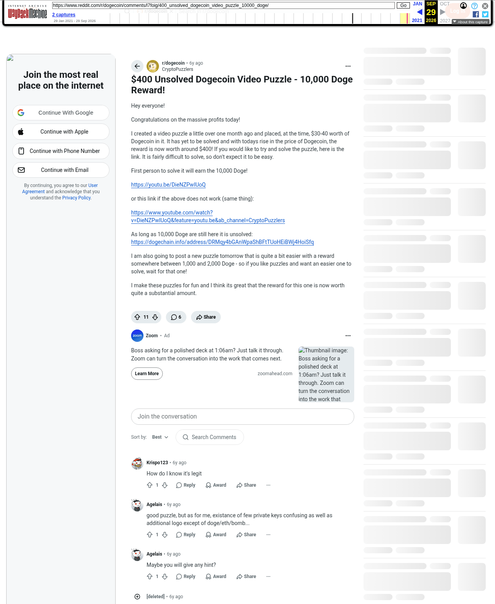

# $400 Unsolved Dogecoin Video Puzzle - 10,000 Doge Reward!

[Original thread](https://www.reddit.com/r/dogecoin/comments/l7foig/400_unsolved_dogecoin_video_puzzle_10000_doge/). The author's second post of Doge's Gambit on r/dogecoin, seven weeks after the first, and the source of the second fact on the [Crypto Puzzlers author record](../../../src/collections/cryptopuzzlers.ts). It prints the Dogecoin address and the rule that the puzzle stays unsolved while the 10,000 DOGE sit there. The post went up on January 29, 2021, at 01:48:07 UTC. Its only edit, at 01:55:19 UTC, added the second video link, the address line and the closing sentence. The author mentions the link in the thread.

## Historical provenance

The Wayback Machine holds an `old.reddit.com` capture from January 29, 2021, 01:49:50 UTC, taken before the edit: it has the post without the second link, the address and the closing sentence, and no comments yet. archive.today has none. The only capture of the post as edited is of the `www.reddit.com` URL, stamped [September 29, 2026, 19:28:44 UTC](https://web.archive.org/web/20260929192844/https://www.reddit.com/r/dogecoin/comments/l7foig/400_unsolved_dogecoin_video_puzzle_10000_doge/). Its HTML carries the edited post word for word and six of the eight comments. Arctic Shift and pullpush both list eight, with the same authors, times, scores, parents and text, the post differing only in how the two archives escape an ampersand.

The capture does not render NcalTsunami's comment or YandrV's reply to the author, and it shows YandrV's first comment as `[deleted]` without its text, since the account is gone. Those three bodies come from Arctic Shift, matched against pullpush. Everything else in the transcript was read on September 29, 2026 against the capture, paragraph by paragraph, both ways, once whitespace is normalized. `archive_content: confirmed` on that basis, for the post and the five comments the capture shows.

The record names none of the commenters. The answer one of them gives is a guess nobody took up.

## Transcript

> Hey everyone!
>
> Congratulations on the massive profits today!
>
> I created a video puzzle a little over one month ago and placed, at the time, $30-40 worth of Dogecoin in it. It has yet to be solved and with todays rise in the price of Dogecoin, the reward is now worth around $400! If you would like to try and solve the puzzle, here is the link. It is fairly difficult to solve, so don't expect it to be easy.
>
> First person to solve it will earn the 10,000 Doge!
>
> https://youtu.be/DieNZPwIUoQ
>
> or this link if the above does not work (same thing):
>
> https://www.youtube.com/watch?v=DieNZPwIUoQ&feature=youtu.be&ab_channel=CryptoPuzzlers
>
> As long as 10,000 Doge are still here it is unsolved: https://dogechain.info/address/DRMqy4bGAnWpaShBFtTUoHEiBWj4HoiSfq
>
> I am also going to post a new puzzle tomorrow that is quite a bit easier with a reward somewhere between 1,000 and 2,000 Doge - so if you like puzzles and want an easier one to solve, wait for that one!
>
> I make these puzzles for fun and I think its great that the reward for this one is now worth quite a substantial amount.

## Comments

In the capture's order, "sorted by best", with the two comments it leaves out placed by time.

**u/Krispo123**, 1 point, top level, January 29, 2021, 01:51:50 UTC:

> How do I know it's legit

**u/NcalTsunami**, 1 point, top level, January 29, 2021, 01:51:55 UTC:

> The answer is Abraham Lincoln.

**u/Agelais**, 1 point, top level, February 8, 2021, 06:15:50 UTC:

> good puzzle, but as for me, existance of few private keys confusing as well as additional logo except of doge/eth/bomb...

**u/Agelais**, 1 point, top level, April 17, 2021, 11:05:29 UTC:

> Maybe you will give any hint?

**u/YandrV**, 1 point, top level, January 29, 2021, 01:54:00 UTC:

> The link did not work for me, but I like your style!

**u/CryptoPuzzlers**, 1 point, reply to YandrV, January 29, 2021, 01:55:48 UTC:

> I added a different link that should work

**u/Agelais**, 1 point, reply to CryptoPuzzlers, March 5, 2021, 12:07:18 UTC:

> Any hints for us?

**u/YandrV**, 1 point, reply to CryptoPuzzlers, January 29, 2021, 08:54:31 UTC:

> Forgive my lack of knowledge, so this is a chess puzzle? I don't really know what I'm looking at, but I'm interested in learning how to solve something like this, your youtube page is cool, but way over my head... for now atleast, also, I think maybe the first link worked, I think it was a VPN issue on my end

## Screenshot

