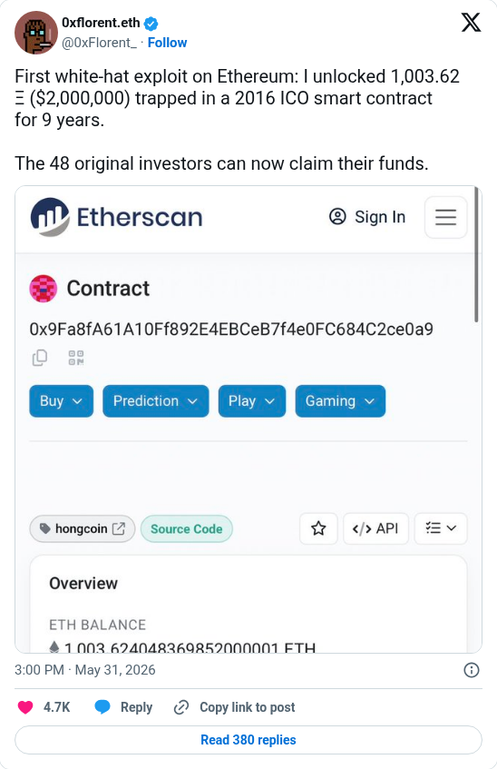

# HongCoin recovery announcement

[Original post](https://x.com/0xFlorent_/status/2061070356564091258). Cited by the [dug/2025-1 solver record](../../../src/collections/dug/2025-1.ts) for what the solver says they do besides puzzles. The post is their own claim; the record does not check the recovered amount.

## Historical provenance

No capture found. The Wayback Machine index was searched on September 25, 2026 for both the `twitter.com` and `x.com` URL, so the transcript below was checked only against the current embed and screenshot.

## Transcript

> First white-hat exploit on Ethereum: I unlocked 1,003.62 Ξ ($2,000,000) trapped in a 2016 ICO smart contract for 9 years.
>
> The 48 original investors can now claim their funds.

## Screenshot

The displayed 3:00 PM timestamp is local to the capture browser. The frontmatter date is May 31 in UTC. The attached image is kept only as rendered in the embed. Capture method and limits: [source archive](../README.md).
