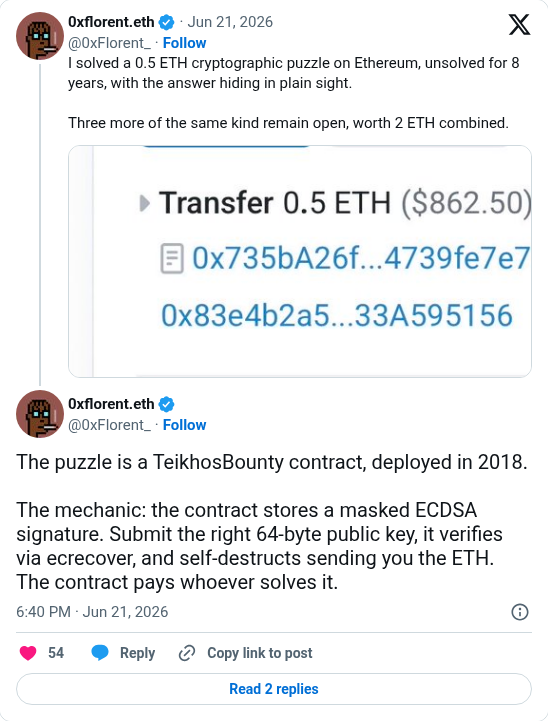

# TeikhosBounty solve

[Original post](https://x.com/0xFlorent_/status/2068735759889145906). Cited by the [dug/2025-1 solver record](../../../src/collections/dug/2025-1.ts) for the solver's Ethereum puzzle. The post replies to the account's own announcement, and the embed prints that parent above it, so the screenshot keeps both. Only the cited reply is transcribed as the source; the parent is quoted for context.

## Historical provenance

No capture found. The Wayback Machine index was searched on September 25, 2026 for both the `twitter.com` and `x.com` URL, so the transcript below was checked only against the current embed and screenshot.

## Transcript

> The puzzle is a TeikhosBounty contract, deployed in 2018.
>
> The mechanic: the contract stores a masked ECDSA signature. Submit the right 64-byte public key, it verifies via ecrecover, and self-destructs sending you the ETH. The contract pays whoever solves it.

The parent the embed prints above it:

> I solved a 0.5 ETH cryptographic puzzle on Ethereum, unsolved for 8 years, with the answer hiding in plain sight.
>
> Three more of the same kind remain open, worth 2 ETH combined.

## Screenshot

The displayed 6:40 PM timestamp is local to the capture browser. The frontmatter date is June 21 in UTC. The parent's attached image shows a 0.5 ETH transfer as rendered in the embed, not the original file. Capture method and limits: [source archive](../README.md).
