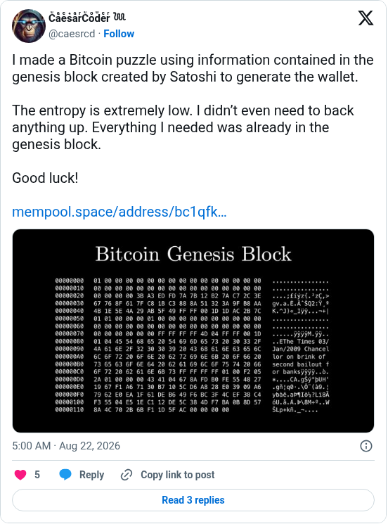

# Genesis puzzle pre-announcement

[Original post](https://x.com/caesrcd/status/2090997418800095526). Cited by the [genesis author record](../../../src/collections/genesis.ts) as the X account that published the announcement text, the target address and a hexdump of the Genesis block sixteen hours before the on-chain announcement. The post identifies a channel, not a person.

## Historical provenance

[Wayback capture from August 22, 2026, 03:00:08 UTC](https://web.archive.org/web/20260822030008/https://twitter.com/caesrcd/status/2090997418800095526) is X's JSON payload for the post, not a rendered page. Its `text` field carries the same wording as the transcript below. The search on September 22, 2026 found nothing; the capture was in the index on September 27.

## Transcript

> I made a Bitcoin puzzle using information contained in the genesis block created by Satoshi to generate the wallet.
>
> The entropy is extremely low. I didn't even need to back anything up. Everything I needed was already in the genesis block.
>
> Good luck!
>
> mempool.space/address/bc1qfk…

## Screenshot

The displayed 5:00 AM timestamp is local to the capture browser. The frontmatter date is August 22 in UTC. The attached image is a hexdump titled Bitcoin Genesis Block; the screenshot keeps its rendering, not the original file. Capture method and limits: [source archive](../README.md).
