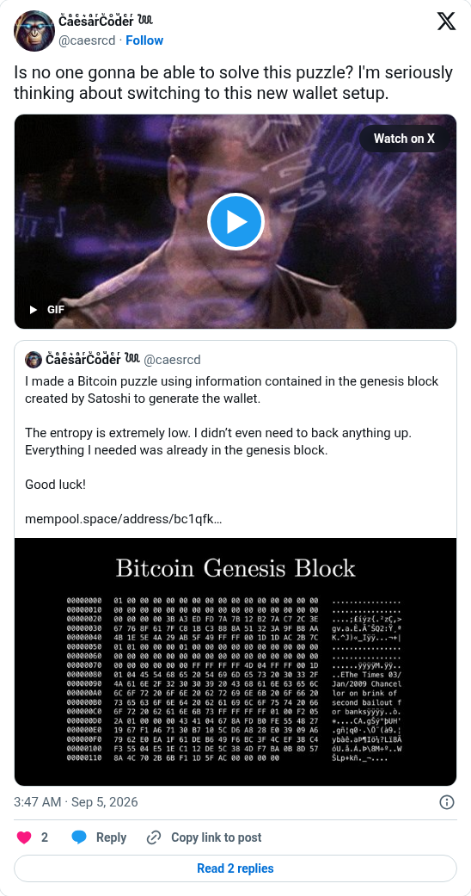

# Genesis puzzle: nobody solving it yet

[Original post](https://x.com/caesrcd/status/2096052655449657713). Cited by the [genesis author record](../../../src/collections/genesis.ts). The post quotes the account's own [announcement](caesrcd-2026-08-22.md), and the embed prints that quote below it, so the screenshot keeps both. Only the cited post is transcribed.

## Historical provenance

[Wayback capture from September 5, 2026, 01:47:50 UTC](https://web.archive.org/web/20260905014750/https://twitter.com/caesrcd/status/2096052655449657713) is X's JSON payload for the post, not a rendered page. Its `text` field carries the same wording as the transcript below.

## Transcript

> Is no one gonna be able to solve this puzzle? I'm seriously thinking about switching to this new wallet setup.

## Screenshot

The displayed 3:47 AM timestamp is local to the capture browser. The frontmatter date is September 5 in UTC. The attachment is a GIF, and the screenshot shows only its first frame. Capture method and limits: [source archive](../README.md).
