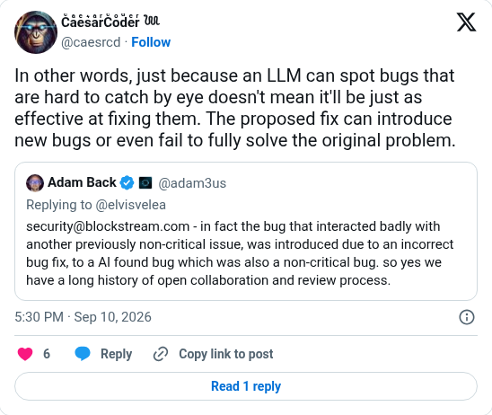

# LLMs find bugs, fixes are another matter

[Original post](https://x.com/caesrcd/status/2098071674205712636). Cited by the [genesis author record](../../../src/collections/genesis.ts). The post quotes a reply by Adam Back (`@adam3us`), and the embed prints it below, so the screenshot keeps both. Only the cited post is transcribed as the source; the quote is kept for context.

## Historical provenance

[Wayback capture from September 10, 2026, 15:30:42 UTC](https://web.archive.org/web/20260910153042/https://twitter.com/caesrcd/status/2098071674205712636) is X's JSON payload for the post, not a rendered page. Its `text` field carries the same wording as the transcript below.

## Transcript

> In other words, just because an LLM can spot bugs that are hard to catch by eye doesn't mean it'll be just as effective at fixing them. The proposed fix can introduce new bugs or even fail to fully solve the original problem.

The quoted reply the embed prints below it:

> security@blockstream.com - in fact the bug that interacted badly with another previously non-critical issue, was introduced due to an incorrect bug fix, to a AI found bug which was also a non-critical bug. so yes we have a long history of open collaboration and review process.

## Screenshot

The displayed 5:30 PM timestamp is local to the capture browser. The frontmatter date is September 10 in UTC. Capture method and limits: [source archive](../README.md).
