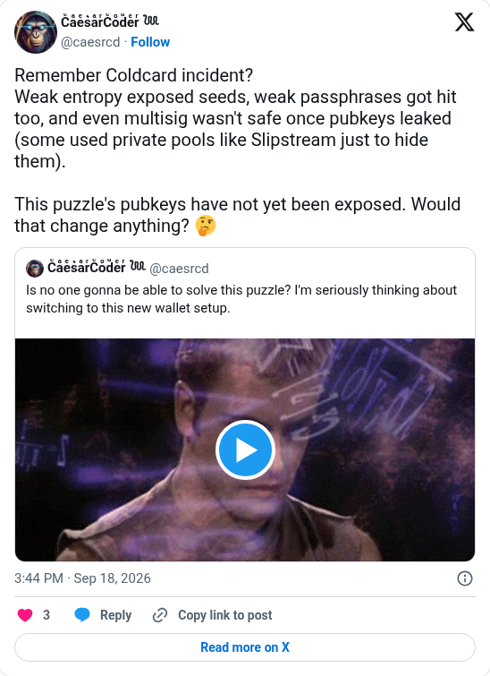

# Genesis puzzle pubkeys not yet exposed

[Original post](https://x.com/caesrcd/status/2100944026774151611). Cited by the [genesis author record](../../../src/collections/genesis.ts). The post quotes the account's own [September 5 post](caesrcd-2026-09-05.md), and the embed prints that quote below it. Only the cited post is transcribed.

## Historical provenance

[Wayback capture from September 18, 2026, 13:44:24 UTC](https://web.archive.org/web/20260918134424/https://twitter.com/caesrcd/status/2100944026774151611) is X's JSON payload for the post, not a rendered page. Its `text` field carries the same wording as the transcript below.

## Transcript

> Remember Coldcard incident?
> Weak entropy exposed seeds, weak passphrases got hit too, and even multisig wasn't safe once pubkeys leaked (some used private pools like Slipstream just to hide them).
>
> This puzzle's pubkeys have not yet been exposed. Would that change anything? 🤔

## Screenshot

The displayed 3:44 PM timestamp is local to the capture browser. The frontmatter date is September 18 in UTC. Capture method and limits: [source archive](../README.md).
