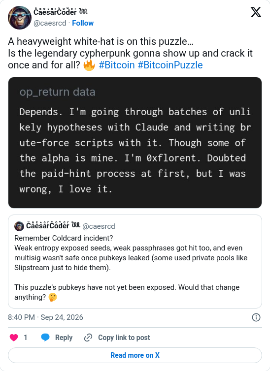

# A white-hat on the Genesis puzzle

[Original post](https://x.com/caesrcd/status/2103192783779750018). Cited by the [genesis author record](../../../src/collections/genesis.ts). The post quotes the account's own [September 18 post](caesrcd-2026-09-18.md), and the embed prints that quote below it. Only the cited post is transcribed.

## Historical provenance

[Wayback capture from September 24, 2026, 18:40:09 UTC](https://web.archive.org/web/20260924184009/https://twitter.com/caesrcd/status/2103192783779750018) is X's JSON payload for the post, not a rendered page. Its `text` field carries the same wording as the transcript below.

## Transcript

> A heavyweight white-hat is on this puzzle…
> Is the legendary cypherpunk gonna show up and crack it once and for all? 🔥 #Bitcoin #BitcoinPuzzle

## Screenshot

The displayed 8:40 PM timestamp is local to the capture browser. The frontmatter date is September 24 in UTC. The attached image shows an `op_return data` field with no txid or address. Its text matches the OP_RETURN of [acda5891…](https://mempool.space/tx/acda5891499731f5cf33afbf8a50a1a76a5e459c681ecc0253f606f68288ff66), confirmed in block 968435 at 18:30:04 UTC, ten minutes before the post. Capture method and limits: [source archive](../README.md).
