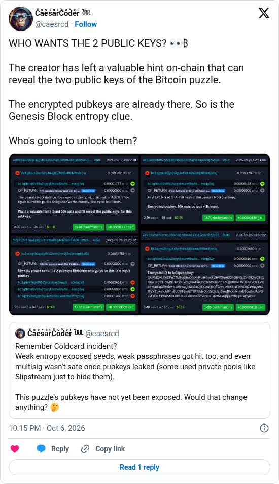

# Who wants the Genesis pubkeys?

[Original post](https://x.com/caesrcd/status/2107565388527456292). Cited by the [genesis author record](../../../src/collections/genesis.ts). The post quotes the account's own [September 18 post](caesrcd-2026-09-18.md), and the embed prints that quote below it. Only the cited post is transcribed.

## Historical provenance

No capture found. The Wayback Machine index was searched on October 6, 2026 for both the `twitter.com` and `x.com` URL, a few minutes after the post went up, so the transcript below was checked only against X's syndication JSON, the current embed and the screenshot.

## Transcript

> WHO WANTS THE 2 PUBLIC KEYS? 👀₿
>
> The creator has left a valuable hint on-chain that can reveal the two public keys of the Bitcoin puzzle.
>
> The encrypted pubkeys are already there. So is the Genesis Block entropy clue.
>
> Who's going to unlock them?

## Screenshot

The displayed 10:15 PM timestamp is local to the capture browser. The frontmatter date is October 6 in UTC, 20:15:19. The attached image stacks four transactions to the puzzle address, each with its `OP_RETURN` opened: [ed010443…](https://mempool.space/tx/ed010443963e3601b35266a52108bd1b8dfa58e9e258a041098c05a474513fab), the 50k offer for the public keys; [ae906bde…](https://mempool.space/tx/ae906bdebdf7cd2e9b2490a727d5d91eaa203c2ae68f8461ea62e07ffe3b9b1c), the September 24 terms; [5216126…](https://mempool.space/tx/5216126176a1e4917f32f0a0aedc403cb23591919eb56520d43f0132a0c2aa5c), a player paying them; and [e9a17ac9…](https://mempool.space/tx/e9a17ac9c9ccc8129075b1f2bfe81a3511ede9c227692fda080deef5f10f05db), the author's `BIE1` reply to that player's key. Capture method and limits: [source archive](../README.md).
