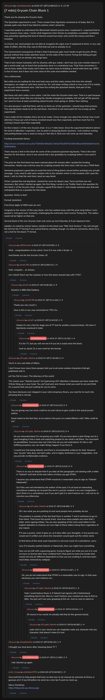

# [7 mbtc] Grycoin Chain Block 1

[Original thread](https://www.reddit.com/r/Grycoin/comments/civj2n/7_mbtc_grycoin_chain_block_1/). The `sourceUrl` of the [grycoin/1](../../../src/collections/grycoin/1.ts) record and the source of its question, format, hash digits and funding transaction, with the solution the author edited in. The solution is also in u/LiaVl's comment. The post went up on July 28, 2019, at 12:58:51 UTC, twelve hours after the block time of its funding transaction and eleven and a half hours after the claim confirmed. Its last edit is stamped 22:37:47 UTC the same day, so the transcript shows the post as it stood after the claim.

## Historical provenance

No capture found. On October 5, 2026 the Wayback Machine index listed one capture of the thread under the `www.reddit.com` URL, June 12, 2023, 06:11:37 UTC. Its `id_` body is Reddit's app shell titled "Reddit - Dive into anything", with neither the post nor a comment in its HTML. The one capture of the `old.reddit.com` URL, a second later, is a 302 redirect to a subreddit search for Grycoin. The archive.today timemaps for the `www.reddit.com`, `old.reddit.com` and bare `reddit.com` URLs answered 404.

The transcript below comes from the [Arctic Shift](https://arctic-shift.photon-reddit.com/) Reddit archive: the post record and the comment tree for `civj2n`, read on October 5, 2026. The [pullpush](https://pullpush.io/) Reddit archive, read the same day, gives the same post text, time and edit stamp, and the same 18 comments with the same authors, times, scores and parents. The last comment, from August 2026, carries the subreddit as `t5_11rekg`, its internal ID, in the render.

The record names none of the commenters: nothing on the chain ties a claim to a name.

## Transcript

> Thank you for playing the Grycoin chain.
>
> The Quizchain experiment is over. There remain three big blocks unsolved as of today. But it is already quite clear that it has failed to achieve what I aimed for.
>
> I expected people to understand the Bitcointalk Satoshi puzzle once I explained it. I expected that to have massive news value. I recall what happened when Dorian (a completely unsuitable candidate) was presented. Igniting that kind of interest would have been well worth the money and time I invested.
>
> As it turns out, most people are not able to recognize the signs even if explained to them. A very sad state of affairs. But the only way to find that out was to actually try it.
>
> The inconvenient consequence of that is that it obviously gets much harder to get Grycoin off the ground without that media attention boost. So the odds of the reverse Turing test failing just got much larger, from an already very large base.
>
> That in turn means humanity will fry (rhymes with gry, haha). I don't see any even remote chance to get a world wide cap on fossil fuel production done in a centralized way. That Paris convention is nice to have, better than Kyoto, but it does not come close to building a world wide hard cap. OPEC is nice to have, but it does not come close to the scale and ambition needed.
>
> Very unfortunate.
>
> But while we are waiting for the next heat wave and the really serious hits from the climate emergency, we might as well have some fun. So I will keep writing a block or two, even if it is mainly for my own entertainment now. I did have fun writing the quizchain blocks, that part of the experiment was a success.
>
> But these will start under a new name. I call the chain the Grycoin chain now.
> That is in part because the real Grycoin chain (the one solving the climate emergency) probably will not get off the ground. So I want to have at least something called Grycoin chain going on. Better than nothing.
>
> It is also because I said that there will be no third run of the quizchain. I should keep that promise. The real big block needs to be the last block. And there is not much point for me to keep up the experiment.
>
> I have made all the mistakes there are to be made. I know enough now about the format, how much attention it buys per unit of money invested (much less than expected), and how much fun it is running it (much more than expected).
>
> So this is block 1 of the new Grycoin chain. It is a 7 mbtc block. Since the experiment failed to deliver the level of attention I expected, I see no point in doing big blocks anymore. I will continue writing and posting blocks once a week as long as I feel like it. Next one will come up next Saturday.
>
> Funding transaction below.
>
> https://www.smartbit.com.au/tx/75af636c49ba8127d02d79a36576e33bf248ceeb5bfd2bb04e2c0c6f4f4d493a
>
> There may be a hint in this block for some of the unsolved quizchain big blocks.
> That is the main function for this block, since it was solved half a day (probably by scripting) before I even post it now.
>
> The prize for this first block has been claimed about 40 minutes after I posted the funding transaction. Maybe was a bit too easy for scripting wizards this time since I did not use a TOMI field.
>
> Someone proposed a good idea to avoid this kind of thing (block solved before posting) over private message. I only need to add some random info to the solution which is not revealed until I post the block. I will try that the next time I post an easy block.
>
> When I posted the real big block, I ducked for cover for about a day. Turns out that was not necessary. But when I started up again, the first thing I wrote in my Twitter feed is the question for this block 1 of the Grycoin chain. Actually a good fit for block 1. And maybe someone saw that and anticipated that as a question for this block.
>
> Question: When is this?
>
> Format: [solution]
>
> First three digits of MD5 hash are 4c4.
>
> Congrats to the winner of this easy block, who has walked away with the prize long before I even posted it. And good luck, humanity, challenging the extremely hard reverse Turing test. The stakes could not be higher on that one.
>
> Second block of the new Grycoin chain will come up next Saturday at 5 pm Japanese time.
>
> Update: As noted by winner below, solution to this block was "Still 21st Century". You will not get the hint for the 77 format if you solved that by scripting, though. As noted in comments, block 21 is not a hint for the block 77 format.

## Comments

**u/JDScreesh**, 2 points:

> Well... congratulations to the solver. Even if it was with a Script. =)
>
> And thanks Aoi for the Grycoin Chain =D

**u/rnd1783**, 1 point:

> Yeah, congrats ... as always.
>
> Am I blind? Don't see the solution or how this block should help with 77#1?

**u/LiaVl**, 2 points, reply to u/rnd1783:

> Solution is **Still 21st Century**

**u/rnd1783**, 1 point, reply to u/LiaVl:

> Thank you very much! :)
>
> How is this in any way connected to 77#1 O.o

**u/LiaVl**, 1 point, reply to u/rnd1783:

> Maybe it's not a hint for stage one of 77 but for another unsolved block. We have 3 big blocks unsolved in total.

**u/AoiNakamoto**, 1 point, reply to u/LiaVl:

> It is for 77, but you will not see it if you let a script solve the block.
>
> And no, block 21 is not a hint for the format.

**u/Crypto_Rachel**, 3 points:

> You're A very sad state of affairs.
>
> I don't know how many times people told you to ad some random characters that get published with it.
>
> yet You Fail to Learn. The idiocracy of the world
>
> The reason your "Satoshi puzzle" isn't garnering ANY attention is because you have made this Whole thing up in your head. You can't just pick and choose what you want to see and think it's a puzzle that was just waiting for you to solve.
>
> You have obviously over stepped in your wild conspiracy theory, you read far to much into phrasing that is normal.

**u/AoiNakamoto**, 0 points, reply to u/Crypto_Rachel:

> You are giving way too much credit to me and refuse to give credit to the actual puzzle author.
>
> Good match to the fact that, as he noted in the post, he created Bitcoin with "little credit to me".

**u/Crypto_Rachel**, 5 points, reply to u/AoiNakamoto:

> No you misunderstand I'm not giving you credit. All you have done is pick things out of a post mangling it into a hash and expecting people to see what's not there. You overreach on possibilities. Everyone else see's this how do you not understand. It's like a self fulfilling prophecy you can make things happen if you force it.
>
> I would love Hal being Satoshi, and there is circumstantial evidence for that. However Your "puzzle" idea does not hold water, and is highly stretched in your imagination. And you provide no Believable evidence.

**u/AoiNakamoto**, 0 points, reply to u/Crypto_Rachel:

> There is no way to dispute that if you take all the paragraphs not starting with a letter in "Satoshi" and look at the last letters of these you get STNM.
>
> I assume you understand that STNM would be a reasonable way to sign as "Satoshi Nakamoto".
>
> So if this was not intended by the author of the post, it is at least an interesting coincidence enabling me to point this out in a puzzle created in my own imagination. I don't think it is a coincidence, but if you don't get it or don't believe me, I will not try to convince you otherwise.

**u/Crypto_Rachel**, 3 points, reply to u/AoiNakamoto:

> Oh I see what you are pointing to and most people here probably do too.
>
> The problem is outside of the fact that there is another T and it continues to go on from there. That loses the puzzle track. Also how many people use more that 1 letter when signing initials. You are also speaking of the most used letters in the english alphabet so chances are very high of those letters being there regardless of any reason.
>
> If it was a puzzle, when it goes on, as it does after your thoughts. A true puzzle you would see it written out where the characters would spell out the whole name.
>
> to find three of the most used characters is not even much of a coincidence. sorry.
>
> now if it actually spelled Satoshi or Nakamoto, then you might have something
>
> Now we are left with a guessing game, trying to figure out what you see in it, and we have no format other than rambled hint's that point to extra line breaks that would not only be different dependent on how you are creating it, and have been most likely removed by wattpad.

**u/AoiNakamoto**, -1 point, reply to u/Crypto_Rachel:

> Ah, you do not understand that STNM is a reasonable way to sign. In that case, obviously you won't believe me...

**u/Crypto_Rachel**, 1 point, reply to u/AoiNakamoto:

> Yeah I could believe those 4, if Satoshi had signed with it beforehand, something tied to him.
> But no I won't believe your cracked out way to find so little.
> You just can't see your grasping at thin air. And no case to stand on

**u/AoiNakamoto**, 1 point, reply to u/Crypto_Rachel:

> Of course in my world, he actually did that (in the genesis block).

**u/Crypto_Rachel**, 1 point, reply to u/AoiNakamoto:

> yeah well in your world you can magically make any character into any character, that doesn't mean it's true

**u/mapl3sn0w**, 1 point:

> I thought you shut down after releasing block 77 ?

**u/AoiNakamoto**, 2 points, reply to u/mapl3sn0w:

> I did. Started up again.

**u/safudev0702**, 1 point:

> Also built this to help people that have no idea how to do manual lol welcome to throw ur guesses at it. If you hit before me send me a nice tip if used my mock up.
>
> Merry Christmas
> https://rbbpuzzle.up.railway.app

## Screenshot

The screenshot is a render of the thread in Arctic Shift's ID lookup, not of Reddit, since no readable capture of the Reddit page exists. Capture method and limits: [source archive](../README.md).
