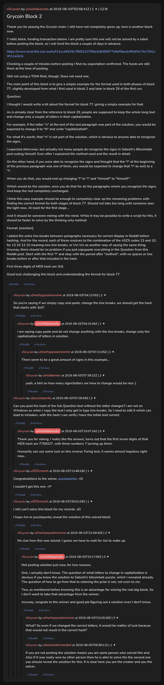

# Grycoin Block 2

[Original thread](https://www.reddit.com/r/Grycoin/comments/cleczc/grycoin_block_2/). The `sourceUrl` of the [grycoin/2](../../../src/collections/grycoin/2.ts) record and the source of its question text, format, hash digits and funding transaction. The author never edited a solution in: the post carries no edit stamp, so the transcript shows it as it was posted. Three of the author's replies add the line break rule, the first digits of the unchanged text's MD5 and why the solution stays unposted. The post went up on August 3, 2019, at 03:58:41 UTC, almost two days after the block time of its funding transaction.

## Historical provenance

No capture found. On October 5, 2026 the Wayback Machine index listed one capture of the thread under the `www.reddit.com` URL, June 12, 2023, 07:07:26 UTC. Its `id_` body is Reddit's app shell titled "Reddit - Dive into anything", with neither the post nor a comment in its HTML. The one capture of the `old.reddit.com` URL, four seconds later, is a 302 redirect to a subreddit search for Grycoin. The archive.today timemaps for the `www.reddit.com`, `old.reddit.com` and bare `reddit.com` URLs answered 404.

The transcript below comes from the [Arctic Shift](https://arctic-shift.photon-reddit.com/) Reddit archive: the post record and the comment tree for `cleczc`, read on October 5, 2026. The [pullpush](https://pullpush.io/) Reddit archive, read the same day, gives the same post text, time and edit stamp, and the same 12 comments with the same authors, times, scores and parents.

The record names none of the commenters: nothing on the chain ties a claim to a name.

## Transcript

> Thank you for playing the Grycoin chain. I still have not completely given up, here is another block now.
>
> 7 mbtc block, funding transaction below. I am pretty sure this one will not be solved by a robot before posting the block, so I will fund the block a couple of days in advance.
>
> https://www.smartbit.com.au/tx/f11eca9925c7809210796a3c8d95677dfaf0becb4f6df4c74e7261c3011a2e3c
>
> Checking a couple of minutes before posting I find my expectation confirmed. The funds are still there at the time of posting.
>
> Still not using a TOMI field, though. Does not need one.
>
> The main point of this block is to give a simple example for the format used in both phases of block 77, slightly developed from what I first used in block 2 and later in block 29 of the first run.
>
> Question:
>
> I thought I would write a bit about the format for block 77, giving a simple example for that.
>
> As is already clear from the reference to block 29, people are supposed to keep the whole long text and change only a couple of letters in their capitalization.
>
> For example, if the letter "n" at the end of the last paragraph was part of the solution, you would be expected to change it to "N" and write "capitalizatioN".
>
> For what it's worth, that "n" is not part of the solution, which is obvious to anyone able to recognize the signs.
>
> I expected otherwise, but actually not many people do recognize the signs in Satoshi's Bitcointalk post outing himself. Even after I explained the method used and the result in detail.
>
> On the other hand, if you were able to recognize the signs and thought that the "I" at the beginning of the previous paragraph was one of them, you would be expected to change that "I" as well to a "i".
>
> When you do that, you would end up changing "I" to "i" and "himself" to "himselF".
>
> Which would be the solution, once you do that for all the paragraphs where you recognize the signs. And keep the rest completely unchanged.
>
> I think this easy example should be enough to completely clear up the remaining problems with finding the correct format for both stages of block 77. Should not take too long until someone sees the light now. At least for the first stage...
>
> And it should be someone mining with the mind. While it may be possible to write a script for this, it should be faster to solve by the thinking only method.
>
> Format: [solution]
>
> I added the extra line breaks between paragraphs necessary for correct display in Reddit before hashing. And for the record, each of these resolves to the combination of the ASCII codes 13 and 10, for 13 10 13 10 meaning two line breaks, or \r\n \r\n as another way of saying the same thing. Anyway, there should be no problem if you just copypaste everything in the Question from this Reddit post. Start with the first "I" and stop with the period after "method", with no spaces or line breaks before or after that included in the hash.
>
> First three digits of MD5 hash are 3c6.
>
> Good luck challenging this block and understanding the format for block 77.

## Comments

**u/martypyouknowme**, 2 points:

> So you're saying if we simply copy and paste, change the line breaks, we should get the hash that starts with 3c6?

**u/AoiNakamoto**, 1 point, reply to u/martypyouknowme:

> I am saying copy paste and do not change anything with the line breaks, change only the capitalization of letters in solution.

**u/martypyouknowme**, 2 points, reply to u/AoiNakamoto:

> There seem to be a great amount of signs in this example...

**u/reddeneer**, 2 points, reply to u/martypyouknowme:

> yeah, a hint on how many signs/letters we have to change would be nice :)

**u/puzzleponky**, 2 points:

> Can you post the hash of the full Question text without the letter changes? I am not on Windows so when I copy the text I only get \\n type line breaks. So I need to edit it which can lead to mistakes, with the hash I can verify I have the initial text correct.

**u/AoiNakamoto**, 0 points, reply to u/puzzleponky:

> Thank you for asking. I really like the answer, turns out that the first seven digits of that MD5 hash are 7759227, with three numbers 7 turning up there.
>
> Humanity can use some luck on this reverse Turing test, it seems almost hopeless right now...

**u/JDScreesh**, 1 point:

> Congratulations to the solver, [puzzleponky](https://www.reddit.com/user/puzzleponky/). =D
>
> I couldn't get this one. =P

**u/JDScreesh**, 1 point:

> I still can't solve this block for my records. xD
>
> I hope Aoi or puzzleponky reveal the solution of this solved block.

**u/martypyouknowme**, 2 points, reply to u/JDScreesh:

> No clue how this was solved. I guess we have to wait for Aoi to wake up.

**u/AoiNakamoto**, 0 points, reply to u/martypyouknowme:

> Not posting solution just now, for two reasons.
>
> One, I actually don't know. The question of what letters to change in capitalization is obvious if you know the solution to Satoshi's bitcointalk puzzle, which I revealed already. The question of how to go from that to claiming the prize is not, not even to me.
>
> Two, as mentioned before knowing this is an advantage for solving the real big block. So I don't want to take that advantage from the winner.
>
> Anyway, congrats to the winner and good job figuring out a solution even I don't know.

**u/martypyouknowme**, 3 points, reply to u/AoiNakamoto:

> What? So even if we changed the correct letters, it would be matter of luck because that would not result in the correct hash?

**u/bestcoderneeded**, 1 point, reply to u/AoiNakamoto:

> If you are not posting the solution means you are same person who solved this and Also if it was really won by other person then he is able to solve the the second one you should reveal the solution for this. It is clear here you are the creator and you the solver.

## Screenshot

The screenshot is a render of the thread in Arctic Shift's ID lookup, not of Reddit, since no readable capture of the Reddit page exists. Capture method and limits: [source archive](../README.md).
