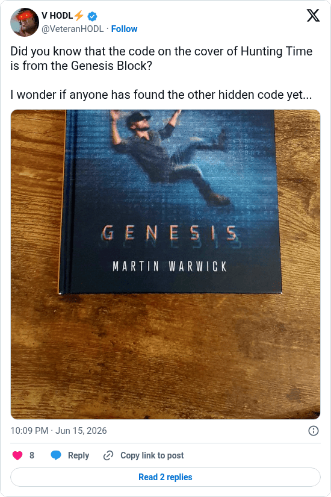

# The other hidden code in Hunting Time

[Original post](https://x.com/VeteranHODL/status/2066614083105738752). Cited by the [hunting-time record](../../../src/collections/hunting-time.ts) as the first public pointer to the hidden phrase, a teaser two weeks before the hunt opened.

## Historical provenance

[Wayback capture from June 15, 2026, 20:09:27 UTC](https://web.archive.org/web/20260615200927/https://twitter.com/VeteranHODL/status/2066614083105738752) is X's JSON payload for the post, not a rendered page. Its `text` field carries the same wording as the transcript below, apart from the t.co link X adds for the attachment.

## Transcript

> Did you know that the code on the cover of Hunting Time is from the Genesis Block?
>
> I wonder if anyone has found the other hidden code yet...

## Screenshot

Rendered from X's public embed in a local headless Chromium, which is why it shows a Follow button. The displayed 10:09 PM timestamp is local to that browser (UTC+2). The frontmatter date is June 15 in UTC. The attached photo shows the novel's cover, Hunting Time: Genesis by Martin Warwick; its original upload is the record's [cover.jpg](../../hunting-time/cover.jpg). Capture method and limits: [source archive](../README.md).
