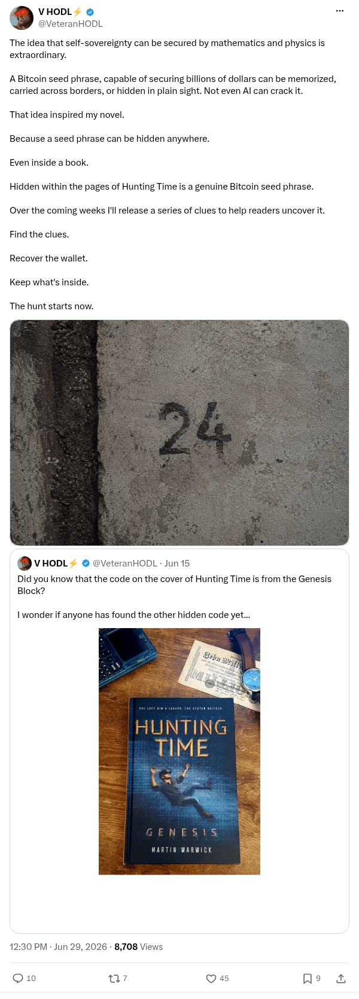

# Hunting Time seed phrase hunt announced

[Original post](https://x.com/VeteranHODL/status/2071632285951226106). Cited by the [hunting-time record](../../../src/collections/hunting-time.ts) as the puzzle's source page and as the first clue. The post quotes the account's own [teaser about the hidden code](veteranhodl-2026-06-15.md), and the page prints that quote below it. Only the cited post is transcribed.

## Historical provenance

[Wayback capture from June 29, 2026, 16:30:00 UTC](https://web.archive.org/web/20260629163000/https://twitter.com/VeteranHODL/status/2071632285951226106) is X's JSON payload for the post, not a rendered page. Its `note_tweet` text carries the same wording as the transcript below; the plain `text` field stops at X's short form.

## Transcript

> The idea that self-sovereignty can be secured by mathematics and physics is extraordinary.
>
> A Bitcoin seed phrase, capable of securing billions of dollars can be memorized, carried across borders, or hidden in plain sight. Not even AI can crack it.
>
> That idea inspired my novel.
>
> Because a seed phrase can be hidden anywhere.
>
> Even inside a book.
>
> Hidden within the pages of Hunting Time is a genuine Bitcoin seed phrase.
>
> Over the coming weeks I'll release a series of clues to help readers uncover it.
>
> Find the clues.
>
> Recover the wallet.
>
> Keep what's inside.
>
> The hunt starts now.

## Screenshot

X's embed cuts this post short behind Show more, so the screenshot is a crop of the logged out post page rendered through Steel instead. The displayed 12:30 PM timestamp is local to that browser (UTC-4). The frontmatter date is June 29 in UTC. The attached photo shows a concrete wall with the number 24; its original upload is the record's [clue-01.jpg](../../hunting-time/clue-01.jpg). Capture method and limits: [source archive](../README.md).
