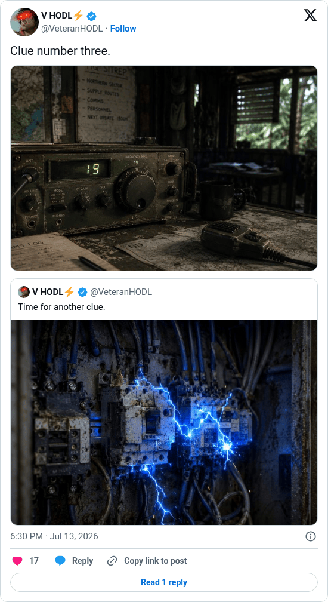

# Hunting Time clue 3

[Original post](https://x.com/VeteranHODL/status/2076705716501610744). Cited by the [hunting-time record](../../../src/collections/hunting-time.ts) as the third clue. The post quotes the account's own [second clue](veteranhodl-2026-07-06.md), and the page prints that quote below it. Only the cited post is transcribed.

## Historical provenance

[Wayback capture from July 13, 2026, 16:30:00 UTC](https://web.archive.org/web/20260713163000/https://twitter.com/VeteranHODL/status/2076705716501610744) is X's JSON payload for the post, not a rendered page. Its `text` field carries the same wording as the transcript below, apart from the t.co links X adds for the attachment and the quote.

## Transcript

> Clue number three.

## Screenshot

Rendered from X's public embed in a local headless Chromium, which is why it shows a Follow button. The displayed 6:30 PM timestamp is local to that browser (UTC+2). The frontmatter date is July 13 in UTC. The attached photo shows a field radio with 19 on its display; its original upload is the record's [clue-03.jpg](../../hunting-time/clue-03.jpg). Capture method and limits: [source archive](../README.md).
