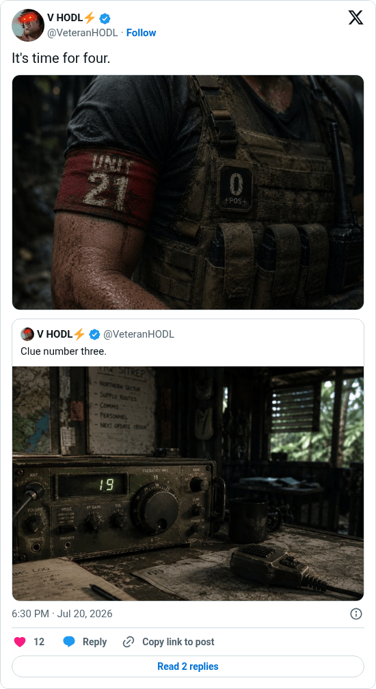

# Hunting Time clue 4

[Original post](https://x.com/VeteranHODL/status/2079242430499487893). Cited by the [hunting-time record](../../../src/collections/hunting-time.ts) as the fourth clue. The post quotes the account's own [third clue](veteranhodl-2026-07-13.md), and the page prints that quote below it. Only the cited post is transcribed.

## Historical provenance

[Wayback capture from July 20, 2026, 16:30:00 UTC](https://web.archive.org/web/20260720163000/https://twitter.com/VeteranHODL/status/2079242430499487893) is X's JSON payload for the post, not a rendered page. Its `text` field carries the same wording as the transcript below, apart from the t.co links X adds for the attachment and the quote.

## Transcript

> It's time for four.

## Screenshot

Rendered from X's public embed in a local headless Chromium, which is why it shows a Follow button. The displayed 6:30 PM timestamp is local to that browser (UTC+2). The frontmatter date is July 20 in UTC. The attached photo shows a soldier's arm band reading UNIT 21 beside a patch with a 0; its original upload is the record's [clue-04.jpg](../../hunting-time/clue-04.jpg). Capture method and limits: [source archive](../README.md).
