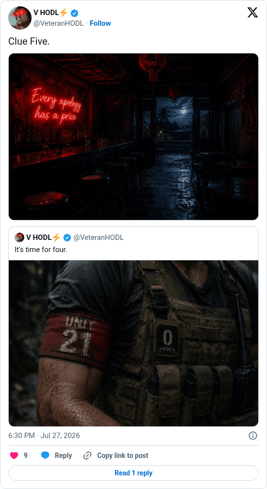

# Hunting Time clue 5

[Original post](https://x.com/VeteranHODL/status/2081779146196439527). Cited by the [hunting-time record](../../../src/collections/hunting-time.ts) as the fifth clue. The post quotes the account's own [fourth clue](veteranhodl-2026-07-20.md), and the page prints that quote below it. Only the cited post is transcribed.

## Historical provenance

[Wayback capture from July 27, 2026, 16:30:00 UTC](https://web.archive.org/web/20260727163000/https://twitter.com/VeteranHODL/status/2081779146196439527) is X's JSON payload for the post, not a rendered page. Its `text` field carries the same wording as the transcript below, apart from the t.co links X adds for the attachment and the quote.

## Transcript

> Clue Five.

## Screenshot

Rendered from X's public embed in a local headless Chromium, which is why it shows a Follow button. The displayed 6:30 PM timestamp is local to that browser (UTC+2). The frontmatter date is July 27 in UTC. The attached photo shows a bar with a red neon sign, Every apology has a price; its original upload is the record's [clue-05.jpg](../../hunting-time/clue-05.jpg). Capture method and limits: [source archive](../README.md).
