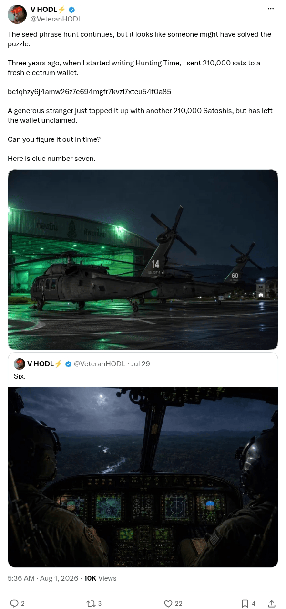

# Hunting Time address and clue 7

[Original post](https://x.com/VeteranHODL/status/2083486983142142452). Cited by the [hunting-time record](../../../src/collections/hunting-time.ts) as the source of the address, the Electrum wallet, the two fundings and the seventh clue. The post quotes the account's own [sixth clue](veteranhodl-2026-07-29.md), and the page prints that quote below it. Only the cited post is transcribed.

## Historical provenance

[Wayback capture from August 1, 2026, 09:36:20 UTC](https://web.archive.org/web/20260801093620/https://twitter.com/VeteranHODL/status/2083486983142142452) is X's JSON payload for the post, not a rendered page. Its `note_tweet` text carries the same wording as the transcript below; the plain `text` field stops at X's short form.

## Transcript

> The seed phrase hunt continues, but it looks like someone might have solved the puzzle.
>
> Three years ago, when I started writing Hunting Time, I sent 210,000 sats to a fresh electrum wallet.
>
> bc1qhzy6j4amw26z7e694mgfr7kvzl7xteu54f0a85
>
> A generous stranger just topped it up with another 210,000 Satoshis, but has left the wallet unclaimed.
>
> Can you figure it out in time?
>
> Here is clue number seven.

## Screenshot

X's embed cuts this post short behind Show more, so the screenshot is a crop of the logged out post page rendered through Steel instead. The displayed 5:36 AM timestamp is local to that browser (UTC-4). The frontmatter date is August 1 in UTC. The attached photo shows two helicopters numbered 14 and 60 outside a hangar; its original upload is the record's [clue-07.jpg](../../hunting-time/clue-07.jpg). Capture method and limits: [source archive](../README.md).
