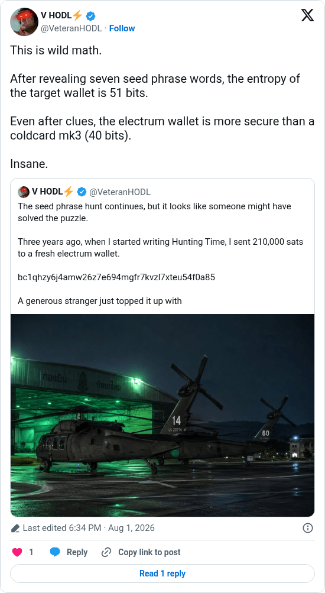

# Seven words, 51 bits left

[Original post](https://x.com/VeteranHODL/status/2083592109647401333). Cited by the [hunting-time record](../../../src/collections/hunting-time.ts) as the hint that each clue so far had given away one word. The post quotes the account's own [address post](veteranhodl-2026-08-01-2083486983142142452.md), and the page prints that quote below it. Only the cited post is transcribed. X lists it as the edit of [an earlier version](https://x.com/VeteranHODL/status/2083591409588662770) posted three minutes before, which lacked `(40 bits)`. The record cites this final version.

## Historical provenance

[Wayback capture from August 1, 2026, 16:34:04 UTC](https://web.archive.org/web/20260801163404/https://twitter.com/VeteranHODL/status/2083592109647401333) is X's JSON payload for the post, not a rendered page. Its `text` field carries the same wording as the transcript below, apart from the t.co link X adds for the quote.

## Transcript

> This is wild math.
>
> After revealing seven seed phrase words, the entropy of the target wallet is 51 bits.
>
> Even after clues, the electrum wallet is more secure than a coldcard mk3 (40 bits).
>
> Insane.

## Screenshot

Rendered from X's public embed in a local headless Chromium, which is why it shows a Follow button. The displayed 6:34 PM timestamp is local to that browser (UTC+2). The frontmatter date is August 1 in UTC. Capture method and limits: [source archive](../README.md).
