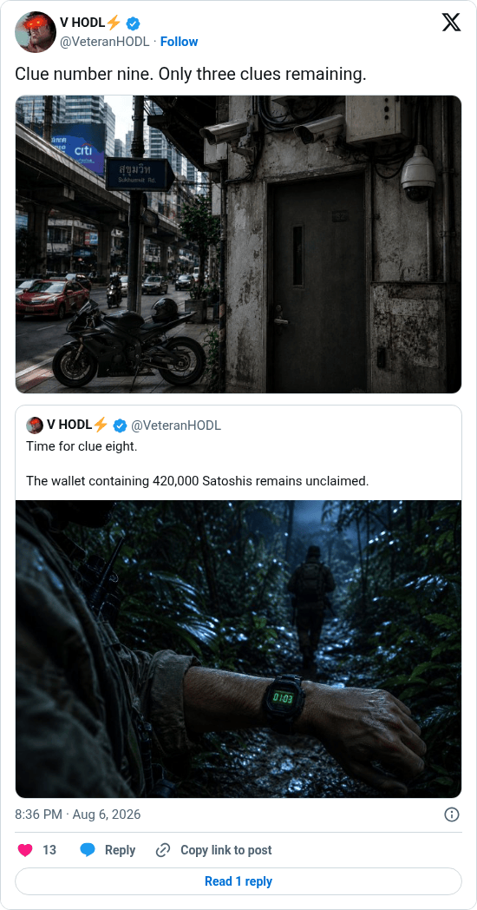

# Hunting Time clue 9

[Original post](https://x.com/VeteranHODL/status/2085434753092653555). Cited by the [hunting-time record](../../../src/collections/hunting-time.ts) as the ninth clue. The post quotes the account's own [eighth clue](veteranhodl-2026-08-03.md), and the page prints that quote below it. Only the cited post is transcribed.

## Historical provenance

[Wayback capture from August 6, 2026, 18:36:05 UTC](https://web.archive.org/web/20260806183605/https://twitter.com/VeteranHODL/status/2085434753092653555) is X's JSON payload for the post, not a rendered page. Its `text` field carries the same wording as the transcript below, apart from the t.co links X adds for the attachment and the quote.

## Transcript

> Clue number nine. Only three clues remaining.

## Screenshot

Rendered from X's public embed in a local headless Chromium, which is why it shows a Follow button. The displayed 8:36 PM timestamp is local to that browser (UTC+2). The frontmatter date is August 6 in UTC. The attached photo shows a street corner under an elevated railway, a motorbike at the kerb; its original upload is the record's [clue-09.jpg](../../hunting-time/clue-09.jpg). Capture method and limits: [source archive](../README.md).
