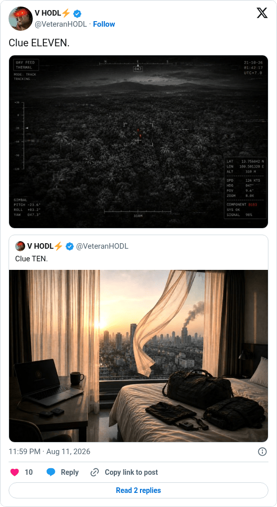

# Hunting Time clue 11

[Original post](https://x.com/VeteranHODL/status/2087297821921640942). Cited by the [hunting-time record](../../../src/collections/hunting-time.ts) as the eleventh clue. The post quotes the account's own [tenth clue](veteranhodl-2026-08-09.md), and the page prints that quote below it. Only the cited post is transcribed.

## Historical provenance

[Wayback capture from August 11, 2026, 21:59:15 UTC](https://web.archive.org/web/20260811215915/https://twitter.com/VeteranHODL/status/2087297821921640942) is X's JSON payload for the post, not a rendered page. Its `text` field carries the same wording as the transcript below, apart from the t.co links X adds for the attachment and the quote.

## Transcript

> Clue ELEVEN.

## Screenshot

Rendered from X's public embed in a local headless Chromium, which is why it shows a Follow button. The displayed 11:59 PM timestamp is local to that browser (UTC+2). The frontmatter date is August 11 in UTC. The attached photo shows a thermal drone feed over a forest; its original upload is the record's [clue-11.jpg](../../hunting-time/clue-11.jpg). Capture method and limits: [source archive](../README.md).
