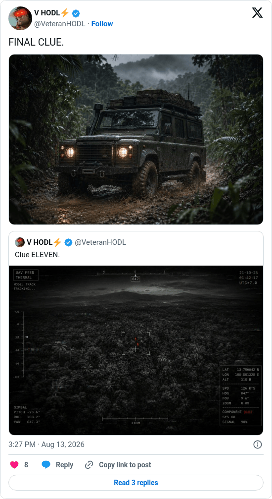

# Hunting Time final clue

[Original post](https://x.com/VeteranHODL/status/2087893684633141356). Cited by the [hunting-time record](../../../src/collections/hunting-time.ts) as the twelfth and last clue. The post quotes the account's own [eleventh clue](veteranhodl-2026-08-11.md), and the page prints that quote below it. Only the cited post is transcribed.

## Historical provenance

[Wayback capture from August 13, 2026, 13:27:00 UTC](https://web.archive.org/web/20260813132700/https://twitter.com/VeteranHODL/status/2087893684633141356) is X's JSON payload for the post, not a rendered page. Its `text` field carries the same wording as the transcript below, apart from the t.co links X adds for the attachment and the quote.

## Transcript

> FINAL CLUE.

## Screenshot

Rendered from X's public embed in a local headless Chromium, which is why it shows a Follow button. The displayed 3:27 PM timestamp is local to that browser (UTC+2). The frontmatter date is August 13 in UTC. The attached photo shows a Land Rover Defender on a muddy jungle track; its original upload is the record's [clue-12.jpg](../../hunting-time/clue-12.jpg). Capture method and limits: [source archive](../README.md).
