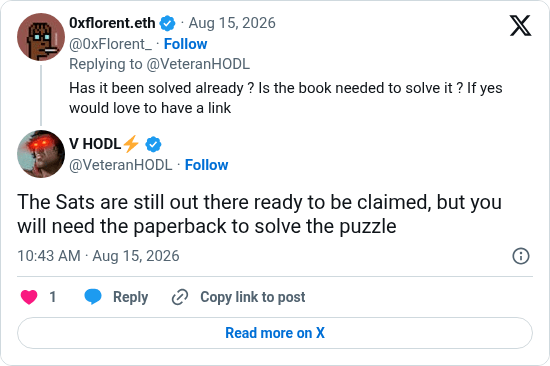

# You will need the paperback

[Original post](https://x.com/VeteranHODL/status/2088547059452235917). Cited by the [hunting-time record](../../../src/collections/hunting-time.ts) as the hint that the page numbers follow the paperback. It answers 0xFlorent_'s question whether the book is needed, and the embed prints that question above it. X hides the reply's leading `@0xFlorent_` on the page, so the transcript starts after it.

## Historical provenance

[Wayback capture from August 15, 2026, 08:43:16 UTC](https://web.archive.org/web/20260815084316/https://twitter.com/VeteranHODL/status/2088547059452235917) is X's JSON payload for the post, not a rendered page. Its `text` field carries the same wording as the transcript below, after the leading `@0xFlorent_` X adds to a reply.

## Transcript

> The Sats are still out there ready to be claimed, but you will need the paperback to solve the puzzle

## Screenshot

Rendered from X's public embed in a local headless Chromium, which is why it shows a Follow button. The displayed 10:43 AM timestamp is local to that browser (UTC+2). The frontmatter date is August 15 in UTC. Capture method and limits: [source archive](../README.md).
