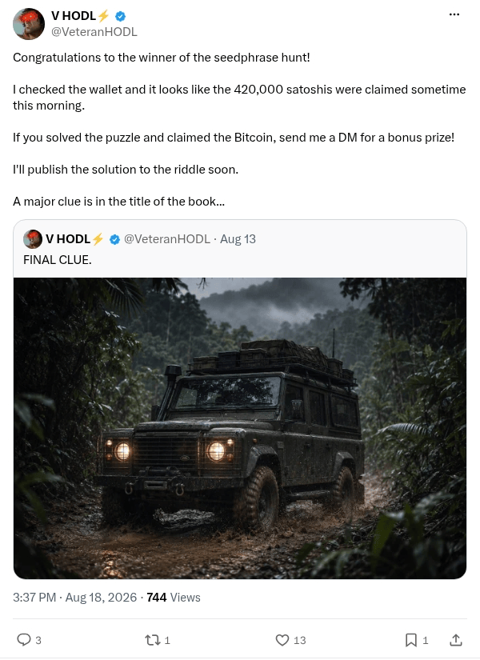

# Hunting Time prize claimed

[Original post](https://x.com/VeteranHODL/status/2089798740978577809). Cited by the [hunting-time record](../../../src/collections/hunting-time.ts) as the post that saw the claim and the hint about the book's title. The post quotes the account's own [final clue](veteranhodl-2026-08-13.md), and the page prints that quote below it. Only the cited post is transcribed.

## Historical provenance

[Wayback capture from August 18, 2026, 19:37:01 UTC](https://web.archive.org/web/20260818193701/https://twitter.com/VeteranHODL/status/2089798740978577809) is X's JSON payload for the post, not a rendered page. Its `note_tweet` text carries the same wording as the transcript below; the plain `text` field stops at X's short form.

## Transcript

> Congratulations to the winner of the seedphrase hunt!
>
> I checked the wallet and it looks like the 420,000 satoshis were claimed sometime this morning.
>
> If you solved the puzzle and claimed the Bitcoin, send me a DM for a bonus prize!
>
> I'll publish the solution to the riddle soon.
>
> A major clue is in the title of the book...

## Screenshot

X's embed cuts this post short behind Show more, so the screenshot is a crop of the logged out post page rendered through Steel instead. The displayed 3:37 PM timestamp is local to that browser (UTC-4). The frontmatter date is August 18 in UTC. Capture method and limits: [source archive](../README.md).
