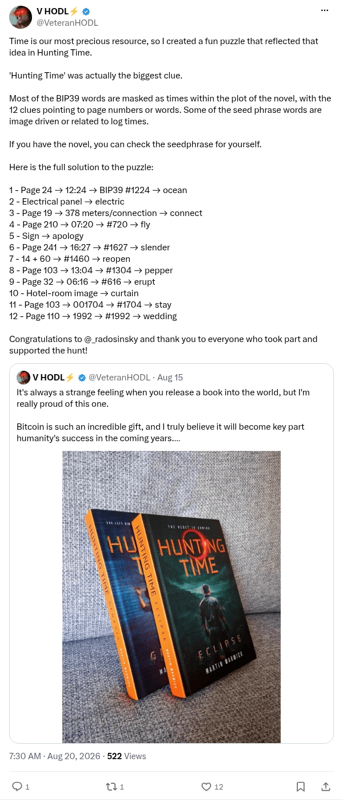

# Hunting Time solution

[Original post](https://x.com/VeteranHODL/status/2090400955707830480). Cited by the [hunting-time record](../../../src/collections/hunting-time.ts) as the source of every answer, the technique and the winner's name. The post quotes the account's own release post for the second novel, and the page prints that quote below it. Only the cited post is transcribed.

## Historical provenance

[Wayback capture from August 20, 2026, 11:30:00 UTC](https://web.archive.org/web/20260820113000/https://twitter.com/VeteranHODL/status/2090400955707830480) is X's JSON payload for the post, not a rendered page. Its `note_tweet` text carries the same wording as the transcript below; the plain `text` field stops at X's short form.

## Transcript

> Time is our most precious resource, so I created a fun puzzle that reflected that idea in Hunting Time.
>
> 'Hunting Time' was actually the biggest clue.
>
> Most of the BIP39 words are masked as times within the plot of the novel, with the 12 clues pointing to page numbers or words. Some of the seed phrase words are image driven or related to log times.
>
> If you have the novel, you can check the seedphrase for yourself.
>
> Here is the full solution to the puzzle:
>
> 1 - Page 24 → 12:24 → BIP39 #1224 → ocean
> 2 - Electrical panel → electric
> 3 - Page 19 → 378 meters/connection → connect
> 4 - Page 210 → 07:20 → #720 → fly
> 5 - Sign → apology
> 6 - Page 241 → 16:27 → #1627 → slender
> 7 - 14 + 60 → #1460 → reopen
> 8 - Page 103 → 13:04 → #1304 → pepper
> 9 - Page 32 → 06:16 → #616 → erupt
> 10 - Hotel-room image → curtain
> 11 - Page 103 → 001704 → #1704 → stay
> 12 - Page 110 → 1992 → #1992 → wedding
>
> Congratulations to @_radosinsky and thank you to everyone who took part and supported the hunt!

## Screenshot

X's embed cuts this post short behind Show more, so the screenshot is a crop of the logged out post page rendered through Steel instead. The displayed 7:30 AM timestamp is local to that browser (UTC-4). The frontmatter date is August 20 in UTC. Capture method and limits: [source archive](../README.md).
