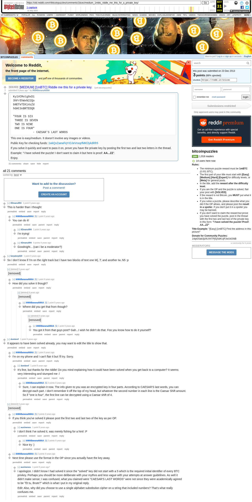

# [MEDIUM] [1mBTC] Riddle me this for a private key.

[Original thread](https://www.reddit.com/r/bitcoinpuzzles/comments/1ticec/medium_1mbtc_riddle_me_this_for_a_private_key/). The `sourceUrl` of the [iamabananaamaa/caesar record](../../../src/collections/iamabananaamaa/caesar.ts), the source of both hints, the address and the WIF, which is the post's four lines joined. The [author's explanation](https://www.reddit.com/r/bitcoinpuzzles/comments/1ticec/comment/ce8nwvi/) is the source of the answer. The post went up on December 23, 2013, at 04:53:59 UTC, an hour and 45 minutes after the funding transaction's block time. Its only edit is stamped 36 seconds later.

## Historical provenance

The Wayback Machine holds one capture of the `old.reddit.com` URL, taken on May 31, 2023. The lookup for the `www.reddit.com` URL got no answer from Wayback on September 24, 2026; archive.today lists one capture of it from August 21, 2019, which answered 429 when read. Provenance rests on the [old.reddit.com capture](https://web.archive.org/web/20230531170758/https://old.reddit.com/r/bitcoinpuzzles/comments/1ticec/medium_1mbtc_riddle_me_this_for_a_private_key/), whose HTML carries the post and all 21 comments the header counts, four of them already `[removed]`. Its body was read on September 24, 2026 and matches the transcript below word for word, including the four lines, the verse and the explanation. `archive_content: confirmed` on that basis.

The Arctic Shift Reddit archive lists the four removed comments with `[deleted]` as both author and body. Their times come from there. The record names none of the commenters.

## Transcript

> ```text
> Ky1VCMxtg9xD1
> 3hFrEhWxN22Qo
> bNEfeTDX14sZd
> hGHC3nBRTEDQ8
>
> "FOUR IS SIX
>  THREE IS SEVEN
>  TWO IS NINE
>  ONE IS FOUR"
>             - CAESAR'S LAST WORDS
> ```
>
> This one is easy/medium. It doesn't involve any images or videos.
>
> Public Key for checking funds: 1wkQxZaewFqYrDJeVnxqrfMKfJykdRfr5
>
> If you solve it quickly and want to pass it on, prove you have the private key by posting the first two and last two letters in the thread.
>
> Example: "I have solved the puzzle! I don't want to claim it but here is proof: **AA...ZZ**".
>
> Enjoy.

## Comments

In the capture's order, "sorted by best".

**u/tf2manu994**, 1 point, top level:

> This is harder than i thought

**u/IAMABananaAMAA**, 1 point, reply to tf2manu994:

> You can do it!

**u/tf2manu994**, 1 point, reply to IAMABananaAMAA:

> I'm trying!

**u/tf2manu994**, 0 points, reply to IAMABananaAMAA:

> Goodnight... (can i be a moderator?)

**u/herpderp020**, 1 point, top level:

> So I don't know if I'm on the right track but I have two blocks of text one M{..T; and another Iw..N5 :p

**[deleted]**, top level, 14:42:38 UTC:

> [removed]

**u/IAMABananaAMAA**, 1 point, reply to the removed comment:

> How did you solve it though?

**[deleted]**, reply:

> [removed]

**u/IAMABananaAMAA**, 1 point, reply:

> Where did you get that from though?

**[deleted]**, reply:

> [removed]

**u/IAMABananaAMAA**, 1 point, reply:

> You got it from that guys post? Gah...I wish he didn't do that. Foo you know how to do it yourself?

**u/dombeef**, 1 point, top level:

> It appears to have been solved already, you may want to edit the title to show that.

**u/IAMABananaAMAA**, 1 point, reply to dombeef:

> I'm on my phone and I can't flair it but I'll try. Sorry.

**u/dombeef**, 1 point, reply:

> It's fine, but thanks for the riddle! Do you mind explaining how it could have been solved when you get back to a computer? It seems very interesting and stumped me :/

**u/IAMABananaAMAA**, 3 points, reply to dombeef, the explanation:

> Sure, I can explain it now. The info given to you was an encrypted key in four parts. According to CAESAR'S last words, you can decrypt each part. I don't remember it off the top of my head, but whatever the second number in each line is the Caesar Shift amount. So if "one is four", the first line can be decrypted using a Caesar shift of 4.

**[deleted]**, top level, 05:20:01 UTC:

> [removed]

**u/IAMABananaAMAA**, 2 points, reply to the removed comment:

> If you think you've solved it please post the first two and last two of the key as per OP.

**u/auximenes**, 1 point, reply to IAMABananaAMAA:

> I don't think I've solved it, was merely fishing for a hint! :P

**u/IAMABananaAMAA**, 2 points, reply to auximenes:

> Nice try :)

**u/IAMABananaAMAA**, 2 points, second reply to the removed comment:

> Next time please use the format in the OP since you actually have the key away.

**u/auximenes**, 1 point, reply to IAMABananaAMAA, edited:

> I apologize. I didn't know I had solved it since the "solved" key did not start with a 5 which is the required initial identifier of every BTC privkey. Perhaps you should be more deliberate with your mythos and less vague with your attempts at answer guidelines. As well it didn't make sense; I was confused, what you claimed were "CAESAR'S LAST WORDS" were not since they were academically agreed to be "Et tu, Brute?" which is what I put in my original reply.
>
> Edit: Also, why did you choose to use a single alphabet substitution cipher on a string that included numbers? That's what really confuses me.

## Screenshot



The screenshot is a render of the archive capture, not of the live page, so it carries the Wayback banner at the top. The "9 years ago" stamps are relative to the capture, May 31, 2023. Capture method and limits: [source archive](../README.md).
