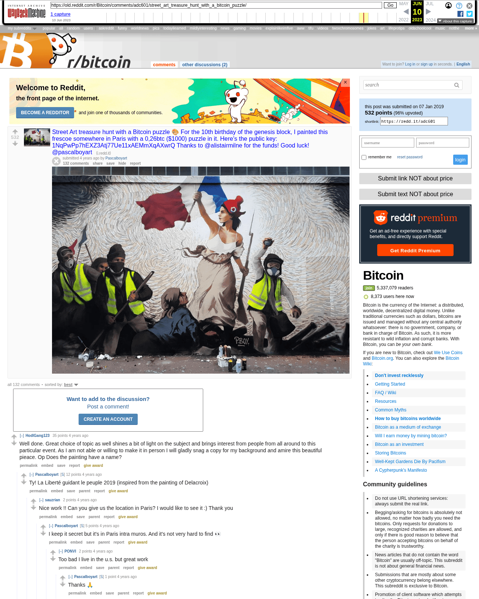

# Street Art treasure hunt with a Bitcoin puzzle

[Original thread](https://www.reddit.com/r/Bitcoin/comments/adc601/street_art_treasure_hunt_with_a_bitcoin_puzzle/). Pascal Boyart's r/Bitcoin post of the mural, the source of the first fact on the [Pascal Boyart author record](../../../src/collections/liberte-guidant-le-peuple.ts). It went up on January 7, 2019, at 00:58:46 UTC, two hours after the post on his own site. It's an image post, so the title carries everything: the occasion, the prize and the address. The comments under it carry the author's hints, the HD picture the record ships, the first public mention of the black light words, and the author's note that someone had claimed the prize an hour earlier.

## Historical provenance

The Wayback Machine holds `www.reddit.com` captures from May 2021, August 2022 and June 2023, an `old.reddit.com` capture from June 10, 2023, and July 2020 captures of one comment permalink. Provenance rests on the [old.reddit.com capture](https://web.archive.org/web/20230610212737/https://old.reddit.com/r/Bitcoin/comments/adc601/street_art_treasure_hunt_with_a_bitcoin_puzzle/), stamped June 10, 2023, 21:27:37 UTC. Its body was read on October 8, 2026. It shows the title as transcribed and 129 of the comments below, and their text matches the transcript once whitespace and Markdown are normalized. `archive_content: confirmed` on that basis.

The [Arctic Shift](https://arctic-shift.photon-reddit.com/) Reddit archive, read the same day, holds 139 comments under the post. The capture lacks ten of them: four live ones, by anon_btc_guy, nksama (twice) and budinske, and six that were deleted or removed. The four live ones come from Arctic Shift and sit last in their branch, after the comments the capture shows. Those six stay out, while the six deleted comments the capture does show keep their place as `[deleted]` or `[removed]`, so the replies under them still have a parent. Scores are the ones Arctic Shift recorded.

The screenshot is a local headless Chromium render of the same capture, cut at the first screen of comments.

## Transcript

> Street Art treasure hunt with a Bitcoin puzzle 🎨 For the 10th birthday of the genesis block, I painted this frescoe somewhere in Paris with a 0,26btc ($1000) puzzle in it. Here's the public key: 1NqPwPp7hEXZ3Atj77Ue11xAEMmXqAXwrQ Thanks to @alistairmilne for the funds! Good luck! @pascalboyart

The post links the photo at https://i.redd.it/6at4j7xlgw821.jpg.

## Comments

In the capture's order, "sorted by best".

**u/HodlGang123**, 35 points:

> Well done. Great choice of topic as well shines a bit of light on the subject and brings interest from people from all around to this particular event. As I am not able or willing to make it in person I will gladly snag a copy for my background and amire this beautiful pieace. Op Does the painting have a name?

**u/Pascalboyart**, 13 points, reply to u/HodlGang123:

> Ty! La Liberté guidant le peuple 2019 (inspired from the painting of Delacroix)

**u/sauzrian**, 2 points, reply to u/Pascalboyart:

> Nice work !! Can you give us the location in Paris? I would like to see it :) Thank you

**u/Pascalboyart**, 5 points, reply to u/sauzrian:

> I keep it secret but it's in Paris intra muros. And it's not very hard to find 👀

**u/PONVI**, 2 points, reply to u/Pascalboyart:

> Too bad I live in the u.s. but great work

**u/Pascalboyart**, 1 point, reply to u/PONVI:

> Thanks 🙏

**u/sauzrian**, 2 points, reply to u/Pascalboyart:

> Thanks i'll stop by this morning :) It's not secret anymore ! [https://www.google.com/maps/place/152+Rue+d'Aubervilliers,+75019+Paris/@48.8929559,2.3596736,15z/data=!4m5!3m4!1s0x47e66e7f7d097f65:0x1c7929bf3a9b8245!8m2!3d48.8930969!4d2.3696729](https://www.google.com/maps/place/152+Rue+d'Aubervilliers,+75019+Paris/@48.8929559,2.3596736,15z/data=!4m5!3m4!1s0x47e66e7f7d097f65:0x1c7929bf3a9b8245!8m2!3d48.8930969!4d2.3696729)

**u/Pascalboyart**, 1 point, reply to u/sauzrian:

> 🎯👍

**u/Pascalboyart**, 36 points:

> To solve the puzzle enterly, you must be physicaly in front of the mural.
> Here you can see the HD picture of the entire frescoe: https://i.imgur.com/BOiXPzl.jpg
> This kind of projects are possible only with your support with btc donations: 1KKFT9Q9BWWMFtrDnfKuaDp32CZQ9Jd7Fg 🙏
> www.pboy-art.com

**u/flat_bitcoin**, 10 points, reply to u/Pascalboyart:

> Too bad I'm far from Paris. Love these type of puzzles though. Nice work

**u/Pascalboyart**, 4 points, reply to u/flat_bitcoin:

> Thanks! You can solve a part though 😌

**u/yesterdaymonth**, 1 point, reply to u/Pascalboyart:

> What do you mean by a part?

**u/s3ane**, 5 points, reply to u/Pascalboyart:

> Too bad you gave the whole picture.
>
> It's easy to find thanks to what is on the right side: name of the company and street number:
>
> 105 Rue d'Aubervilliers, 75018 Paris, France
> [https://www.google.com/maps/uv?hl=fr&pb=!1s0x47e66e7f45f8da07:0xffaede0983e804ed!2m22!2m2!1i80!2i80!3m1!2i20!16m16!1b1!2m2!1m1!1e1!2m2!1m1!1e3!2m2!1m1!1e5!2m2!1m1!1e4!2m2!1m1!1e6!3m1!7e115!4s/maps/place/105%2Btafanel/@48.8913254,2.3688745,3a,75y,300.44h,90t/data%3D\*213m4\*211e1\*213m2\*211s5MIhTkQLH2Q7EJZ3GGPjQg\*212e0\*214m2\*213m1\*211s0x47e66e7f45f8da07:0xffaede0983e804ed!5s105+tafanel+-+Recherche+Google&imagekey=!1e2!2s5MIhTkQLH2Q7EJZ3GGPjQg&sa=X&ved=2ahUKEwjd-5TH69vfAhUJKFAKHSRdDFUQpx8wCnoECAAQCw](https://www.google.com/maps/uv?hl=fr&pb=!1s0x47e66e7f45f8da07:0xffaede0983e804ed!2m22!2m2!1i80!2i80!3m1!2i20!16m16!1b1!2m2!1m1!1e1!2m2!1m1!1e3!2m2!1m1!1e5!2m2!1m1!1e4!2m2!1m1!1e6!3m1!7e115!4s/maps/place/105%2Btafanel/@48.8913254,2.3688745,3a,75y,300.44h,90t/data%3D*213m4*211e1*213m2*211s5MIhTkQLH2Q7EJZ3GGPjQg*212e0*214m2*213m1*211s0x47e66e7f45f8da07:0xffaede0983e804ed!5s105+tafanel+-+Recherche+Google&imagekey=!1e2!2s5MIhTkQLH2Q7EJZ3GGPjQg&sa=X&ved=2ahUKEwjd-5TH69vfAhUJKFAKHSRdDFUQpx8wCnoECAAQCw)
>
> And too bad I can only go back to Paris in 3 weeks...
>
> Anyway, this is _génial_ (_en français dans le texte_).

**u/s3ane**, 3 points, reply to u/s3ane:

> I love how we can actually see one of your work not to far from here, on Street View (same street).
>
> [https://imgur.com/a/GiEG4r4](https://imgur.com/a/GiEG4r4)

**u/Pascalboyart**, 2 points, reply to u/s3ane:

> Thanks! Well done 👍

**u/PuckFride88**, 3 points, reply to u/Pascalboyart:

> This is so cool I can't
>
> Well done

**u/HodlGang123**, 2 points, reply to u/Pascalboyart:

> Op. Are you willing to give a general location of this painting, name of painting as well?

**u/Pascalboyart**, 5 points, reply to u/HodlGang123:

> It's in Paris intra muros, secret place but it isn't hard to find... 🕵 "La Liberté guidant le peuple 2019" (inspired from the painting of Delacroix)

**u/s3ane**, 2 points, reply to u/HodlGang123:

> He actually gave one easy clue to find the place.

**u/UsefulAccount3**, 2 points, reply to u/Pascalboyart:

> Hi Pascal, awesome piece, and amazing statement!
>
> When you say we must be physically in front of the mural to solve the puzzle entirely, is that because it would be difficult for a camera to capture some small detail in the image? Or is it because we need to be able to physically touch the mural (or a similar reason)?
>
> In other words, is the clue lost due to pixelation effects, or is it because we can not physically touch the mural?

**u/Pascalboyart**, 1 point, reply to u/UsefulAccount3:

> You can solve a part from your desk and other part you must see the wall in real life

**u/goodbtc**, 25 points:

> WHY did you censor the liberty of the French republic? I am not sure if you grasp the full meaning of this act, while the UNCENSORED image was used of the fucking fiat banknotes: https://i.imgur.com/DQAdP5V.jpg
>
> Vive la France! https://i.imgur.com/XRbJdeF.jpg

**u/cumulus_nimbus**, 13 points, reply to u/goodbtc:

> probably the first clue.... those who go there phsically, be sure to bring some paint-remover, accetone, etc.. ;)

**u/pikmin04**, 7 points, reply to u/cumulus_nimbus:

> I hope there is no need to alter the painting in order to solve the puzzle !

**u/CocoDaPuf**, 2 points, reply to u/pikmin04:

> More likely that it would be a decal that would peel off

**u/Priest_of_Satoshi**, 2 points, reply to u/cumulus_nimbus:

> Someone call Nicolas Cage!
>
> edit: fixed. happy bday Nicolas Cage.

**u/No_H_in_Cage**, 4 points, reply to u/Priest_of_Satoshi:

> There is no 'H' in Nicolas Cage.
>
> IT'S HIS BIRTHDAY TODAY AND YOU CAN'T SPELL HIS NAME RIGHT? FOR SHAME.
>
> Source: http://en.wikipedia.org/wiki/Nicolas_Cage | http://www.imdb.com/name/nm0000115/

**u/FantasticEchidna4**, 1 point, reply to u/cumulus_nimbus:

> maybe it's just _white paper_ not paint, covering her breast. this matches the op clue that you must be there, maybe to remove it?

**u/rydan**, 4 points, reply to u/goodbtc:

> I mean this is Bitcoin where up is down and down is up. A censorship resistant currency would choose to censor something that fiat leaves uncensored.

**u/OnReddit10Mins**, 0 points, reply to u/goodbtc:

> The French gave up their fiat banknotes to the failed Euro experiment. Some shop receipts still show a notional franc figure, but what it is based on at this remove, who knows?

**u/bubbasparse**, 10 points:

> This is epic. Wish I was closer to admire in person.

**u/agnus-dei**, 3 points, reply to u/bubbasparse:

> Yeah.. very close through a QR code reader.

**u/DTR-Rob**, 11 points:

> You are a hero!

**u/alistairmilne**, 7 points:

> Remember, you can increase the bounty on the puzzle by donating here: https://www.blockchain.com/btc/address/1NqPwPp7hEXZ3Atj77Ue11xAEMmXqAXwrQ

**u/Pascalboyart**, 2 points, reply to u/alistairmilne:

> 🎯

**u/modern_life_blues**, 1 point, reply to u/alistairmilne:

> Why blockchain.com? Isn't that ver's site that presents bcash as bitcoin?

**u/StealthSecrecy**, 6 points:

> [Here's](https://www.blockchain.com/btc/address/1NqPwPp7hEXZ3Atj77Ue11xAEMmXqAXwrQ) the wallet, for those playing along at home.

**u/htime-**, 6 points:

> Well, here goes my night I guess :D Nice work guys

**u/Pascalboyart**, 3 points, reply to u/htime-:

> Ty 😉

**u/Jauny78**, 5 points:

> can someone ELI5 how this type of puzzle works?

**u/Notcompromisedyet**, 2 points, reply to u/Jauny78:

> The background lines may be some sort of code, if you decode it you get the private key to a wallet, or its something entirely different.

**u/TFenceChair**, 5 points:

> Well done

**u/Pascalboyart**, 2 points, reply to u/TFenceChair:

> Ty 🙏

**u/TFenceChair**, 3 points, reply to u/Pascalboyart:

> I have zero way of solving this. I hope that the person who does, it does goes to the right person.
>
> Question - wasn't there a similar riddle last year too? Did that get solved?

**u/PuckFride88**, 3 points, reply to u/TFenceChair:

> I also wonder who'll be first to the key, hope they'll post here.
>
> Maybe if we upvote this post enough news outlets will pick it up.

**u/F0rtysxity**, 5 points:

> Great job!!! Gilets jaunes and Bitcoin go hand in hand. Vive le Revolution!

**u/Pascalboyart**, 1 point, reply to u/F0rtysxity:

> ✊

**[deleted]**, reply to u/Pascalboyart:

> [deleted]

**u/xxyyzz111**, 4 points:

> I know what I'm doing when I visit Paris for the first time next month!

**u/Pascalboyart**, 2 points, reply to u/xxyyzz111:

> You're welcome! 🇫🇷

**u/rashu8534**, 4 points:

> I don't know anything about France, except a very few. Its a shame.
>
> Here are some of the differences. Can someone explain its significance.
>
> 1. The liberty lady's eyes looking away from the fighters, compared to the original, where she was looking at them.
> 2. background changed to 'Arc de Triomphe' (symbolizing soldiers/fighters, I guess) from 'Notre Dame de Paris'(symbolizing religion). (refering [wikipedia](https://upload.wikimedia.org/wikipedia/commons/5/5d/Eug%C3%A8ne_Delacroix_-_Le_28_Juillet._La_Libert%C3%A9_guidant_le_peuple.jpg). forgive me if my understanding is wrong)
> 3. tricolor on the hat of liberty lady, which is new in this painting.
> 4. tricolor shirts missing in the guy on her feet, who is also strangely bleeding his eyes.
> 5. the weapon of fight became stones and sticks from guns and swords.

**u/sudomatrix**, 4 points:

> Does someone in Paris want to team up with me? I think I know how to solve it, and I thought I might be able to do it without being there from the hi-res picture, but I can't get everything I need without being up close.
>
> Edit: I found a detail in the photo that I think PBOY staged on purpose as a "confirmation" that the method I am thinking is correct.

**u/Basic_Twist**, 3 points, reply to u/sudomatrix:

> See DM.

**u/changelieu**, 2 points, reply to u/sudomatrix:

> Hey @sudomatrix, I also DM'd you :-) I'm planning to go see the fresco tomorrow around noon ! So I'll be glad to team up with you on this puzzle. Thx

**u/sudomatrix**, 3 points:

> By the way, unrelated to the puzzle, how do you paint such sharp clean QR code and Bitcoin address under the QR code? Did you print a template and cut it out for spraying?

**u/Pascalboyart**, 3 points, reply to u/sudomatrix:

> Stencil

**u/HodlGang123**, 3 points:

> "We the citizens rise strong United and able "

**u/lukegarcia789**, 3 points:

> WOW

**u/rektcoin**, 3 points:

> what's with the bra?

**u/Captnhappy**, 1 point, reply to u/rektcoin:

> or is that part of the clue?

**u/netpoe**, -1 point, reply to u/rektcoin:

> In Delacroix painting, the woman is topless. Today that would be considered porn.

**u/immolated_**, 3 points:

> I figured out the methodology to reach the solution (can't get there from the picture) but don't want to spoil it =)

**u/yesterdaymonth**, 2 points, reply to u/immolated_:

> What makes you so sure? Can you explain without revealing it?

**u/sudomatrix**, 2 points, reply to u/yesterdaymonth:

> It can't be based on the location's GPS because that's easy to get without actually travelling there...

**u/Basic_Twist**, 2 points, reply to u/immolated_:

> What do you mean by "can't get there from the picture"?

**u/immolated_**, 2 points, reply to u/Basic_Twist:

> Can't withdraw it unless you're there.

**u/Basic_Twist**, 2 points, reply to u/immolated_:

> Sent you a DM. :)

**u/sudomatrix**, 2 points, reply to u/immolated_:

> I think perhaps I can tell the different spray strokes for the "relevant" parts just from the hi-res image, without actually being there. Or perhaps I'm completely off :-)

**u/Pascalboyart**, 1 point, reply to u/immolated_:

> 👍👍👍

**u/PerceptionKey**, 3 points:

> went there today and am going back tomorrow. Pray for me bois! i hope it's not some crazy complicated math problem

**u/mxxxxxxxxxx**, 2 points:

> Nice street art.
> How do you call the painting?

**u/Pascalboyart**, 2 points, reply to u/mxxxxxxxxxx:

> Thanks, "La Liberté guidant le peuple 2019" (inspired by the painting of Delacroix)

**u/Bitcoin_21**, 2 points:

> nice idea

**u/Pascalboyart**, 1 point, reply to u/Bitcoin_21:

> Thanks 🙌

**u/Way2Paradise**, 2 points:

> I like that kind of street art. Very good work!

**u/Pascalboyart**, 1 point, reply to u/Way2Paradise:

> Thank you! 🙏🙏

**u/rydan**, 2 points:

> Do you have the private key in case someone paints over this and destroys the puzzle?

**u/Pascalboyart**, 1 point, reply to u/rydan:

> Sure!

**u/stinkyhotdoghead**, 2 points:

> Down with globalism! And sweet art. If I had the money I'd have you paint that on one side of my house and then another one on the other side that would be a modern interpretation of something from the American Revolution.

**u/cryptohazard**, 2 points:

> Jolie Fresque!
>
> I am wondering how long it will take to be cracked.

**u/pokerslam556**, 2 points:

> Could the girl not have a orange hat with bitcoin on it? Edit: Sorry, seems negative reaction. It surely is beautiful! Love it.

**u/HoneyNutsNakamoto**, 2 points:

> Love the incorporation of the yellow vests!

**u/VitusNansen**, 2 points:

> There is no bra on woman in the original picture )

**u/sudomatrix**, 2 points:

> Don't stare at this picture so long you get lost in the minutia.

**u/modern_life_blues**, 2 points:

> Gosh darn. That's cool.

**u/Zukicha**, 2 points:

> I love everything associated with this fact.

**u/cryptobecl**, 2 points:

> I spent around 45 minutes in front of it yesterday night and could only find part of the answer. I'll have to go back!
> Nice to meet some other crypto afficionados there :)

**u/Pascalboyart**, 1 point, reply to u/cryptobecl:

> 👍👀

**u/3rdiJedi**, 2 points:

> Think OP maybe our Ben Franklin in this community. Brilliant! Keep it up!

**u/BTCkoning**, 2 points:

> Great art as always Pascal! But i don't really get it. Is this puzzle being able to be solved online (from picture) or not? Because i think in your tweet or something you wrote you need to physically be there?

**u/Pascalboyart**, 1 point, reply to u/BTCkoning:

> You can solve a part from your home

**u/BTCkoning**, 3 points, reply to u/Pascalboyart:

> Okay would at least try to solve a part then i guess!

**u/Pascalboyart**, 2 points, reply to u/BTCkoning:

> Good luck 🔍👍

**u/pikmin04**, 1 point, reply to u/BTCkoning:

> Did you figure something out ?

**u/BTCkoning**, 1 point, reply to u/pikmin04:

> To be honest i haven't really looked at it for long. Haven't had the time to properly look at it.

**u/ningrim**, 3 points:

> what does her hat represent?

**u/Pascalboyart**, 4 points, reply to u/ningrim:

> This is the phrygian cap

**u/SHIMINA14**, 1 point:

> Looks like it might use a finger print scanner?

**u/CallMeFib3r**, 1 point:

> Give this man some gold

**u/bitcointwitter**, 1 point:

> Just a random question so what happens if someone goes over then paints over that shit?
> Just saying?

**u/Notcompromisedyet**, 2 points, reply to u/bitcointwitter:

> Bitcoin becomes 26/21000000 % scarcer.

**u/octobitio**, 1 point:

> fresco ~~e~~ ?

**u/Pascalboyart**, 1 point, reply to u/octobitio:

> Fresco, thx

**u/mapl3sn0w**, 1 point:

> Who’s the author of this amazing piece of art ?

**u/takeshi_reg**, 1 point:

> Hey, if anyone from Paris with some spare time would like to team up, please DM me. Got some ideas, but need somebody to physically go to the place.
>
> I am the author of [http://themillionetherhomepage.com/](http://themillionetherhomepage.com/). I know how cryptos work.
>
> We'll split 50/50.

**u/alexandernacho**, 1 point, reply to u/takeshi_reg:

> Going there tomorrow, just PM'ed you!

**u/changelieu**, 1 point, reply to u/takeshi_reg:

> Hey @takeshi\_reg, i already PM'ed you this morning ;)

**u/HodlGang123**, 1 point:

> Curious about the legality as well was this like a illegal street art thing our did the artist have permission from the property owner?

**u/Pascalboyart**, 6 points, reply to u/HodlGang123:

> Not realy...

**u/HodlGang123**, 5 points, reply to u/Pascalboyart:

> Well I'm sure it will be beloved by the locals, and all who travel down the street this piece is located on. This is quality street art.

**u/Pascalboyart**, 3 points, reply to u/HodlGang123:

> Thanks! 🙌🙏

**u/eastonsn**, 2 points, reply to u/HodlGang123:

> I thought it was Roses?

**u/crypl**, 1 point, reply to u/eastonsn:

> Celebrations!

**u/N-ve**, 1 point:

> Living in the age of liberalism while covering up her bare bosom.

**u/meknoid333**, 0 points:

> Is that an antifa hat in the lady of liberty?

**u/Pascalboyart**, 2 points, reply to u/meknoid333:

> It's a phrygian cap

**u/starvingprogrammer1**, 0 points, reply to u/meknoid333:

> Wait, is it?

**[deleted]**, reply to u/meknoid333:

> [removed]

**u/megaOga27**, -11 points:

> Omg, gilet jaune are fucking retards that have no clues on how economical stuff works

**u/crayzcrinkle**, -1 point:

> Nice piece of art. There's no puzzle in it tho. Unless the question is maybe written on the ground in front. Or maybe somethings list in translation...

**u/greeniscolor**, -3 points:

> Sadly the yellow vest protests could be fired up by right wing people to change the system and to let le Pen win the next election. I would be very careful with jumping on this protest - it'll be used in the next elections against democracy. Russia today is involved, breitbart., Etc. Especially young people are triggered to go on the streets against Macron and against the 'system'. Think about who will win by bringing up the people against the more left party. Macron needs to fix the problems the conservative party left over. I'm not saying he's a good or bad president - just be careful and look close to see what's going on with those protests. It's obvious, that right wing parties gain more and more power. USA, Turkey, Poland, Hungary, Brazil, Germany, etc.
> To use Jeanne d'Arc as the leader of the neo revolution is maybe a little bit strange. It's not the revolution - it's the evolution of the right wing.
> My two satoshis. The best way to gain power is to make the people belief that everything is fucked up. It's not getting better when right people gain more power. It's dangerous. Same shit happened in Germany after ww1. People were unsatisfied with the situation - and then the 'great leader' just came up in the right moment... And we all know what this led to.
>
> Kudos to your art though!

**[deleted]**:

> [deleted]

**[deleted]**:

> [removed]

**[deleted]**:

> [removed]

**[deleted]**:

> [deleted]

**u/anon_btc_guy**, 1 point:

> It makes me want to seed 12 words...

**u/nksama**, 2 points:

> when you mean a part is a specific number of words from the private key? and how much? 1/12, 4/12...?

**u/Pascalboyart**, 1 point, reply to u/nksama:

> Good question 🔍... there's a clue on the hq pic

**u/Pascalboyart**, 1 point, reply to u/Pascalboyart:

> https://www.pboy-art.com/single-post/2019/01/06/Fresque-Liberté-guidant-le-peuple-2019

**u/budinske**, 2 points:

> Apparently there's some words that are visible when exposed to a blacklight: https://cdn.discordapp.com/attachments/434606875275952128/532259820888260609/IMG_20190107_180353.jpg
>
> The others are supposed to be seed words from the bip39 french word list, but those who know them are hoarding them and not sharing.

**u/sudomatrix**, 2 points, reply to u/budinske:

> On the far right there is black paint on black background saying '12 seed words'. this tells us we are looking for 12 words, most likely from the French word list.
>
> There is an old video showing PBOY painting with UV paint, showing he had worked with UV paint before. shining UV light on the painting reveals writing in three groups: to the left, above, and to the right of the woman's face. Some have found these to lead to a few words from the French word list.
>
> the background is made of colored bars. there are several areas (6?) where the colored bars are grouped into tight regular formations. the arrangement of colored bars might be translated into numbers then words.

**u/Pascalboyart**, 1 point, reply to u/sudomatrix:

> The puzzle has been solved yesterday, here's the solution: https://www.pboy-art.com/single-post/2019/01/13/Solution-de-lénigme-de-la-fresque-La-Liberté-guidant-le-peuple-2019

**u/sudomatrix**, 2 points, reply to u/Pascalboyart:

> thanks PBOY, great fun!

**u/sudomatrix**, 2 points, reply to u/Pascalboyart:

> Your solution says 'ATOUT' Caesar cipher + 20 = 'UNION'. That makes sense. Then it says 'JPAVFLU' Caesar cipher + 19 = 'CITIZEN'. That does not work. It seems to me that the clue would have been 'JPAPGLU' + 19 = 'CITIZEN'. What am I doing wrong?
>
> EDIT: I just realized your solution page must have been auto-translated from French to English. Your seed words have also been translated, giving the \*wrong\* seed words. You should fix the solution page so the seed words are correct.

**u/sudomatrix**, 2 points, reply to u/sudomatrix:

> How are the colored bars encoded? Take for example, group 2. I see 'Yellow Blue Blue Orange Yellow Blue Blue Peach Brown Peach'. The first letter is supposed to decode to 'U' in 'USURE'. There are six colors, so this is base-6. 'U' is letter #21 (decimal). In base-6 this is '33'. I would think the first two color bars would have to be the same color to represent '33' in base-6.
>
> EDIT: I read how the winner solved this part, and he didn't. He cross-referenced all the color-bar codes with the French BIP wordlist like a giant Sudoku to get 4 of the words, then wrote code to brute-force the last 2 words. So he never did figure out how the color-bars are coded. Very clever. [https://bitcoin.fr/recit-de-la-decouverte-des-bitcoins-dans-la-fresque-la-liberte-guidant-le-peuple-2019/](https://bitcoin.fr/recit-de-la-decouverte-des-bitcoins-dans-la-fresque-la-liberte-guidant-le-peuple-2019/)

**u/Pascalboyart**, 1 point, reply to u/sudomatrix:

> No it's correct, it's just a translation of the french words in english... 😁

**u/sudomatrix**, 1 point, reply to u/Pascalboyart:

> But how does the color-bar coding work?

**u/nksama**, 2 points:

> puzzle solved?

**u/Pascalboyart**, 2 points, reply to u/nksama:

> Yes! Someone solved the puzzle one hour ago! For now we don't know who is it... 🕵 (Please contact me and tell us who you solved it) I'll publish the solution very soon 🔍👀

## Screenshot

