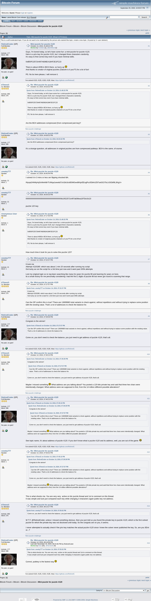

# Mini-puzzle for puzzle #120

[Original thread](https://bitcointalk.org/index.php?topic=5513047), posted by RetiredCoder at 2024-10-14 13:48:32 UTC as [msg64633165](https://bitcointalk.org/index.php?topic=5513047.msg64633165#msg64633165). The `sourceUrl` of the [mini/120 record](../../../src/collections/mini/120.ts), the source of both hints and of the published key, which sneeky777 posted at 18:59:33 UTC. The prize address is not printed: the post names puzzle #120 and says the BCH is there. The thread is one page of 14 posts, and every one of them is below.

## Historical provenance

The Wayback Machine holds a [capture of the thread](https://web.archive.org/web/20250830144758/https://bitcointalk.org/index.php?topic=5513047), stamped August 30, 2025, 14:47:58, and one of the `.msg64633165` URL from October 9, 2025. The `id_` body of the first was read on September 26, 2026: the same 14 posts, each one matching this transcript word for word once whitespace is normalized. `archive_content: confirmed` on that basis. RetiredCoder's last post carries an edit stamped November 15, 2024, 20:23:46, a month after the solve; the capture shows the same text.

The screenshot is a headless Chromium render of the live thread on September 26, 2026, 1100 pixels wide and trimmed to the forum's frame. The transcript comes from the same pages' HTML through a parser, one entry per post with its author, its UTC time and its message link. Quoted posts are nested quotes, emoticons are their names in brackets, and forum signatures are left out.

## Transcript

> Guys, I'm bored today, so let's have some fun: a mini-puzzle for puzzle #120.
> Here is a priv key for puzzle #120, but I changed three characters randomly.
> It's easy to find correct key even if you have minimal skills.
> 0xB50F22572A497A836EA18AF2E1FC23
> There is about 400$ in BCH there, so hurry up [Wink]
> And thanks to creator of original puzzles (Satoshi is it you??) for a lot of fun!
> PS. No bs here please, I will remove it.

## Comments

**kTimesG**, 2024-10-14 16:33:32 UTC, [msg64633713](https://bitcointalk.org/index.php?topic=5513047.msg64633713#msg64633713):

> **Quote from: RetiredCoder on October 14, 2024, 01:48:32 PM**
>
> > Guys, I'm bored today, so let's have some fun: a mini-puzzle for puzzle #120.
> > Here is a priv key for puzzle #120, but I changed three characters randomly.
> > It's easy to find correct key even if you have minimal skills.
> > 0xB50F22572A497A836EA18AF2E1FC23
> > There is about 400$ in BCH there, so hurry up [Wink]
> > And thanks to creator of original puzzles (Satoshi is it you??) for a lot of fun!
> > PS. No bs here please, I will remove it.
>
> Are the BCH addresses compressed (from compressed pub key)?

**RetiredCoder**, 2024-10-14 16:58:32 UTC, [msg64633797](https://bitcointalk.org/index.php?topic=5513047.msg64633797#msg64633797):

> **Quote from: kTimesG on October 14, 2024, 04:33:32 PM**
>
> > Are the BCH addresses compressed (from compressed pub key)?
>
> It's a strange question, all addresses in original puzzles are from compressed pubkeys. BCH is the same, of course.

**sneeky777**, 2024-10-14 18:45:44 UTC, [msg64634093](https://bitcointalk.org/index.php?topic=5513047.msg64634093#msg64634093):

> I solved it in 3 mins or less am flipping shocked tbh.
> INynpi2HhMyHy5nWwN8rTUWqaJuewitd7zA2bUtzvBSMGwvBKip/EEogPcc0DbhUZ67ukrDCIToLUOObf9L3KgU=

**sneeky777**, 2024-10-14 18:59:33 UTC, [msg64634120](https://bitcointalk.org/index.php?topic=5513047.msg64634120#msg64634120):

> 0000000000000000000000000000000000b10f22572c497a836ea187f2e1fc23
> puzzle 120 key

**Anonymous User**, 2024-10-14 19:17:00 UTC, [msg64634171](https://bitcointalk.org/index.php?topic=5513047.msg64634171#msg64634171):

> **Quote from: RetiredCoder on October 14, 2024, 01:48:32 PM**
>
> > Guys, I'm bored today, so let's have some fun: a mini-puzzle for puzzle #120.
> > Here is a priv key for puzzle #120, but I changed three characters randomly.
> > It's easy to find correct key even if you have minimal skills.
> > 0xB50F22572A497A836EA18AF2E1FC23
> > There is about 400$ in BCH there, so hurry up [Wink]
> > And thanks to creator of original puzzles (Satoshi is it you??) for a lot of fun!
> > PS. No bs here please, I will remove it.
>
> How much time it took for you to solve this puzzle 120?

**sneeky777**, 2024-10-14 19:22:37 UTC, [msg64634188](https://bitcointalk.org/index.php?topic=5513047.msg64634188#msg64634188):

> It took me
> Attempt #220285: which was about 1 min 20 seconds after running my script.
> Got lucky as run the script for a 3rd time just now and it went past 300k attempts
> Lost my original login so re reg been searching like many for years for puzzle 66 and learning for years on here.
> its a small victory for me personally considering i had the first 2 digits of puzzle 66 but never got round to scanning that range.

**kTimesG**, 2024-10-14 19:27:57 UTC, [msg64634203](https://bitcointalk.org/index.php?topic=5513047.msg64634203#msg64634203):

> **Quote from: sneeky777 on October 14, 2024, 07:22:37 PM**
>
> > It took me
> > Attempt #220285: which was about 1 min 20 seconds after running my script.
> > Got lucky as run the script for a 3rd time just now and it went past 300k attempts
>
> Can the OP confirm this is true? There are 13699680 total variants to check against, without repetitions and without trying to replace some position with the existing value. That's a lot of addresses to check the balance for.

**RetiredCoder**, 2024-10-14 19:39:39 UTC, [msg64634242](https://bitcointalk.org/index.php?topic=5513047.msg64634242#msg64634242):

> Congrats to the winner!
> **Quote from: kTimesG on October 14, 2024, 07:27:57 PM**
>
> > Can the OP confirm this is true? There are 13699680 total variants to check against, without repetitions and without trying to replace some position with the existing value. That's a lot of addresses to check the balance for.
>
> Come on, you don't need to check the balance, you just need to get address of puzzle #120, that's all.

**kTimesG**, 2024-10-14 19:45:10 UTC, [msg64634259](https://bitcointalk.org/index.php?topic=5513047.msg64634259#msg64634259):

> **Quote from: RetiredCoder on October 14, 2024, 07:39:39 PM**
>
> > Congrats to the winner!
> > **Quote from: kTimesG on October 14, 2024, 07:27:57 PM**
> >
> > > Can the OP confirm this is true? There are 13699680 total variants to check against, without repetitions and without trying to replace some position with the existing value. That's a lot of addresses to check the balance for.
> >
> > Come on, you don't need to check the balance, you just need to get address of puzzle #120, that's all.
>
> Maybe I missed something [Smiley] What address are you talking about? You posted a 120-bits private key and said that three hex chars were intentionally changed. What address were we supposed to find, from the 14 million different possible alterations?

**RetiredCoder**, 2024-10-14 19:46:10 UTC, [msg64634261](https://bitcointalk.org/index.php?topic=5513047.msg64634261#msg64634261):

> **Quote from: kTimesG on October 14, 2024, 07:45:10 PM**
>
> > **Quote from: RetiredCoder on October 14, 2024, 07:39:39 PM**
> >
> > > Congrats to the winner!
> > > **Quote from: kTimesG on October 14, 2024, 07:27:57 PM**
> > >
> > > > Can the OP confirm this is true? There are 13699680 total variants to check against, without repetitions and without trying to replace some position with the existing value. That's a lot of addresses to check the balance for.
> > >
> > > Come on, you don't need to check the balance, you just need to get address of puzzle #120, that's all.
> >
> > Maybe I missed something [Smiley] What address are you talking about? You posted a 120-bits private key and said that three hex chars were intentionally changed. What address were we supposed to find, from the 14 million different possible alterations?
>
> See topic name, it's about address of puzzle #120. If you don't know what is puzzle #120 and its address, well, you are out of the game [Grin]

**sneeky777**, 2024-10-14 19:55:02 UTC, [msg64634289](https://bitcointalk.org/index.php?topic=5513047.msg64634289#msg64634289):

> **Quote from: kTimesG on October 14, 2024, 07:45:10 PM**
>
> > **Quote from: RetiredCoder on October 14, 2024, 07:39:39 PM**
> >
> > > Congrats to the winner!
> > > **Quote from: kTimesG on October 14, 2024, 07:27:57 PM**
> > >
> > > > Can the OP confirm this is true? There are 13699680 total variants to check against, without repetitions and without trying to replace some position with the existing value. That's a lot of addresses to check the balance for.
> > >
> > > Come on, you don't need to check the balance, you just need to get address of puzzle #120, that's all.
> >
> > Maybe I missed something [Smiley] What address are you talking about? You posted a 120-bits private key and said that three hex chars were intentionally changed. What address were we supposed to find, from the 14 million different possible alterations?
>
> This is what shocks me. You are very very active on btc puzzle thread and 1st to comment on this thread.
> It was simple and luck just compared each key while changing 3 characters again public key not address.

**kTimesG**, 2024-10-14 20:13:27 UTC, [msg64634344](https://bitcointalk.org/index.php?topic=5513047.msg64634344#msg64634344):

> **Quote from: sneeky777 on October 14, 2024, 07:55:02 PM**
>
> > Come on, you don't need to check the balance, you just need to get address of puzzle #120, that's all.
>
> W T F. @RetiredCoder, unless I missed something obvious, then you just told us you found the private key to puzzle #120, which is the first solved puzzle for which the private key was not disclosed until today. So the congrats are on you, it seems.
> I never attempted to actually check if the priv key matches the actual puzzle #120 since I knew the solver never published the key. So, are you 3Emi or...?

**RetiredCoder**, 2024-10-14 20:14:09 UTC, [msg64634346](https://bitcointalk.org/index.php?topic=5513047.msg64634346#msg64634346), edited 2024-11-15 20:23:46 UTC:

> **Quote from: sneeky777 on October 14, 2024, 07:55:02 PM**
>
> > This is what shocks me. You are very very active on btc puzzle thread and 1st to comment on this thread.
> > It was simple and luck just compared each key while changing 3 characters again public key not address.
>
> Correct, pubkey is the fastest way [Smiley]
