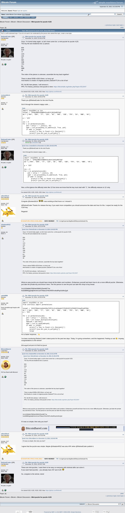

# Mini-puzzle for puzzle #125

[Original thread](https://bitcointalk.org/index.php?topic=5518896), posted by RetiredCoder at 2024-11-14 13:45:25 UTC as [msg64739119](https://bitcointalk.org/index.php?topic=5518896.msg64739119#msg64739119). The `sourceUrl` of the [mini/2 record](../../../src/collections/mini/2.ts), the source of its hint and of the published key and WIF, which AbadomRSZ posted at 22:21:24 UTC, and of the [author record](../../../src/collections/mini.ts)'s fact about what mini-puzzles are for. The prize address is not printed: the post names puzzle #125. The thread is one page of 9 posts, and every one of them is below.

## Historical provenance

The Wayback Machine holds a [capture of the thread](https://web.archive.org/web/20250830143820/https://bitcointalk.org/index.php?topic=5518896), stamped August 30, 2025, 14:38:20, and two of single message URLs from December 13, 2024 and February 18, 2025. The `id_` body of the first was read on September 26, 2026: the same 9 posts, each one matching this transcript word for word once whitespace is normalized. `archive_content: confirmed` on that basis.

The screenshot is a headless Chromium render of the live thread on September 26, 2026, 1100 pixels wide and trimmed to the forum's frame. The transcript comes from the same pages' HTML through a parser, one entry per post with its author, its UTC time and its message link. Quoted posts are nested quotes, emoticons are their names in brackets, and forum signatures are left out.



## Transcript

> Guys, I'm bored today again, so let's have some fun: a mini-puzzle for puzzle #125.
> The key fell and shattered into 12 pieces:
> 804
> E09
> 77
> 1C5
> 225
> AC
> 960
> 33B
> 7F0
> E4
> 6BB
> 48
> The order of the pieces is unknown, assemble the key back together!
> There is about 500$ in BCH there, so hurry up!
> And thanks to creator of original puzzles (Satoshi??) for a lot of fun!
> PS. No BS here please, I will remove it.
> PPS. For history, previous mini-puzzle is here: https://bitcointalk.org/index.php?topic=5513047

## Comments

**iceland2k14**, 2024-11-14 15:45:33 UTC, [msg64739765](https://bitcointalk.org/index.php?topic=5518896.msg64739765#msg64739765):

> Thank you @RetiredCoder for the mini Puzzle.
> Got it through the slowest crappy code.....
> **Code:**
>
> ```text
> import secp256k1 as ice
> target = '1PXAyUB8ZoH3WD8n5zoAthYjN15yN5CVq5'
> dd = ['804', 'E09', '77', '225', 'AC', '960', '33B', '7F0', 'E4', '6BB', '48']
> p = '1C5'
> inc = 0
> for i in permutations(dd):
>     pvk = int(p + ''.join(i), 16)
>     addr = ice.privatekey_to_address(0, True, pvk)
>     if addr == target:
>         print(f'== Key is Found ==\n {hex(pvk)}')
>         print(f'{ice.btc_pvk_to_wif(pvk)}')
> ```

**RetiredCoder**, 2024-11-14 15:51:42 UTC, [msg64739795](https://bitcointalk.org/index.php?topic=5518896.msg64739795#msg64739795):

> **Quote from: iceland2k14 on November 14, 2024, 03:45:33 PM**
>
> > Thank you @RetiredCoder for the mini Puzzle.
> > Got it through the slowest crappy code.....
> > **Code:**
> >
> > ```text
> > import secp256k1 as ice
> > target = '1PXAyUB8ZoH3WD8n5zoAthYjN15yN5CVq5'
> > dd = ['804', 'E09', '77', '225', 'AC', '960', '33B', '7F0', 'E4', '6BB', '48']
> > p = '1C5'
> > inc = 0
> > for i in permutations(dd):
> >     pvk = int(p + ''.join(i), 16)
> >     addr = ice.privatekey_to_address(0, True, pvk)
> >     if addr == target:
> >         print(f'== Key is Found ==\n {hex(pvk)}')
> >         print(f'{ice.btc_pvk_to_wif(pvk)}')
> > ```
>
> Nice, at first glance the difficulty looks like 12! but since we know that the key must start with "1", the difficulty reduces to 11! only.

**albert0bsd**, 2024-11-14 21:43:36 UTC, [msg64741133](https://bitcointalk.org/index.php?topic=5518896.msg64741133#msg64741133):

> Congrats @iceland2k14 [Grin] [Grin] I was working at that hours so I missed it.
> @RetiredCoder Thanks for release the key, if you want more competition you should announce the date and hour for this. I expect be ready for the #130 key.
> Regards!

**AbadomRSZ**, 2024-11-14 22:21:24 UTC, [msg64741259](https://bitcointalk.org/index.php?topic=5518896.msg64741259#msg64741259):

> **Quote from: RetiredCoder on November 14, 2024, 01:45:25 PM**
>
> > Guys, I'm bored today again, so let's have some fun: a mini-puzzle for puzzle #125.
> > The key fell and shattered into 12 pieces:
> > 804
> > E09
> > 77
> > 1C5
> > 225
> > AC
> > 960
> > 33B
> > 7F0
> > E4
> > 6BB
> > 48
> > The order of the pieces is unknown, assemble the key back together!
> > There is about 500$ in BCH there, so hurry up!
> > And thanks to creator of original puzzles (Satoshi??) for a lot of fun!
> > PS. No BS here please, I will remove it.
> > PPS. For history, previous mini-puzzle is here: https://bitcointalk.org/index.php?topic=5513047
>
> What an easy puzzle you should have mixed all the letters and numbers. Embarrass yourself and learn how to do a more difficult puzzle. Otherwise, just take the private key and throw it here. The first person to see the post can take this shop to buy bread.
> 0x1c533b6bb7f0804e09960225e44877ac
> KwDiBf89QgGbjEhKnhXJuH7Nbdz1FhKePEPcr4to6PqoSc6KxQy6

**zahid888**, 2024-11-14 22:26:24 UTC, [msg64741272](https://bitcointalk.org/index.php?topic=5518896.msg64741272#msg64741272):

> **Code:**
>
> ```text
> import secp256k1 as ice
> from itertools import permutations
> target = '0233709eb11e0d4439a729f21c2c443dedb727528229713f0065721ba8fa46f00e'
> dd = ['804', 'E09', '77', '225', 'AC', '960', '33B', '7F0', 'E4', '6BB', '48']
> p = '1C5'
> for i in permutations(dd):
>     pvk = int(p + ''.join(i), 16)
>     pub = ice.scalar_multiplication(pvk)
>     addrpub = pub.hex()
>     addr = ice.to_cpub(addrpub)
>     if addr == target:
>         print(f'== Key is Found ==\n {hex(pvk)}')
>         print(f'{ice.btc_pvk_to_wif(pvk)}')
>         break
> ```
>
> For a faster response... 👆
> I’ve been monitoring Retired Coder's latest posts for the past two days. Today, I’m going somewhere, and this happened. Feeling so sad 😢. Anyway, congratulations to the winner!

**BitcoinBarrel**, 2024-11-14 22:29:03 UTC, [msg64741280](https://bitcointalk.org/index.php?topic=5518896.msg64741280#msg64741280):

> **Quote from: AbadomRSZ on November 14, 2024, 10:21:24 PM**
>
> > **Quote from: RetiredCoder on November 14, 2024, 01:45:25 PM**
> >
> > > Guys, I'm bored today again, so let's have some fun: a mini-puzzle for puzzle #125.
> > > The key fell and shattered into 12 pieces:
> > > 804
> > > E09
> > > 77
> > > 1C5
> > > 225
> > > AC
> > > 960
> > > 33B
> > > 7F0
> > > E4
> > > 6BB
> > > 48
> > > The order of the pieces is unknown, assemble the key back together!
> > > There is about 500$ in BCH there, so hurry up!
> > > And thanks to creator of original puzzles (Satoshi??) for a lot of fun!
> > > PS. No BS here please, I will remove it.
> > > PPS. For history, previous mini-puzzle is here: https://bitcointalk.org/index.php?topic=5513047
> >
> > What an easy puzzle you should have mixed all the letters and numbers. Embarrass yourself and learn how to do a more difficult puzzle. Otherwise, just take the private key and throw it here. The first person to see the post can take this shop to buy bread.
> > 0x1c533b6bb7f0804e09960225e44877ac
> > KwDiBf89QgGbjEhKnhXJuH7Nbdz1FhKePEPcr4to6PqoSc6KxQy6
>
> If it was so simple, then why you lose?

**albert0bsd**, 2024-11-14 22:47:05 UTC, [msg64741326](https://bitcointalk.org/index.php?topic=5518896.msg64741326#msg64741326):

> **Quote from: BitcoinBarrel on November 14, 2024, 10:29:03 PM**
>
> > If it was so simple, then why you lose?
>
> I agree that the puzzle was simple, Maybe @AbadomRSZ was also AFK when @RetiredCoder publish it.

**RetiredCoder**, 2024-11-15 05:54:57 UTC, [msg64741927](https://bitcointalk.org/index.php?topic=5518896.msg64741927#msg64741927):

> These are mini-puzzles, I want them to be easy so everyone with minimal skills can solve it.
> If you want hard puzzles - you already have #67 and #135 [Wink]
> So, congrats to the winner, done!
