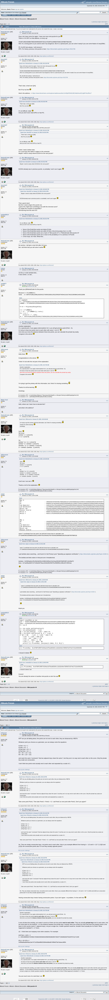

# Mini-puzzle #4

[Original thread](https://bitcointalk.org/index.php?topic=5526453), posted by RetiredCoder at 2025-01-14 17:22:30 UTC as [msg64953111](https://bitcointalk.org/index.php?topic=5526453.msg64953111#msg64953111). The `sourceUrl` of the [mini/4 record](../../../src/collections/mini/4.ts) and the source of its three hints, of the author's explanation that is the first hint's answer, and of the key, which iceland2k14 posted at 12:09:39 UTC on January 15 and the author called correct. The post prints only the public key; llenn1227 printed the address a minute later. The thread runs two pages, 26 posts, and every one of them is below.

## Historical provenance

The Wayback Machine holds a [capture of page 1](https://web.archive.org/web/20250830150658/https://bitcointalk.org/index.php?topic=5526453), stamped August 30, 2025, 15:06:58, and a [capture of page 2](https://web.archive.org/web/20250607142437/https://bitcointalk.org/index.php?topic=5526453.20), stamped June 7, 2025, 14:24:37, besides single message URLs from January and February 2025. The `id_` bodies of both pages were read on September 26, 2026: the same 26 posts as here, each one matching this transcript word for word once whitespace is normalized. `archive_content: confirmed` on that basis.

The screenshot is a headless Chromium render of the live thread on September 26, 2026, 1100 pixels wide and trimmed to the forum's frame, its two pages stacked in order. The transcript comes from the same pages' HTML through a parser, one entry per post with its author, its UTC time and its message link. Quoted posts are nested quotes, emoticons are their names in brackets, and forum signatures are left out.



## Transcript

> Guys, let's have some fun again, I have one more mini-puzzle for you [Smiley]
> There is 0.01 BTC on that address, so hurry up!
> 03C8F139DAD58B4786D3649992849733C2A7626F011089E87508CCDF8B0758C493
> Hint: It's a strong point so you cannot solve it by kangaroos. But it's a special point, you can solve it easily if you use some feature of secp256k1.
> PS. No BS here please, I will remove it.
> PPS. For history, previous mini-puzzle is here: https://bitcointalk.org/index.php?topic=5522785

## Comments

**llenn1227**, 2025-01-14 17:23:52 UTC, [msg64953113](https://bitcointalk.org/index.php?topic=5526453.msg64953113#msg64953113):

> **Quote from: RetiredCoder on January 14, 2025, 05:22:30 PM**
>
> > Guys, let's have some fun again, I have one more mini-puzzle for you [Smiley]
> > There is 0.01 BTC on that address, so hurry up!
> > 03C8F139DAD58B4786D3649992849733C2A7626F011089E87508CCDF8B0758C493
> > Hint: It's a strong point so you cannot solve it by kangaroos. But it's a special point, you can solve it easily if you use some feature of secp256k1.
> > PS. No BS here please, I will remove it.
> > PPS. For history, previous mini-puzzle is here: https://bitcointalk.org/index.php?topic=5522785
>
> That's Sad, a hard one QAQ
> But i'll try my best [Cheesy]
> Here's the address - > https://www.blockchain.com/explorer/addresses/btc/1AH5pRZW4ZofEJhdb3muNZ1q88YNu3Rez7

**RetiredCoder**, 2025-01-14 17:26:13 UTC, [msg64953121](https://bitcointalk.org/index.php?topic=5526453.msg64953121#msg64953121):

> **Quote from: llenn1227 on January 14, 2025, 05:23:52 PM**
>
> > That's Sad, a hard one QAQ
> > But i'll try my best [Cheesy]
>
> It's not difficult, really [Wink]
> And you don't even need GPUs or fast PC.

**llenn1227**, 2025-01-14 17:30:19 UTC, [msg64953132](https://bitcointalk.org/index.php?topic=5526453.msg64953132#msg64953132), edited 2025-01-14 18:31:28 UTC:

> **Quote from: RetiredCoder on January 14, 2025, 05:26:13 PM**
>
> > **Quote from: llenn1227 on January 14, 2025, 05:23:52 PM**
> >
> > > That's Sad, a hard one QAQ
> > > But i'll try my best [Cheesy]
> >
> > It's not difficult, really [Wink]
> > And you don't even need GPUs or fast PC.
>
> I think i need a better brain.
> For a pool guy who failed 4 subject in this semester.
> Maybe I need to study whole ECDSA for the next puzzle?

**RetiredCoder**, 2025-01-14 18:58:05 UTC, [msg64953401](https://bitcointalk.org/index.php?topic=5526453.msg64953401#msg64953401):

> **Quote from: llenn1227 on January 14, 2025, 05:30:19 PM**
>
> > Maybe I need to study whole ECDSA for the next puzzle?
>
> ECDSA already was in previous puzzle, so probably I won't use it again [Smiley]

**llenn1227**, 2025-01-14 19:02:25 UTC, [msg64953411](https://bitcointalk.org/index.php?topic=5526453.msg64953411#msg64953411):

> **Quote from: RetiredCoder on January 14, 2025, 06:58:05 PM**
>
> > **Quote from: llenn1227 on January 14, 2025, 05:30:19 PM**
> >
> > > Maybe I need to study whole ECDSA for the next puzzle?
> >
> > ECDSA already was in previous puzzle, so probably I won't use it again [Smiley]
>
> That a good news!
> But first i need to figure this puzzle out.
> I guess this might have something to do with the mirrored curve?
> Or maybe the constant of secp256k1?
> Still learning how this work Orz

**iceland2k14**, 2025-01-15 05:30:51 UTC, [msg64954587](https://bitcointalk.org/index.php?topic=5526453.msg64954587#msg64954587):

> **Quote from: RetiredCoder on January 14, 2025, 05:26:13 PM**
>
> > It's not difficult, really [Wink]
> > And you don't even need GPUs or fast PC.
>
> None of the Endo/Sym points are below 53 bitsNone of the Endo/Sym points are within 30 bits of the bit boundary from 1 to 256None of the Endo/Sym points are a hash of "Mini-puzzle #4" or "RetiredCoder Mini-puzzle #4"None of the Endo/Sym points are a close to the privatekey or K or previous #3 PuzzleC'mon Guys. do it fast. What else...

**RetiredCoder**, 2025-01-15 06:15:12 UTC, [msg64954659](https://bitcointalk.org/index.php?topic=5526453.msg64954659#msg64954659):

> No worries, I will give a new hint after 24 hours.
> But I still think that you will solve it earlier [Smiley]

**hskun**, 2025-01-15 09:02:56 UTC, [msg64955092](https://bitcointalk.org/index.php?topic=5526453.msg64955092#msg64955092):

> not the p n endo lambda beta...
> it was solved...so sad...

**ukn9977**, 2025-01-15 09:44:00 UTC, [msg64955173](https://bitcointalk.org/index.php?topic=5526453.msg64955173#msg64955173):

> Thank you @RetiredCoder for the puzzle.
> Because: k = k*LAMBDA+1
> Solve : k = 89767419612596129250022730500283612052200928704544131917942315608641440322898
> **Code:**
>
> ```text
> # sagemath
> N = 115792089237316195423570985008687907852837564279074904382605163141518161494337
> LAMBDA = 37718080363155996902926221483475020450927657555482586988616620542887997980018
> R.<k> = PolynomialRing(GF(N))
> # k = k*LAMBDA+1
> r = (k -  (k*LAMBDA+1)).roots()
> for x in r:
>     print("k = ", x[0])
> #k =  89767419612596129250022730500283612052200928704544131917942315608641440322898
> ```

**RetiredCoder**, 2025-01-15 10:27:05 UTC, [msg64955287](https://bitcointalk.org/index.php?topic=5526453.msg64955287#msg64955287):

> Another explanation:
> It's a special point, if you apply endomorphism for it, you will get previous point (Point - G).
> It's funny to have two points next to each other with same Y, isn't it? [Smiley]
> And since you know the distance between these two points, you can calculate the private key easily.
> Congrats to the winner! [Smiley]

**JDScreesh**, 2025-01-15 10:54:56 UTC, [msg64955362](https://bitcointalk.org/index.php?topic=5526453.msg64955362#msg64955362):

> Hello there [Smiley]
> Congratulations to the winner [Wink]
> I think I'm lost with this red part of the explanation:
> **Quote from: RetiredCoder on January 15, 2025, 10:27:05 AM**
>
> > Another explanation:
> > It's a special point, if you apply endomorphism for it, you will get previous point (Point - G).
> > It's funny to have two points next to each other with same Y, isn't it? [Smiley]
> > And since you know the distance between these two points, you can calculate the private key easily.
> > Congrats to the winner! [Smiley]
>
> I'm trying to get the privkey with this information, but I think I'm missing something [Huh]
> Thanks for all the learning [Smiley]
> Greetings.

**Major Azul**, 2025-01-15 11:00:41 UTC, [msg64955375](https://bitcointalk.org/index.php?topic=5526453.msg64955375#msg64955375):

> hello, where can I learn how to decode this?
> and what is the address?

**RetiredCoder**, 2025-01-15 11:06:49 UTC, [msg64955392](https://bitcointalk.org/index.php?topic=5526453.msg64955392#msg64955392):

> **Quote from: JDScreesh on January 15, 2025, 10:54:56 AM**
>
> > I'm trying to get the privkey with this information, but I think I'm missing something [Huh]
> > Thanks for all the learning [Smiley]
> > Greetings.
>
> Sure! [Cheesy]
> We know:
> lambda * x = a [mod N]
> x = a + 1 [mod N]
> So:
> lambda * (a + 1) = a [mod N]
> lambda * a + lambda = a [mod N]
> (lambda - 1) * a + lambda = 0 [mod N]
> a = -lambda / (lambda - 1) [mod N]

**JDScreesh**, 2025-01-15 11:19:18 UTC, [msg64955423](https://bitcointalk.org/index.php?topic=5526453.msg64955423#msg64955423):

> **Quote from: RetiredCoder on January 15, 2025, 11:06:49 AM**
>
> > Sure! [Cheesy]
> > We know:
> > lambda * x = a [mod N]
> > x = a + 1 [mod N]
> > So:
> > lambda * (a + 1) = a [mod N]
> > lambda * a + lambda = a [mod N]
> > (lambda - 1) * a + lambda = 0 [mod N]
> > a = -lambda / (lambda - 1) [mod N]
>
> Cool! now I can see it [Grin]
> Thanks a lot for the explanation [Wink]

**mjojo**, 2025-01-15 11:34:12 UTC, [msg64955457](https://bitcointalk.org/index.php?topic=5526453.msg64955457#msg64955457):

> **Code:**
>
> ```text
> DBL 0:
> a0                               : 28656494787849788178846280232722535366602610135464471548693628842033875030774 Y
> a1                               : 64085527874626556120582535604906191133993776464141088401876389432686378436844 N
> Lam Numerator                    : 24451327812764160469375732394646891906403158240170826054096020762142281864872 Y
> Lam Denominator                  : 12378966511936916817594086201124474414717568262641612764295194857463922202025 Y
> Result Lam                       : 90164811066602240685525910245268168444406468821116643963079939878016814643363 N
> Modular Inverse                  : 73354833296120792775670026364214776218043641652330273932372744839188764773793 Y
> Result X                         : 90888779158563823146755473862282102363969308959424961308149641532476281635987 Y
> Result Y                         : 46201727910540285190454324890558278619756708117972953873730558795650959119923 N
> DBL 1:
> a0                               : 104403551840626474953376424551165765467561720381305370579875450682007898015831 Y
> a1                               : 64085527874626556120582535604906191133993776464141088401876389432686378436844 N
> Lam Numerator                    : 87957283359521357687061983675423052553526169065692381021112082220578186202170 N
> Lam Denominator                  : 12378966511936916817594086201124474414717568262641612764295194857463922202025 Y
> Result Lam                       : 94165601948352868544180331085494877662307814315103203626908763534409097566489 N
> Modular Inverse                  : 73354833296120792775670026364214776218043641652330273932372744839188764773793 Y
> Result X                         : 23620854997921501804136411791104769986833072451863613446092941013256551136065 Y
> Result Y                         : 46201727910540285190454324890558278619756708117972953873730558795650959119923 N
> ```
>
> same Y coordinate from two point, but still don't know how to calculate Lam 37718080363155996902926221483475020450927657555482586988616620542887997980018

**JDScreesh**, 2025-01-15 11:48:54 UTC, [msg64955486](https://bitcointalk.org/index.php?topic=5526453.msg64955486#msg64955486):

> **Quote from: mjojo on January 15, 2025, 11:34:12 AM**
>
> > same Y coordinate from two point, but still don't know how to calculate Lam 37718080363155996902926221483475020450927657555482586988616620542887997980018
>
> I got lambda value searching... and found it in Hal Finney's post "Speeding up signature verification" ( https://bitcointalk.org/index.php?topic=3238.0 )
> The lambda and beta values in that post are in hexadecimal.
> lambda = 0x5363ad4cc05c30e0a5261c028812645a122e22ea20816678df02967c1b23bd72
> beta = 0x7ae96a2b657c07106e64479eac3434e99cf0497512f58995c1396c28719501ee
> [Smiley]

**mjojo**, 2025-01-15 12:01:50 UTC, [msg64955523](https://bitcointalk.org/index.php?topic=5526453.msg64955523#msg64955523):

> **Quote from: JDScreesh on January 15, 2025, 11:48:54 AM**
>
> > **Quote from: mjojo on January 15, 2025, 11:34:12 AM**
> >
> > > same Y coordinate from two point, but still don't know how to calculate Lam 37718080363155996902926221483475020450927657555482586988616620542887997980018
> >
> > I got lambda value searching... and found it in Hal Finney's post "Speeding up signature verification" ( https://bitcointalk.org/index.php?topic=3238.0 )
> > The lambda and beta values in that post are in hexadecimal.
> > lambda = 0x5363ad4cc05c30e0a5261c028812645a122e22ea20816678df02967c1b23bd72
> > beta = 0x7ae96a2b657c07106e64479eac3434e99cf0497512f58995c1396c28719501ee
> > [Smiley]
>
> thank you

**iceland2k14**, 2025-01-15 12:09:39 UTC, [msg64955544](https://bitcointalk.org/index.php?topic=5526453.msg64955544#msg64955544):

> **Code:**
>
> ```text
> import secp256k1 as ice
> pub = '03C8F139DAD58B4786D3649992849733C2A7626F011089E87508CCDF8B0758C493'
> lmda = 0x5363ad4cc05c30e0a5261c028812645a122e22ea20816678df02967c1b23bd72
> N = ice.N
> G = ice.scalar_multiplication(1)
> Q = ice.pub2upub(pub)   # pvk
> QE = ice.pub_endo1(Q)   # pvk * lmda % N
> QG = ice.point_subtraction( Q, G )  # pvk -1
> if QG == QE:    # pvk -1 = (pvk * lmda % N)
>     # pvk -1 = (pvk * lmda % N)
>     # pvk - pvk * lmda = 1 %N
>     # pvk (1 - lmda) = 1  %N
>     # pvk = 1 / (1 - lmda)  %N
>     print(f'[+] PrivateKey: {hex(pow((1-lmda), N-2, N))}')
> ```
>
> **Code:**
>
> ```text
> [+] PrivateKey: 0xc6768f199574104ae1b75eab82b0cc1d2d2e9ee7d50637a574e27131e9301552
> ```
>
> I missed it indeed. [Sad]

**RetiredCoder**, 2025-01-15 12:21:28 UTC, [msg64955584](https://bitcointalk.org/index.php?topic=5526453.msg64955584#msg64955584):

> **Quote from: iceland2k14 on January 15, 2025, 12:09:39 PM**
>
> > **Code:**
> >
> > ```text
> > [+] PrivateKey: 0xc6768f199574104ae1b75eab82b0cc1d2d2e9ee7d50637a574e27131e9301552
> > ```
> >
> > I missed it indeed. Sad
>
> Correct!
> You are already the winner of another mini-puzzle so don't be sad [Smiley]

**kTimesG**, 2025-01-15 15:02:19 UTC, [msg64956118](https://bitcointalk.org/index.php?topic=5526453.msg64956118#msg64956118), edited 2025-01-15 15:13:08 UTC:

> WTF are you all talking about, the points are not next to each other, they are distanced by x*BETA.
> Whatever point you choose as a generator, you can always solve the equations:
> k1*lam = k1 + 1
> k2*lam = k2 - 1
> k3*lam*lam = k3 + 1
> k4*lam*lam = k4 - 1
> k5 = -k5 + 1 (k = 1/2)
> k6 = -k6 - 1 (k = -1/2)
> and reach the same "conclusion" that two adjacent keys share the same Y, but they are in no way next to each other on the curve. Only the private key scalar are consecutive.
> I don't think two points exist actually next to each other and separated by a scalar of 1.

**RetiredCoder**, 2025-01-15 15:12:02 UTC, [msg64956159](https://bitcointalk.org/index.php?topic=5526453.msg64956159#msg64956159):

> **Quote from: kTimesG on January 15, 2025, 03:02:19 PM**
>
> > WTF are you all talking about, the points are not next to each other, they are distanced by x*BETA.
> > Whatever point you choose as a generator, you can always solve the equations:
> > k1*lam = k1 + 1
> > k2*lam = k2 - 1
> > k3*lam*lam = k3 + 1
> > k4*lam*lam = k4 - 1
> > and reach the same "conclusion" that two adjacent keys share the same Y, but they are in no way next to each other on the curve. Only the private key scalar are consecutive.
> > I don't think two points exist actually next to each other and separated by a scalar of 1.
>
> Take some point Point1. Then take Point2 = Point1 + G. I call Point2 as next point after Point1. Don't you agree?

**kTimesG**, 2025-01-15 15:16:30 UTC, [msg64956175](https://bitcointalk.org/index.php?topic=5526453.msg64956175#msg64956175):

> **Quote from: RetiredCoder on January 15, 2025, 03:12:02 PM**
>
> > **Quote from: kTimesG on January 15, 2025, 03:02:19 PM**
> >
> > > WTF are you all talking about, the points are not next to each other, they are distanced by x*BETA.
> > > Whatever point you choose as a generator, you can always solve the equations:
> > > k1*lam = k1 + 1
> > > k2*lam = k2 - 1
> > > k3*lam*lam = k3 + 1
> > > k4*lam*lam = k4 - 1
> > > and reach the same "conclusion" that two adjacent keys share the same Y, but they are in no way next to each other on the curve. Only the private key scalar are consecutive.
> > > I don't think two points exist actually next to each other and separated by a scalar of 1.
> >
> > Take some point Point1. Then take Point2 = Point1 + G. I call Point2 as next point after Point1. Don't you agree?
>
> No. They are simply consecutive keys, not points next to each other. How is you example different from having k = -1/2 and k = 1/2 ? [-1/2]G and [1/2]G are consecutive points also? Or are they actually opposite points?

**RetiredCoder**, 2025-01-15 15:31:52 UTC, [msg64956236](https://bitcointalk.org/index.php?topic=5526453.msg64956236#msg64956236):

> **Quote from: kTimesG on January 15, 2025, 03:16:30 PM**
>
> > **Quote from: RetiredCoder on January 15, 2025, 03:12:02 PM**
> >
> > > **Quote from: kTimesG on January 15, 2025, 03:02:19 PM**
> > >
> > > > WTF are you all talking about, the points are not next to each other, they are distanced by x*BETA.
> > > > Whatever point you choose as a generator, you can always solve the equations:
> > > > k1*lam = k1 + 1
> > > > k2*lam = k2 - 1
> > > > k3*lam*lam = k3 + 1
> > > > k4*lam*lam = k4 - 1
> > > > and reach the same "conclusion" that two adjacent keys share the same Y, but they are in no way next to each other on the curve. Only the private key scalar are consecutive.
> > > > I don't think two points exist actually next to each other and separated by a scalar of 1.
> > >
> > > Take some point Point1. Then take Point2 = Point1 + G. I call Point2 as next point after Point1. Don't you agree?
> >
> > No. They are simply consecutive keys, not points next to each other. How is you example different from having k = -1/2 and k = 1/2 ? [-1/2]G and [1/2]G are consecutive points also? Or are they actually opposite points?
>
> Having consecutive keys means having consecutive points. If you don't agree - no problem, I'm fine with that [Grin]

**kTimesG**, 2025-01-15 15:50:42 UTC, [msg64956301](https://bitcointalk.org/index.php?topic=5526453.msg64956301#msg64956301), edited 2025-01-15 16:05:03 UTC:

> **Quote from: RetiredCoder on January 15, 2025, 10:27:05 AM**
>
> > Another explanation:
> > It's a special point, if you apply endomorphism for it, you will get previous point (Point - G).
> > It's funny to have two points next to each other with same Y, isn't it? [Smiley]
> > And since you know the distance between these two points, you can calculate the private key easily.
>
> It was all about the wording, you made it sound as if there are two points next to each other. They are actually private keys next to each other. And the same goes for the distance - it is the distance between the private keys. Anyway, there are at least four keys that have the property which is the basis of your puzzle (same Y, adjacent keys), not just a single one. A better question would be: shouldn't there actually be 6 of them? What happened to lambda^3 = 1? Hmm.
> LE - I think there are maaaany more other solutions. For example:
> (k/2)*lam = (k/2) + 1
> k = 26024669624720066173548254508404295800636635574530772464662847532876721171439
> kG.y = (k+1)G.y =
> 0x99dabfaa9e4dac1be74714258a4f862f2694e9d6e6b74f9fe979a7ebeec465fc

**RetiredCoder**, 2025-01-15 16:04:42 UTC, [msg64956352](https://bitcointalk.org/index.php?topic=5526453.msg64956352#msg64956352):

> **Quote from: kTimesG on January 15, 2025, 03:50:42 PM**
>
> > **Quote from: RetiredCoder on January 15, 2025, 10:27:05 AM**
> >
> > > Another explanation:
> > > It's a special point, if you apply endomorphism for it, you will get previous point (Point - G).
> > > It's funny to have two points next to each other with same Y, isn't it? [Smiley]
> > > And since you know the distance between these two points, you can calculate the private key easily.
> >
> > It was all about the wording, you made it sound as if there are two points next to each other. They are actually private keys next to each other. And the same goes for the distance - it is the distance between the private keys. Anyway, there are at least four keys that have the property which is the basis of your puzzle (same Y, adjacent keys), not just a single one. A better question would be: shouldn't there actually be 6 of them? What happened to lambda^3 = 1? Hmm.
>
> You are much more of a nerd than I am [Cheesy]
