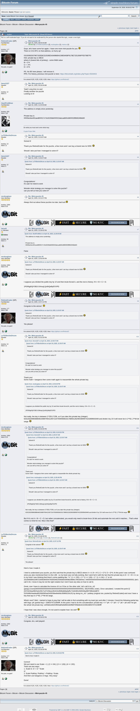

# Mini-puzzle #5

[Original thread](https://bitcointalk.org/index.php?topic=5538285), posted by RetiredCoder at 2025-04-16 08:03:44 UTC as [msg65283009](https://bitcointalk.org/index.php?topic=5538285.msg65283009#msg65283009). The `sourceUrl` of the [mini/5 record](../../../src/collections/mini/5.ts) and the source of its hint, of the author's confirmation that is the hint's answer, and of the key, which LeTH3knXoDArzm posted with the method at 13:45:28 UTC. The key HardFireMiner posted at 11:29:49 UTC does not match the public key. The post prints only the public key; mcdouglasx printed the address. The thread is one page of 14 posts, and every one of them is below.

## Historical provenance

The Wayback Machine holds two captures of the thread, stamped May 13, 2025 and [August 30, 2025, 14:43:59](https://web.archive.org/web/20250830144359/https://bitcointalk.org/index.php?topic=5538285). The `id_` body of the later one was read on September 26, 2026: the same 14 posts, each one matching this transcript word for word once whitespace is normalized. `archive_content: confirmed` on that basis.

The screenshot is a headless Chromium render of the live thread on September 26, 2026, 1100 pixels wide and trimmed to the forum's frame. The transcript comes from the same pages' HTML through a parser, one entry per post with its author, its UTC time and its message link. Quoted posts are nested quotes, emoticons are their names in brackets, and forum signatures are left out.

## Transcript

> Guys, let's have some fun again, I have one more mini-puzzle for you [Smiley]
> There is 0.01 BTC on that address, so hurry up!
> 03150992937967192EBCD2539E5A949689AC69E6458F9178E7251356FFE079B7F0
> Hint: private key is ABCD
> where A (lowest bits of privkey) - some 64bit value
> B = 2*A
> C = 3*A
> D = 4*A
> PS. No BS here please, I will remove it.
> PPS. For history, previous mini-puzzle is here: https://bitcointalk.org/index.php?topic=5526453

## Comments

**llenn1227**, 2025-04-16 09:36:44 UTC, [msg65283221](https://bitcointalk.org/index.php?topic=5538285.msg65283221#msg65283221):

> Yeah! Long time no see!
> Finally another fun puzzle
> Looking on it!

**HardFireMiner**, 2025-04-16 11:29:49 UTC, [msg65283495](https://bitcointalk.org/index.php?topic=5538285.msg65283495#msg65283495):

> The address is empty since yesterday.
> Private key is:
> 0000be3ee491aed800017c7dc9235db000023abcadb50c880002f8fb9246bb60

**LeTH3knXoDArzm**, 2025-04-16 11:33:07 UTC, [msg65283504](https://bitcointalk.org/index.php?topic=5538285.msg65283504#msg65283504):

> Solved it!
> Thank you RetiredCoder for the puzzle, a few more and I can buy a brand new rtx 5090 [Grin]
> Should I also put how I managed to solve it?

**llenn1227**, 2025-04-16 11:56:07 UTC, [msg65283574](https://bitcointalk.org/index.php?topic=5538285.msg65283574#msg65283574):

> **Quote from: LeTH3knXoDArzm on April 16, 2025, 11:33:07 AM**
>
> > Solved it!
> > Thank you RetiredCoder for the puzzle, a few more and I can buy a brand new rtx 5090 [Grin]
> > Should I also put how I managed to solve it?
>
> Congrulations!
> It's sad i've need to work
> Wonder what strategy you manage to solve this puzzle?
> can you tell us how you solve it?

**mcdouglasx**, 2025-04-16 12:31:57 UTC, [msg65283674](https://bitcointalk.org/index.php?topic=5538285.msg65283674#msg65283674):

> Always find out about these puzzles too late, bad luck [Cry]

**farou9**, 2025-04-16 12:39:42 UTC, [msg65283695](https://bitcointalk.org/index.php?topic=5538285.msg65283695#msg65283695):

> **Quote from: HardFireMiner on April 16, 2025, 11:29:49 AM**
>
> > The address is empty since yesterday.
> > Private key is:
> > 0000be3ee491aed800017c7dc9235db000023abcadb50c880002f8fb9246bb60
>
> False

**mcdouglasx**, 2025-04-16 12:55:49 UTC, [msg65283748](https://bitcointalk.org/index.php?topic=5538285.msg65283748#msg65283748):

> **Quote from: LeTH3knXoDArzm on April 16, 2025, 11:33:07 AM**
>
> > Solved it!
> > Thank you RetiredCoder for the puzzle, a few more and I can buy a brand new rtx 5090 [Grin]
> > Should I also put how I managed to solve it?
>
> I suppose you divided the public key by 10 and then brute-forced A, and the rest is history. If A + B + C + D.
> 1PGRtg6XjiYSB1VJAhsqLQc6hQeBqFGVPD

**RetiredCoder**, 2025-04-16 12:57:12 UTC, [msg65283750](https://bitcointalk.org/index.php?topic=5538285.msg65283750#msg65283750):

> Congrats to the winner! [Smiley]
> **Quote from: LeTH3knXoDArzm on April 16, 2025, 11:33:07 AM**
>
> > Solved it!
> > Thank you RetiredCoder for the puzzle, a few more and I can buy a brand new rtx 5090 [Grin]
> > Should I also put how I managed to solve it?
>
> Yes please!

**LeTH3knXoDArzm**, 2025-04-16 13:02:30 UTC, [msg65283762](https://bitcointalk.org/index.php?topic=5538285.msg65283762#msg65283762):

> **Quote from: llenn1227 on April 16, 2025, 11:56:07 AM**
>
> > **Quote from: LeTH3knXoDArzm on April 16, 2025, 11:33:07 AM**
> >
> > > Solved it!
> > > Thank you RetiredCoder for the puzzle, a few more and I can buy a brand new rtx 5090 [Grin]
> > > Should I also put how I managed to solve it?
> >
> > Congrulations!
> > It's sad i've need to work
> > Wonder what strategy you manage to solve this puzzle?
> > can you tell us how you solve it?
>
> Thank you!
> Some math + kangaroo then some math again to reassemble the whole private key.
> **Quote from: mcdouglasx on April 16, 2025, 12:55:49 PM**
>
> > **Quote from: LeTH3knXoDArzm on April 16, 2025, 11:33:07 AM**
> >
> > > Solved it!
> > > Thank you RetiredCoder for the puzzle, a few more and I can buy a brand new rtx 5090 [Grin]
> > > Should I also put how I managed to solve it?
> >
> > I suppose you divided the public key by 10 and then brute-forced A, and the rest is history. If A + B + C + D.
> > 1PGRtg6XjiYSB1VJAhsqLQc6hQeBqFGVPD
>
> Not really, the key is between 2^255-2^256, so if you take this private key (integer): 62522620898388648159897954119572167059065661617885912620603899974102669643449 and divide it by 10 it will never be in 2**63, 2**64 bit range [Grin]

**mcdouglasx**, 2025-04-16 13:04:35 UTC, [msg65283768](https://bitcointalk.org/index.php?topic=5538285.msg65283768#msg65283768):

> **Quote from: LeTH3knXoDArzm on April 16, 2025, 01:02:30 PM**
>
> > **Quote from: llenn1227 on April 16, 2025, 11:56:07 AM**
> >
> > > **Quote from: LeTH3knXoDArzm on April 16, 2025, 11:33:07 AM**
> > >
> > > > Solved it!
> > > > Thank you RetiredCoder for the puzzle, a few more and I can buy a brand new rtx 5090 [Grin]
> > > > Should I also put how I managed to solve it?
> > >
> > > Congrulations!
> > > It's sad i've need to work
> > > Wonder what strategy you manage to solve this puzzle?
> > > can you tell us how you solve it?
> >
> > Thank you!
> > Some math + kangaroo then some math again to reassemble the whole private key.
> > **Quote from: mcdouglasx on April 16, 2025, 12:55:49 PM**
> >
> > > **Quote from: LeTH3knXoDArzm on April 16, 2025, 11:33:07 AM**
> > >
> > > > Solved it!
> > > > Thank you RetiredCoder for the puzzle, a few more and I can buy a brand new rtx 5090 [Grin]
> > > > Should I also put how I managed to solve it?
> > >
> > > I suppose you divided the public key by 10 and then brute-forced A, and the rest is history. If A + B + C + D.
> > > 1PGRtg6XjiYSB1VJAhsqLQc6hQeBqFGVPD
> >
> > Not really, the key is between 2^255-2^256, so if you take this private key (integer): 62522620898388648159897954119572167059065661617885912620603899974102669643449 and divide it by 10 it will never be in 2**63, 2**64 bit range [Grin]
>
> But if it's not A + B + C + D, but rather concatenated, you would only need to brute-force 16 bits and automate the rest until it matches... That's what comes to mind for me. Was it like that?

**LeTH3knXoDArzm**, 2025-04-16 13:45:28 UTC, [msg65283923](https://bitcointalk.org/index.php?topic=5538285.msg65283923#msg65283923):

> **Quote from: RetiredCoder on April 16, 2025, 12:57:12 PM**
>
> > Congrats to the winner! [Smiley]
> > **Quote from: LeTH3knXoDArzm on April 16, 2025, 11:33:07 AM**
> >
> > > Solved it!
> > > Thank you RetiredCoder for the puzzle, a few more and I can buy a brand new rtx 5090 [Grin]
> > > Should I also put how I managed to solve it?
> >
> > Yes please!
>
> Here's how I made it:
> I tried to understand your puzzle, you first said that the private key is ABCD where A = A; B = A*2; C = C*3; D = D*4. At this point I was confused since you also mentioned that A is the LSB - so my brain was not fully working. But I went full in with the fact that the private key is D + C + B + A; so in my mind I was thinking that there's some padding like: "4 * (1 << 192) + 3 * (1 << 128) + 2 * (1 << 64) + 1" or int: 25108406941546723056364004793593481054836439088298861789185/hex: 04000000000000000300000000000000020000000000000001 (let's call it nG, I know it may be not the right notation but I don't have any idea on how to call it)
> Great, now I have to calculate the inverse of it so I'll be on 'the other side', let's call it inv_nG (gmpy2.invert(04000000000000000300000000000000020000000000000001, SECP256k1.order). Once calculated, I created the point Q' (047d234ae9820a3c0817cd7229eee4fc615c8586afb8a8af5c72d4280c084528ad987396cb4d872 5200d9b04added6530b9080ad2405f38ee6ebfdc35869233c20) by doing inv_nG * pubkey (original one, posted by RetiredCoded) and now I have a key that lays in 2**63, 2**64 bit range.
> What's next? Well, I started to hope & pray that I will be able to find something with my toast (pc) and after 2 minutes I found the following partial key with bsgs: pK (partial key) = 3380374721080fff. At this point I had to do the concatenation; private key = 4 * pK + 3 * pK + 2 * pK + pK and I've got the whole full private key: ce00dd1c84203ffc9a80a5d563182ffd67006e8e42101ffe3380374721080fff
> I hope that I was clear enough, I'm not used to explain how I do stuff [Smiley]

**mcdouglasx**, 2025-04-16 14:26:02 UTC, [msg65284053](https://bitcointalk.org/index.php?topic=5538285.msg65284053#msg65284053):

> Congrats, bro, well played!.

**RetiredCoder**, 2025-04-16 14:30:36 UTC, [msg65284065](https://bitcointalk.org/index.php?topic=5538285.msg65284065#msg65284065):

> **Quote from: LeTH3knXoDArzm on April 16, 2025, 01:45:28 PM**
>
> > Here's how I made it:
>
> Correct!
> We just need to use Scale = 1 | (2 << 64) | (3 << 128) | (4 << 192).
> There are two ways:
>
> 1. Scale G: G' = G * Scale
>    or
> 2. Scale PubKey: PubKey' = PubKey / Scale.
>    And then use kangaroo or bsgs. Very easy!
>    Done!
