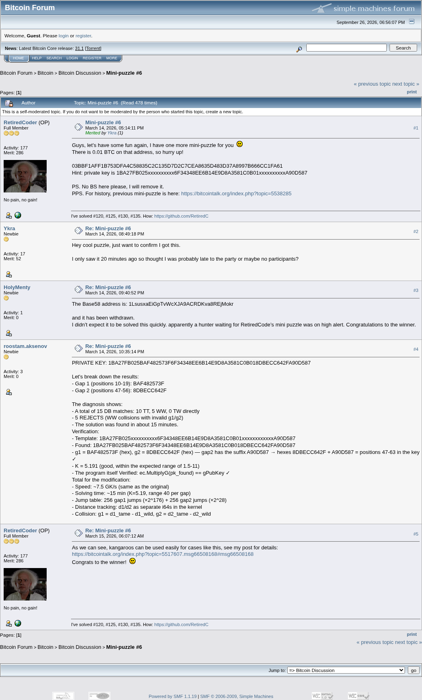

# Mini-puzzle #6

[Original thread](https://bitcointalk.org/index.php?topic=5577390), posted by RetiredCoder at 2026-03-14 17:14:11 UTC as [msg66508848](https://bitcointalk.org/index.php?topic=5577390.msg66508848#msg66508848). The `sourceUrl` of the [mini/6 record](../../../src/collections/mini/6.ts) and the source of its hint and of the key, which roostam.aksenov posted at 22:35:14 UTC as the hint's answer. The post prints only the public key and the key with two gaps; HolyMenty printed the address. The thread is one page of 5 posts, and every one of them is below.

## Historical provenance

The Wayback Machine holds one capture of the thread, [page 1](https://web.archive.org/web/20260926184129/https://bitcointalk.org/index.php?topic=5577390.0), stamped September 26, 2026, 18:41:29, the day this archive was made. CDX queries for `topic=5577390` and for the first post's message URL returned nothing, and MemGator knew no capture. The `id_` body was read on September 26, 2026: the same 5 posts, each one matching this transcript word for word once whitespace is normalized. `archive_content: confirmed` on that basis.

The screenshot is a headless Chromium render of the live thread on September 26, 2026, 1100 pixels wide and trimmed to the forum's frame. The transcript comes from the same pages' HTML through a parser, one entry per post with its author, its UTC time and its message link. Quoted posts are nested quotes, emoticons are their names in brackets, and forum signatures are left out.

## Transcript

> Guys, let's have some fun again, I have one more mini-puzzle for you [Smiley]
> There is 0.01 BTC on that address, so hurry up!
> 03BBF1AFF1B753DFA4C58835C2C135D7D2C7CEA8635D483D37A8997B666CC1FA61
> Hint: private key is 1BA27FB025xxxxxxxxxx6F34348EE6B14E9D8A3581C0B01xxxxxxxxxxA90D587
> PS. No BS here please, I will remove it.
> PPS. For history, previous mini-puzzle is here: https://bitcointalk.org/index.php?topic=5538285

## Comments

**Ykra**, 2026-03-14 20:49:18 UTC, [msg66509584](https://bitcointalk.org/index.php?topic=5577390.msg66509584#msg66509584):

> Hey cool puzzle, just want to confirm I got this.
> I only saw it 20 minutes ago so thought I was probably late to the party or maybe no participants?

**HolyMenty**, 2026-03-14 21:40:52 UTC, [msg66509797](https://bitcointalk.org/index.php?topic=5577390.msg66509797#msg66509797):

> The Base58 address is: 1LsusxaEiGpTvWcXJA9ACRDKva8REjMokr
> and it has been withdrawn.
> I didn’t expect it to be solved this quickly. apparently a hunter waiting for RetiredCode’s mini puzzle was on high alert. Congratulations to the winner.

**roostam.aksenov**, 2026-03-14 22:35:14 UTC, [msg66509998](https://bitcointalk.org/index.php?topic=5577390.msg66509998#msg66509998):

> PRIVATE KEY: 1BA27FB025BAF482573F6F34348EE6B14E9D8A3581C0B018DBECC642FA90D587
> Let's break down the results:
>
> - Gap 1 (positions 10-19): BAF482573F
> - Gap 2 (positions 47-56): 8DBECC642F
>   The diagnosis shows:
> - A total of 15 DB matches: 10 TT, 5 WW, 0 TW directly
> - 5 REJECTS (WW collisions with invalid g1/g2)
> - The solution was found in about 15 minutes.
>   Verification:
> - Template: 1BA27FB025xxxxxxxxxx6F34348EE6B14E9D8A3581C0B01xxxxxxxxxxxxA90D587
> - Found: 1BA27FB025BAF482573F6F34348EE6B14E9D8A3581C0B018DBECC642FA90D587
> - g1 = BAF482573F (hex), g2 = 8DBECC642F (hex) — gap2 has the suffix A90D587 → hexes 8DBECC642F + A90D587 = positions 47-63 in the key ✓
> - K = 5.191 (good, within the expected range of 1.5-11)
> - The program itself Verified: ec.MultiplyG(pk_found) == gPubKey ✓
>   Total for the modification:
> - Speed: ~7.5 GK/s (same as the original)
> - Solving time: ~15 min (K=5.19, range 40 per gap)
> - Jump table: 256 gap1 jumps (×2^176) + 256 gap2 jumps (×2^28)
> - Distance tracking: d1/d2 as separate i64s in the kernel
> - Collision: g1 = d1_tame - d1_wild, g2 = d2_tame - d2_wild

**RetiredCoder**, 2026-03-15 06:07:12 UTC, [msg66510658](https://bitcointalk.org/index.php?topic=5577390.msg66510658#msg66510658):

> As we can see, kangaroos can be used easily for cases like this, see my post for details:
> https://bitcointalk.org/index.php?topic=5517607.msg66508168#msg66508168
> Congrats to the winner! [Smiley]
