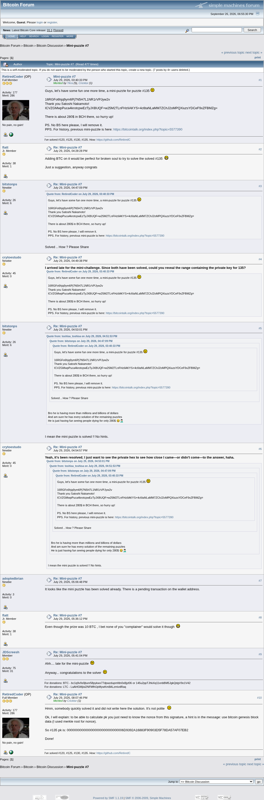

# Mini-puzzle #7

[Original thread](https://bitcointalk.org/index.php?topic=5589799), posted by RetiredCoder at 2026-07-29 15:40:33 UTC as [msg66991218](https://bitcointalk.org/index.php?topic=5589799.msg66991218#msg66991218). The `sourceUrl` of the [mini/7 record](../../../src/collections/mini/7.ts) and the source of its hint, of the author's explanation that is the hint's answer, and of the key of puzzle #135, printed in that explanation at 20:07:46 UTC. It is also where the [author record](../../../src/collections/mini.ts) takes the fact about that explanation. The post prints the #135 address, not the CashAddr. The thread is one page of 10 posts, and every one of them is below. The forum notes that 7 posts by 4 or more users were deleted; they are not in the live thread or the capture.

## Historical provenance

The Wayback Machine holds one capture of the thread, [stamped July 30, 2026, 13:32:11](https://web.archive.org/web/20260730133211/https://bitcointalk.org/index.php?topic=5589799), the day after it closed. Its `id_` body was read on September 26, 2026: the same 10 posts, each one matching this transcript word for word once whitespace is normalized. `archive_content: confirmed` on that basis.

The screenshot is a headless Chromium render of the live thread on September 26, 2026, 1100 pixels wide and trimmed to the forum's frame. The transcript comes from the same pages' HTML through a parser, one entry per post with its author, its UTC time and its message link. Quoted posts are nested quotes, emoticons are their names in brackets, and forum signatures are left out.

## Transcript

> Guys, let's have some fun one more time, a mini-puzzle for puzzle #135 [Smiley]
> 16RGFo6hjq9ym6Pj7N5H7L1NR1rVPJyw2v
> Thank you Satoshi Nakamoto!
> ICVZGMwpPuca4krotcpwEzTyJXBUQF+w25M2TLnFHzIiAKYS+4c6taNLaMM7ZChJ2oMPQXiuzsYDCeF9xZFBMZg=
> There is about 280$ in BCH there, so hurry up!
> PS. No BS here please, I will remove it.
> PPS. For history, previous mini-puzzle is here: https://bitcointalk.org/index.php?topic=5577390

## Comments

**flatt**, 2026-07-29 16:28:28 UTC, [msg66991366](https://bitcointalk.org/index.php?topic=5589799.msg66991366#msg66991366):

> Adding BTC on it would be perfect for broken soul to try to solve the solved #135 [Grin]
> Just a suggestion, anyway congrats

**bitstonps**, 2026-07-29 16:47:09 UTC, [msg66991418](https://bitcointalk.org/index.php?topic=5589799.msg66991418#msg66991418):

> **Quote from: RetiredCoder on July 29, 2026, 03:40:33 PM**
>
> > Guys, let's have some fun one more time, a mini-puzzle for puzzle #135 [Smiley]
> > 16RGFo6hjq9ym6Pj7N5H7L1NR1rVPJyw2v
> > Thank you Satoshi Nakamoto!
> > ICVZGMwpPuca4krotcpwEzTyJXBUQF+w25M2TLnFHzIiAKYS+4c6taNLaMM7ZChJ2oMPQXiuzsYDCeF9xZFBMZg=
> > There is about 280$ in BCH there, so hurry up!
> > PS. No BS here please, I will remove it.
> > PPS. For history, previous mini-puzzle is here: https://bitcointalk.org/index.php?topic=5577390
>
> Solved .. How ? Please Share

**crytoestudo**, 2026-07-29 16:49:38 UTC, [msg66991427](https://bitcointalk.org/index.php?topic=5589799.msg66991427#msg66991427):

> **I arrived late for the mini-challenge. Since both have been solved, could you reveal the range containing the private key for 135?**
> **Quote from: RetiredCoder on July 29, 2026, 03:40:33 PM**
>
> > Guys, let's have some fun one more time, a mini-puzzle for puzzle #135 [Smiley]
> > 16RGFo6hjq9ym6Pj7N5H7L1NR1rVPJyw2v
> > Thank you Satoshi Nakamoto!
> > ICVZGMwpPuca4krotcpwEzTyJXBUQF+w25M2TLnFHzIiAKYS+4c6taNLaMM7ZChJ2oMPQXiuzsYDCeF9xZFBMZg=
> > There is about 280$ in BCH there, so hurry up!
> > PS. No BS here please, I will remove it.
> > PPS. For history, previous mini-puzzle is here: https://bitcointalk.org/index.php?topic=5577390

**bitstonps**, 2026-07-29 16:53:01 UTC, [msg66991437](https://bitcointalk.org/index.php?topic=5589799.msg66991437#msg66991437):

> **Quote from: toshisa_toshisa on July 29, 2026, 04:51:53 PM**
>
> > **Quote from: bitstonps on July 29, 2026, 04:47:09 PM**
> >
> > > **Quote from: RetiredCoder on July 29, 2026, 03:40:33 PM**
> > >
> > > > Guys, let's have some fun one more time, a mini-puzzle for puzzle #135 [Smiley]
> > > > 16RGFo6hjq9ym6Pj7N5H7L1NR1rVPJyw2v
> > > > Thank you Satoshi Nakamoto!
> > > > ICVZGMwpPuca4krotcpwEzTyJXBUQF+w25M2TLnFHzIiAKYS+4c6taNLaMM7ZChJ2oMPQXiuzsYDCeF9xZFBMZg=
> > > > There is about 280$ in BCH there, so hurry up!
> > > > PS. No BS here please, I will remove it.
> > > > PPS. For history, previous mini-puzzle is here: https://bitcointalk.org/index.php?topic=5577390
> > >
> > > Solved .. How ? Please Share
> >
> > Bro he is having more than millions and billions of dollars
> > And am sure he has every solution of the remaining puzzles
> > He is just having fun seeing people dying for only 280$ 😂🤦🏻‍♂️
>
> I mean the mini puzzle is solved !! No hints.

**crytoestudo**, 2026-07-29 16:54:57 UTC, [msg66991444](https://bitcointalk.org/index.php?topic=5589799.msg66991444#msg66991444):

> Yeah, it’s been resolved; I just want to see the private hex to see how close I came—or didn't come—to the answer, haha.
> **Quote from: bitstonps on July 29, 2026, 04:53:01 PM**
>
> > **Quote from: toshisa_toshisa on July 29, 2026, 04:51:53 PM**
> >
> > > **Quote from: bitstonps on July 29, 2026, 04:47:09 PM**
> > >
> > > > **Quote from: RetiredCoder on July 29, 2026, 03:40:33 PM**
> > > >
> > > > > Guys, let's have some fun one more time, a mini-puzzle for puzzle #135 [Smiley]
> > > > > 16RGFo6hjq9ym6Pj7N5H7L1NR1rVPJyw2v
> > > > > Thank you Satoshi Nakamoto!
> > > > > ICVZGMwpPuca4krotcpwEzTyJXBUQF+w25M2TLnFHzIiAKYS+4c6taNLaMM7ZChJ2oMPQXiuzsYDCeF9xZFBMZg=
> > > > > There is about 280$ in BCH there, so hurry up!
> > > > > PS. No BS here please, I will remove it.
> > > > > PPS. For history, previous mini-puzzle is here: https://bitcointalk.org/index.php?topic=5577390
> > > >
> > > > Solved .. How ? Please Share
> > >
> > > Bro he is having more than millions and billions of dollars
> > > And am sure he has every solution of the remaining puzzles
> > > He is just having fun seeing people dying for only 280$ 😂🤦🏻‍♂️
> >
> > I mean the mini puzzle is solved !! No hints.

**adoptedbrian**, 2026-07-29 17:06:48 UTC, [msg66991483](https://bitcointalk.org/index.php?topic=5589799.msg66991483#msg66991483):

> It looks like the mini puzzle has been solved already. There is a pending transaction on the wallet address.

**flatt**, 2026-07-29 17:36:12 UTC, [msg66991582](https://bitcointalk.org/index.php?topic=5589799.msg66991582#msg66991582):

> Even though the prize was 10 BTC , I bet none of you "complainer" would solve it though [Grin]

**JDScreesh**, 2026-07-29 17:41:04 UTC, [msg66991599](https://bitcointalk.org/index.php?topic=5589799.msg66991599#msg66991599):

> Ahh.... late for the mini-puzzle [Undecided]
> Anyway... congratulations to the solver [Smiley]

**RetiredCoder**, 2026-07-29 20:07:46 UTC, [msg66992048](https://bitcointalk.org/index.php?topic=5589799.msg66992048#msg66992048):

> Hmm, somebody quickly solved it and did not write here the solution. It's not polite [Wink]
> Ok, I will explain: to be able to calculate pk you just need to know the nonce from this signature, a hint is in the message: use bitcoin genesis block data (I used merkle root for nonce).
> So #135 pk is: 0000000000000000000000000000006D9392A16883F90903D5F78DA57AF07EB2
> Done!
