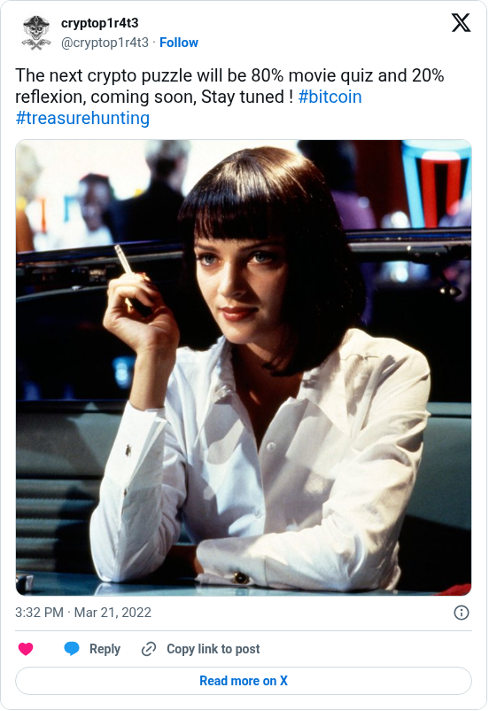

# Movie Enigma announcement

[Original post](https://x.com/cryptop1r4t3/status/1505915271118262286). Cited by the [movie-enigma author record](../../../src/collections/movie-enigma.ts) as the author's own framing of the puzzle before it went live.

## Historical provenance

No capture found. The Wayback Machine index and the MemGator aggregator were searched on September 22, 2026 for both the `twitter.com` and `x.com` URL, so the transcript below was checked only against the current embed and screenshot.

## Transcript

> The next crypto puzzle will be 80% movie quiz and 20% reflexion, coming soon, Stay tuned ! #bitcoin #treasurehunting

## Screenshot

The displayed 3:32 PM timestamp is local to the capture browser. The frontmatter date is March 21 in UTC. Capture method and limits: [source archive](../README.md).
