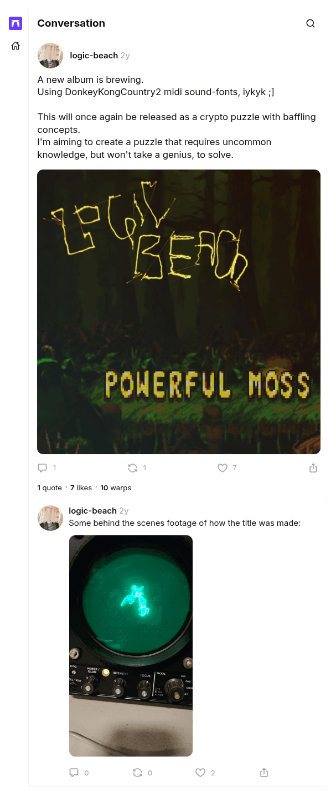

# A new album is brewing

[Original cast](https://farcaster.xyz/logic-beach/0x79eeff14), posted by logic-beach (Farcaster fid 11574) at 2024-03-26 14:45:32 UTC. The March 2024 announcement of the album that became Powerful Moss. It is the source of the first fact on the [LogicBeach author record](../../../src/collections/powerful-moss.ts) and of the hint about the Donkey Kong Country 2 soundfonts.

## Historical provenance

No capture found. On September 30, 2026 the Wayback Machine CDX API answered with no captures for both spellings of the link, `farcaster.xyz/logic-beach/0x79eeff14` and `warpcast.com/logic-beach/0x79eeff14`, and MemGator found none either. Even a capture would hold little: the one Wayback capture of a sibling cast from this set is the Farcaster app shell, with no cast text in its HTML.

The cast itself does not depend on the client. It is a signed Farcaster message, and the transcript comes from a Farcaster hub (`hub.pinata.cloud`, `castById` for fid 11574), read on September 30, 2026: message hash `0x79eeff14db3368caa4c30d76fd61aaa7d200991a`, Ed25519 signer `0x72ec335f33c7d8ccda03a8863850b0788d011adea83ff658e21160666c7583eb`, signature `IhoYx8WD7EU0Gzyfut9xH6157j6kRWNv3fXSMG2BO6Y1TAoZSPUt7d8mKhGCdMNBp3iyV1kOWhA5yJbKC+FiDw==`. Any hub serves the same signed message for as long as the cast is not deleted.

The screenshot is a headless Chromium render of the cast page on farcaster.xyz on the same day, trimmed to the page's content.

## Transcript

> A new album is brewing.
> Using DonkeyKongCountry2 midi sound-fonts, iykyk ;]
>
> This will once again be released as a crypto puzzle with baffling concepts.
> I'm aiming to create a puzzle that requires uncommon knowledge, but won't take a genius, to solve.

Embeds: <https://i.imgur.com/0mIUahA.png>.
