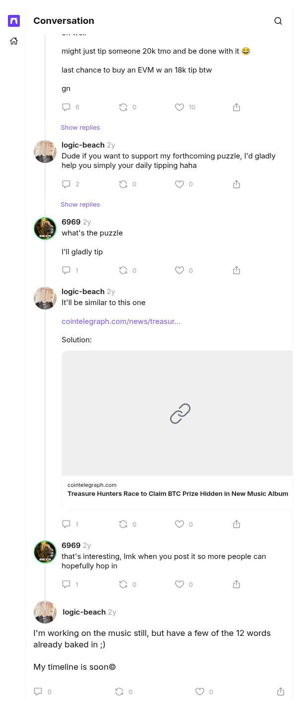

# A few of the 12 words already baked in

[Original cast](https://farcaster.xyz/logic-beach/0x0a3431a4), posted by logic-beach (Farcaster fid 11574) at 2024-04-14 18:31:13 UTC. A reply by LogicBeach in another account's thread about tipping, and the source of the hint that some of the twelve words were already in the music in April 2024. It replies to cast `0x2dec11470b61c3dfc7b3499581cdae9524a187d0` by fid 13086, which the transcript leaves out.

## Historical provenance

No capture found. On September 30, 2026 the Wayback Machine CDX API answered with no captures for both spellings of the link, `farcaster.xyz/logic-beach/0x0a3431a4` and `warpcast.com/logic-beach/0x0a3431a4`, and MemGator found none either. Even a capture would hold little: the one Wayback capture of a sibling cast from this set is the Farcaster app shell, with no cast text in its HTML.

The cast itself does not depend on the client. It is a signed Farcaster message, and the transcript comes from a Farcaster hub (`hub.pinata.cloud`, `castById` for fid 11574), read on September 30, 2026: message hash `0x0a3431a4599ebf7f55ea52dc0680814af44edb6c`, Ed25519 signer `0x72ec335f33c7d8ccda03a8863850b0788d011adea83ff658e21160666c7583eb`, signature `0klYzBULlbciPaIe/AQ20ov8MQ2RJ/B7hRf+ZEpraSmgjDNDkOdCvHnJMhr0k/MSr+iQdl49naXhN5XC99ikBw==`. Any hub serves the same signed message for as long as the cast is not deleted.

The screenshot is a headless Chromium render of the cast page on farcaster.xyz on the same day, trimmed to the page's content.

## Transcript

> I'm working on the music still, but have a few of the 12 words already baked in ;)
>
> My timeline is soon©
