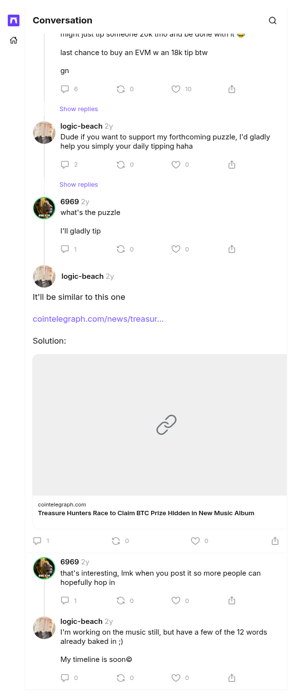

# It'll be similar to this one

[Original cast](https://farcaster.xyz/logic-beach/0x7e781ad1), posted by logic-beach (Farcaster fid 11574) at 2024-04-14 18:29:16 UTC. A reply by LogicBeach in another account's thread, the source of the hint that points at Bifurcations and its published solution. It replies to cast `0xdfdeeb0d96471c2faf5d86144934321384033a53` by fid 13086, which the transcript leaves out.

## Historical provenance

No capture found. On September 30, 2026 the Wayback Machine CDX API answered with no captures for both spellings of the link, `farcaster.xyz/logic-beach/0x7e781ad1` and `warpcast.com/logic-beach/0x7e781ad1`, and MemGator found none either. Even a capture would hold little: the one Wayback capture of a sibling cast from this set is the Farcaster app shell, with no cast text in its HTML.

The cast itself does not depend on the client. It is a signed Farcaster message, and the transcript comes from a Farcaster hub (`hub.pinata.cloud`, `castById` for fid 11574), read on September 30, 2026: message hash `0x7e781ad1245e6377b0aa6398a6fa54b7972db9fb`, Ed25519 signer `0x72ec335f33c7d8ccda03a8863850b0788d011adea83ff658e21160666c7583eb`, signature `QOvUbvaWpp2REWjzNa9RBYRSyutTJEev3oc3gKW+UPvGWFGnsicUuq3KIz+0Hcg6CYEf1Kesvf1WOO+i36b7Cw==`. Any hub serves the same signed message for as long as the cast is not deleted.

The screenshot is a headless Chromium render of the cast page on farcaster.xyz on the same day, trimmed to the page's content.

## Transcript

> It'll be similar to this one
>
> https://cointelegraph.com/news/treasure-hunters-race-to-claim-btc-prize-hidden-in-new-music-album
>
> Solution:
> https://elronvhubbard.medium.com/logic-beach-bifurcations-album-puzzle-write-up-1e1094d41038

Embeds: <https://cointelegraph.com/news/treasure-hunters-race-to-claim-btc-prize-hidden-in-new-music-album>, <https://elronvhubbard.medium.com/logic-beach-bifurcations-album-puzzle-write-up-1e1094d41038>.
