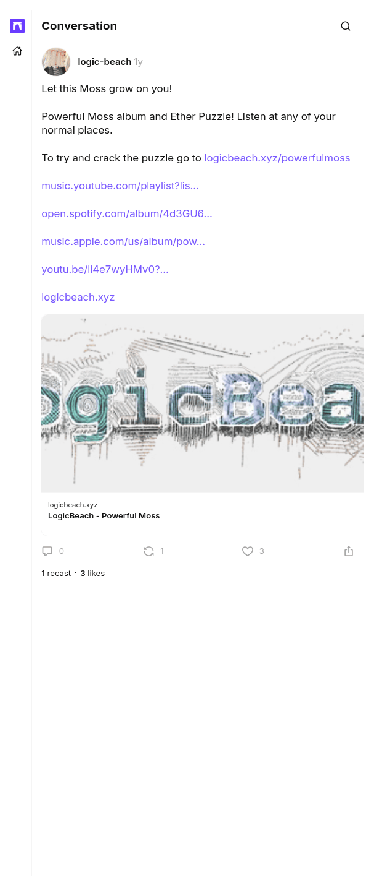

# Let this Moss grow on you

[Original cast](https://farcaster.xyz/logic-beach/0x57ab427d), posted by logic-beach (Farcaster fid 11574) at 2025-01-17 12:55:27 UTC. The launch cast of Powerful Moss. The record's `startedAt` is its time, and it is the source of the second fact on the author record and of the album links.

## Historical provenance

No capture found. On September 30, 2026 the Wayback Machine CDX API answered with no captures for both spellings of the link, `farcaster.xyz/logic-beach/0x57ab427d` and `warpcast.com/logic-beach/0x57ab427d`, and MemGator found none either. Even a capture would hold little: the one Wayback capture of a sibling cast from this set is the Farcaster app shell, with no cast text in its HTML.

The cast itself does not depend on the client. It is a signed Farcaster message, and the transcript comes from a Farcaster hub (`hub.pinata.cloud`, `castById` for fid 11574), read on September 30, 2026: message hash `0x57ab427df00f421d834e08c0f50114982848d2c5`, Ed25519 signer `0x72ec335f33c7d8ccda03a8863850b0788d011adea83ff658e21160666c7583eb`, signature `9bY0Tw0yLF+eq5Q01TdBptPL0Hbzu2i2tYJkbX1Ndrt+L2zseccKAFaW8xfKxX++gqh7a6oapBml1hSfRZJgAA==`. Any hub serves the same signed message for as long as the cast is not deleted.

The screenshot is a headless Chromium render of the cast page on farcaster.xyz on the same day, trimmed to the page's content.

## Transcript

> Let this Moss grow on you!
>
> Powerful Moss album and Ether Puzzle! Listen at any of your normal places.
>
> To try and crack the puzzle go to https://Logicbeach.xyz/powerfulmoss
>
> https://music.youtube.com/playlist?list=OLAK5uy_kfF9cwECQUmlBhRzcgn_ZJ5xqUAjn5UkY&si=C8jR7DNqNF8w3VuI
>
> https://open.spotify.com/album/4d3GU6GwuQWGbEhZi8D6T4?si=LTFQov4aTmicJ9NV88pvvA
>
> https://music.apple.com/us/album/powerful-moss/1790138815
>
> https://youtu.be/li4e7wyHMv0?si=qPIBsou05kzyr89-
>
> Https://logicbeach.xyz/

Embeds: <https://Logicbeach.xyz/powerfulmoss>, <https://music.youtube.com/playlist?list=OLAK5uy_kfF9cwECQUmlBhRzcgn_ZJ5xqUAjn5UkY&si=C8jR7DNqNF8w3VuI>.
