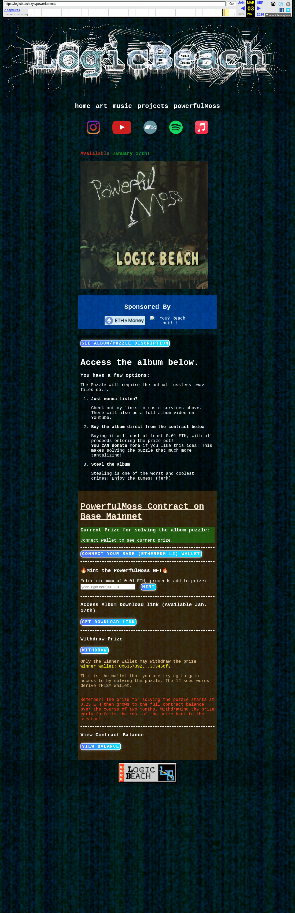

# The Powerful Moss puzzle page

[Original page](https://logicbeach.xyz/powerfulmoss) on LogicBeach's site. The `sourceUrl` of the [Powerful Moss record](../../../src/collections/powerful-moss.ts): the winner wallet, the prize contract, the prize rules and the hints the page gave. The page went up before the puzzle opened, with Wayback captures from December 2024, and the puzzle opened on January 17, 2025, the date the page names for the album download.

## Historical provenance

The Wayback Machine holds captures from December 18 and 23, 2024, January 20 and 29, March 3 and 7, 2025, and September 24, 2026. The [March 3, 2025 capture](https://web.archive.org/web/20250303003748/https://logicbeach.xyz/powerfulmoss) is the one the record's hints confirm against: its `id_` body, read on September 30, 2026 with an HTML parser, carries the full description below. `archive_content: confirmed` on that basis.

The page changed after that. The live page on September 30, 2026, and the September 24, 2026 capture with the same text, keep the introduction, the contract section and the prize rules but drop the part from "How the Powerful Moss Puzzle Works" to "Enjoy the tunes! (jerk)", including the note on lossless .wav files. The prize note changed too: the capture says the pot "grows to 1 ETH over the course of 2 months", the live page "grows to the full contract balance over the course of two months".

The screenshot is a headless Chromium render of the March 3, 2025 capture on September 30, 2026, 1100 pixels wide. The page folds the description behind its "See Album/Puzzle Description" button, so the render shows the rest and the transcript takes the description from the HTML. The transcript keeps the page's text block by block; link targets are left out except where the text names them.

## Transcript

> LogicBeach - Powerful Moss
>
> home
>
> art
>
> music
>
> projects
>
> powerfulMoss
>
> Avaialable January 17th!
>
> Sponsored By
>
> See Album/Puzzle Description
>
> Borrowing funky soundfonts hot off the DonkeyKongCountry2 SuperNintendo cartridge, LogicBeach's latest experimental release, Powerful Moss, has more than meets the ear!
>
> Did you hear that?
>
> What a weird sound...
>
> Like a clock, year, or seed phrase, this album has 12 of 'em.
>
> 12 songs... and all that implies. There's more waiting for those who pay attention and fall through the surface cracks. Can you find it? and when you do find it, can you solve it!?
>
> The prize you are after, aside from the bragging rights of solving this puzzle is 1 ETH (currently ~$4,000) and whatever else has been tossed into the prize wallet.
>
> How the Powerful Moss Puzzle Works
>
> By leveraging today’s cutting-edge technology—namely the Ethereum blockchain—we can craft novel ways to create and interact with art. This isn’t just an album; it’s a carefully designed puzzle embedded within music. Hidden across the tracks are 12 secret seed words, essential components of a cryptocurrency wallet.
>
> To solve the puzzle, you must:
>
> Find all twelve words hidden in the album.
>
> Determine the correct order of these words.
>
> Import the completed seed phrase into a wallet application like Coinbase Wallet, MetaMask, or Frame.
>
> Use the withdraw button below with control of the prize wallet
>
> *NOTE! The puzzle prize pot starts at 0.25 ETH and grows to 1 ETH over the course of 2 months. Withdrawing earlier than two months forfeits the remaining prize back to the creator
>
> Profit?
>
> The winning wallet unlocks access to the funds held by the Powerful Moss NFT contract.
>
> Why This Puzzle Works
>
> Seed phrases are a cornerstone of blockchain security—they act as keys to access cryptocurrency wallets. By embedding the seed words in this album, I’ve created a fusion of art, logic, and reward.
>
> This puzzle also ties directly to the Ethereum blockchain. The funds, contributed by album supporters, are securely held in the NFT contract. The only way to access these funds is by solving the puzzle and importing the winning account into a wallet. This ensures that the reward goes to someone who truly engages with the album on a deeper level, creating a unique intersection of music, technology, and treasure-hunting.
>
> Are you ready to dive in, solve the mystery, and claim the prize? Let this Powerful Moss begin to grow in your mind!!
>
> Access the album below.
>
> You have a few options:
>
> The Puzzle will require the actual lossless .wav files so...
>
> Just wanna listen?
>
> Check out my links to music services above. There will also be a full album video on Youtube.
>
> Buy the album direct from the contract below
>
> Buying it will cost at least 0.01 ETH, with all proceeds entering the prize pot!
>
> You CAN donate more if you like this idea! This makes solving the puzzle that much more tantalizing!
>
> Steal the album
>
> Stealing is one of the worst and coolest crimes! Enjoy the tunes! (jerk)
>
> PowerfulMoss Contract on Base Mainnet
>
> Current Prize for solving the album puzzle:
>
> Connect wallet to see current prize.
>
> Connect your Base (Ethereum L2) Wallet
>
> 🔥Mint the PowerfulMoss NFT🔥
>
> Enter minimum of 0.01 ETH, proceeds add to prize:
>
> Mint
>
> Access Album Download link (Available Jan. 17th)
>
> Get download link
>
> Withdraw Prize
>
> Withdraw
>
> Only the winner wallet may withdraw the prize
>
> Winner Wallet: 0x6357392...3C3468f3
>
> This is the wallet that you are trying to gain access to by solving the puzzle. The 12 seed words derive THIS^ wallet.
>
> Remember! The prize for solving the puzzle starts at 0.25 ETH then grows to the full contract balance over the course of two months. Withdrawing the prize early forfeits the rest of the prize back to the creator!
>
> View Contract Balance
>
> View Balance
