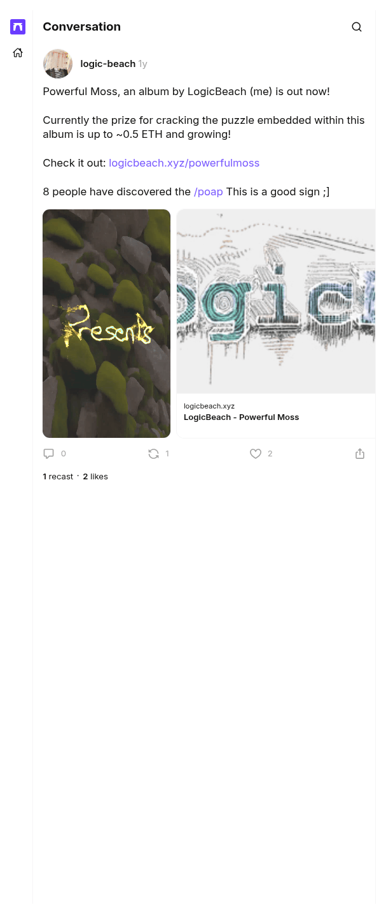

# Powerful Moss is out now

[Original cast](https://farcaster.xyz/logic-beach/0x6179943b), posted by logic-beach (Farcaster fid 11574) at 2025-01-24 15:53:51 UTC. The cast a week after the launch, with the prize near 0.5 ETH and the POAP remark. It is the source of the third fact on the author record and of the POAP hint.

## Historical provenance

No capture found. The Wayback Machine holds one capture of `farcaster.xyz/logic-beach/0x6179943b`, stamped September 30, 2026, 08:23:47 UTC, and its `id_` body is the Farcaster app shell: the title `Farcaster` and scripts, no cast text. It confirms nothing, so the entry names no capture. The CDX API found none for `warpcast.com/logic-beach/0x6179943b`.

The cast itself does not depend on the client. It is a signed Farcaster message, and the transcript comes from a Farcaster hub (`hub.pinata.cloud`, `castById` for fid 11574), read on September 30, 2026: message hash `0x6179943b132bac0697f25d0b2087739e891f1d55`, Ed25519 signer `0x72ec335f33c7d8ccda03a8863850b0788d011adea83ff658e21160666c7583eb`, signature `A3MiF9Yh6o0NKca4zOeNbHB20XIWlrWF9OJJLa0xwelfrHfwEeyEfUPETYyx/weSZE+8GIe94fbspDxpPj+RAA==`. Any hub serves the same signed message for as long as the cast is not deleted.

The screenshot is a headless Chromium render of the cast page on farcaster.xyz on the same day, trimmed to the page's content.

## Transcript

> Powerful Moss, an album by LogicBeach (me) is out now!
>
> Currently the prize for cracking the puzzle embedded within this album is up to ~0.5 ETH and growing!
>
> Check it out: https://logicbeach.xyz/powerfulmoss
>
> 8 people have discovered the /poap This is a good sign ;]

Embeds: <https://stream.warpcast.com/v1/video/01949904-688b-f99c-1701-150d6afd3a80.m3u8>, <https://logicbeach.xyz/powerfulmoss>.
