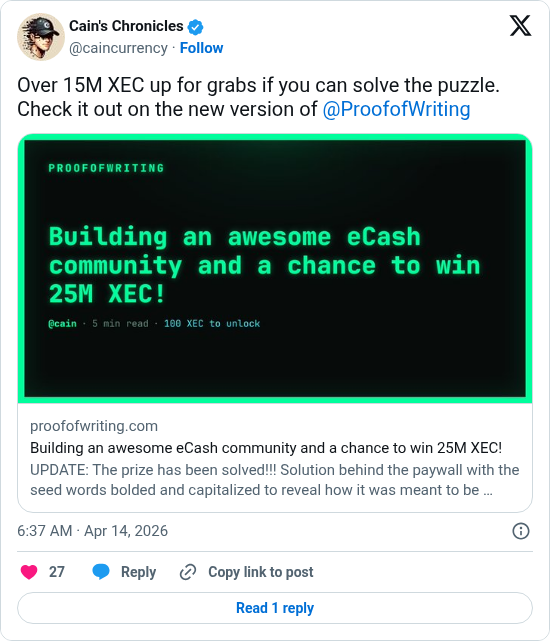

# Proof Of Writing puzzle relaunch

[Original post](https://x.com/caincurrency/status/2043911484040740939). Cited by the [proof-of-writing author record](../../../src/collections/proof-of-writing.ts) as the author's announcement of the republished puzzle.

## Historical provenance

[Wayback capture from April 14, 2026, 04:37:26 UTC](https://web.archive.org/web/20260414043726/https://twitter.com/caincurrency/status/2043911484040740939) is X's JSON payload for the post, not a rendered page. Its `text` field carries the same wording as the transcript below.

## Transcript

> Over 15M XEC up for grabs if you can solve the puzzle. Check it out on the new version of @ProofofWriting proofofwriting.com/posts/building…

## Screenshot

The displayed 6:37 AM timestamp is local to the capture browser. The frontmatter date is April 14 in UTC. The link card shows the article as it reads at capture time, with the solved update already in its summary. Capture method and limits: [source archive](../README.md).
