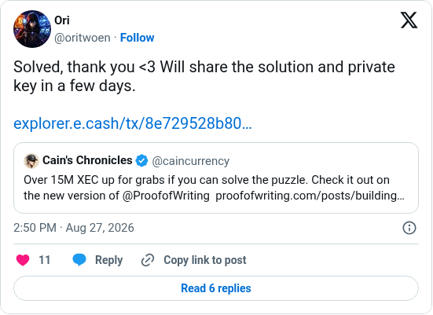

# Proof Of Writing solved

[Original post](https://x.com/oritwoen/status/2092957918186316275). Cited by the [proof-of-writing solver record](../../../src/collections/proof-of-writing.ts). The post quotes the author's [relaunch post](caincurrency-2026-04-14.md), and the embed prints that quote below it. Only the cited post is transcribed.

## Historical provenance

[Wayback capture from August 27, 2026, 12:50:27 UTC](https://web.archive.org/web/20260827125027/https://twitter.com/oritwoen/status/2092957918186316275) is X's JSON payload for the post, not a rendered page. Its `text` field carries the same wording as the transcript below.

## Transcript

> Solved, thank you <3 Will share the solution and private key in a few days.
>
> explorer.e.cash/tx/8e729528b80…

## Screenshot

The displayed 2:50 PM timestamp is local to the capture browser. The frontmatter date is August 27 in UTC. The shortened link leads to [8e729528…](https://explorer.e.cash/tx/8e729528b8091f19ca5371f3a6a56e3536d18d7514a1d2abdf3f2f889d189c30), the claim transaction the record carries. Capture method and limits: [source archive](../README.md).
