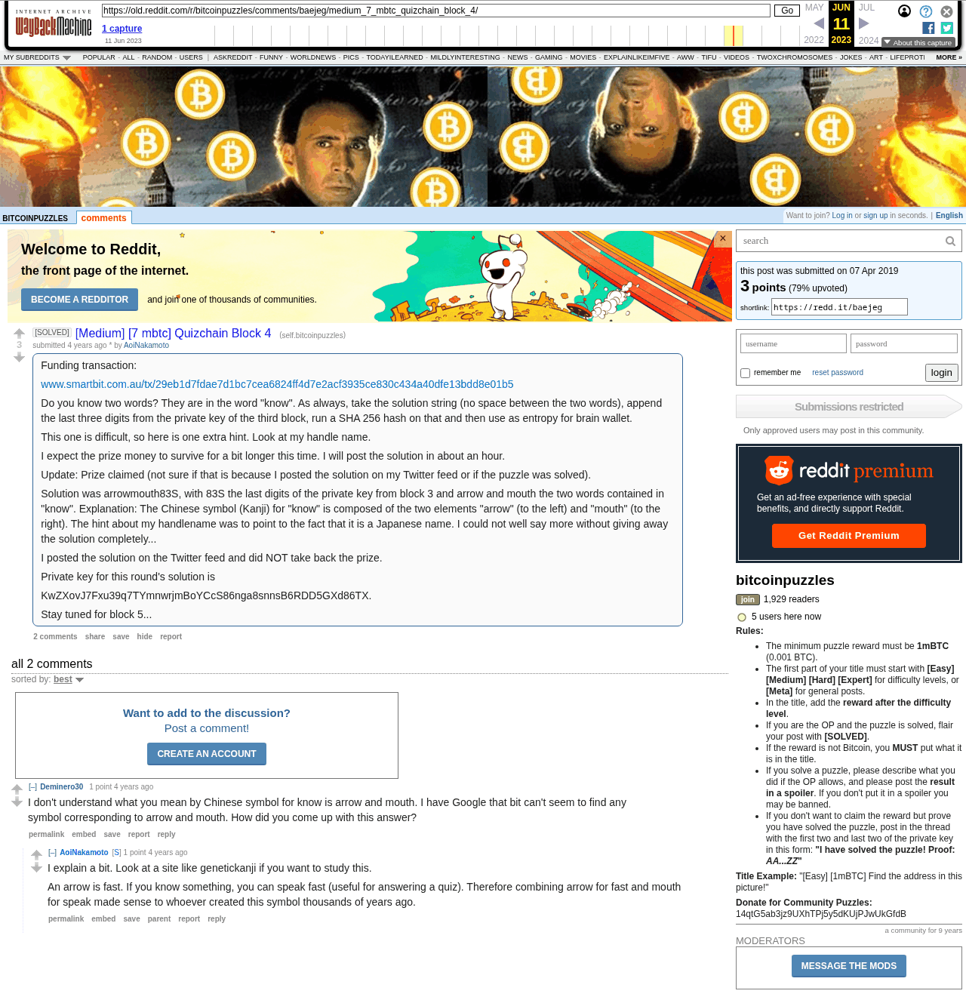

# [Medium] [7 mbtc] Quizchain Block 4

[Original thread](https://www.reddit.com/r/bitcoinpuzzles/comments/baejeg/medium_7_mbtc_quizchain_block_4/). The `sourceUrl` of the [quizchain/4 record](../../../src/collections/quizchain/4.ts), the source of its three hints, their answers, the funding txid and the WIF, all in the post itself. The address is not printed; the funding transaction pays it. The entropy hash is not printed either: the record reconstructs it from the recipe in the post and the published solution. The post went up on April 7, 2019, at 09:17:36 UTC, two minutes after the funding transaction's block time. Its last edit is stamped 10:23:05 UTC, 22 minutes before the block time of the claim it reports.

## Historical provenance

The Wayback Machine holds one capture of the `old.reddit.com` URL, taken on June 11, 2023, and a `www.reddit.com` capture a second earlier, which the record's first hint links as its confirmation. archive.today did not answer on September 24, 2026. Provenance rests on the [old.reddit.com capture](https://web.archive.org/web/20230611095721/https://old.reddit.com/r/bitcoinpuzzles/comments/baejeg/medium_7_mbtc_quizchain_block_4/), whose HTML carries the post with its update and solution and both comments the thread header counts. Its body was read on September 24, 2026 and matches the transcript below word for word, including the solution string and the WIF. `archive_content: confirmed` on that basis.

The record names none of the commenters.

## Transcript

> Funding transaction:
>
> www.smartbit.com.au/tx/29eb1d7fdae7d1bc7cea6824ff4d7e2acf3935ce830c434a40dfe13bdd8e01b5
>
> Do you know two words? They are in the word "know". As always, take the solution string (no space between the two words), append the last three digits from the private key of the third block, run a SHA 256 hash on that and then use as entropy for brain wallet.
>
> This one is difficult, so here is one extra hint. Look at my handle name.
>
> I expect the prize money to survive for a bit longer this time. I will post the solution in about an hour.
>
> Update: Prize claimed (not sure if that is because I posted the solution on my Twitter feed or if the puzzle was solved).
>
> Solution was arrowmouth83S, with 83S the last digits of the private key from block 3 and arrow and mouth the two words contained in "know". Explanation: The Chinese symbol (Kanji) for "know" is composed of the two elements "arrow" (to the left) and "mouth" (to the right). The hint about my handlename was to point to the fact that it is a Japanese name. I could not well say more without giving away the solution completely...
>
> I posted the solution on the Twitter feed and did NOT take back the prize.
>
> Private key for this round's solution is
>
> KwZXovJ7Fxu39q7TYmnwrjmBoYCcS86nga8snnsB6RDD5GXd86TX.
>
> Stay tuned for block 5...

## Comments

**u/Deminero30**, 1 point:

> I don't understand what you mean by Chinese symbol for know is arrow and mouth. I have Google that bit can't seem to find any symbol corresponding to arrow and mouth. How did you come up with this answer?

**u/AoiNakamoto**, 1 point, reply:

> I explain a bit. Look at a site like genetickanji if you want to study this.
>
> An arrow is fast. If you know something, you can speak fast (useful for answering a quiz). Therefore combining arrow for fast and mouth for speak made sense to whoever created this symbol thousands of years ago.

## Screenshot

The screenshot is a render of the archive capture, not of the live page, so it carries the Wayback banner at the top. The "4 years ago" stamps are relative to the capture, June 11, 2023. The Twitter posts the author mentions are not archived here. Capture method and limits: [source archive](../README.md).
