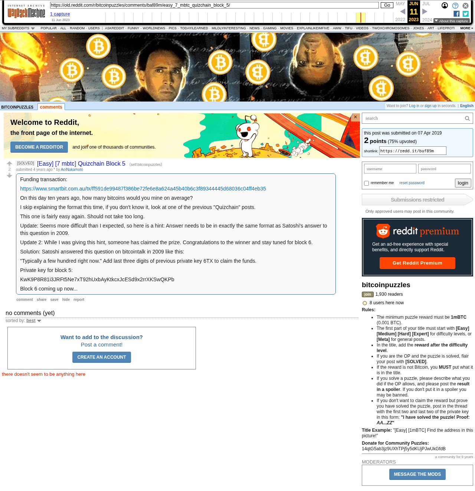

# [Easy] [7 mbtc] Quizchain Block 5

[Original thread](https://www.reddit.com/r/bitcoinpuzzles/comments/baf89m/easy_7_mbtc_quizchain_block_5/). The `sourceUrl` of the [quizchain/5 record](../../../src/collections/quizchain/5.ts), the source of its three hints, their answers, the funding txid and the WIF, all in the post itself. The address is not printed; the funding transaction pays it. The entropy hash is not printed either: the record reconstructs it from the recipe of the earlier blocks and the published solution. The post went up on April 7, 2019, at 11:11:54 UTC, three minutes after the funding transaction's block time. Its last edit is stamped 12:39:57 UTC, ten minutes before the block time of the claim it reports.

## Historical provenance

The Wayback Machine holds one capture of the `old.reddit.com` URL and one of the `www.reddit.com` URL, both stamped June 11, 2023, 16:25:10; the record's first hint links the `www` one as its confirmation. archive.today did not answer on September 24, 2026. Provenance rests on the [old.reddit.com capture](https://web.archive.org/web/20230611162510/https://old.reddit.com/r/bitcoinpuzzles/comments/baf89m/easy_7_mbtc_quizchain_block_5/), whose HTML carries the post with both updates and the solution. Its body was read on September 24, 2026 and matches the transcript below word for word, including Satoshi's sentence, the key suffix and the WIF. `archive_content: confirmed` on that basis.

The thread had no comments when it was captured.

## Transcript

> Funding transaction:
>
> https://www.smartbit.com.au/tx/ff591de99487f386be72fe6e8a624a45b40b6c3f89344445d68036c04ff4eb35
>
> On this day ten years ago, how many bitcoins would you mine on average?
>
> I skip explaining the format this time, if you don't know it, look at one of the previous "Quizchain" posts.
>
> This one is fairly easy again. Should not take too long.
>
> Update: Seems more difficult than I expected, so here is a hint: Answer needs to be in exactly the same format as Satoshi's answer to this question in 2009.
>
> Update 2: While I was giving this hint, someone has claimed the prize. Congratulations to the winner and stay tuned for block 6.
>
> Solution: Satoshi answered this question on bitcointalk in 2009 like this:
>
> "Typically a few hundred right now." Add last three digits of previous private key 6TX to claim the funds.
>
> Private key for block 5:
>
> KwK9P8R81i3JRFt5Ne7xT92hUxbAyKtkcxJcESd9x2rrXKSwQKPb
>
> Block 6 coming up now...

## Screenshot

The screenshot is a render of the archive capture, not of the live page, so it carries the Wayback banner at the top. The "4 years ago" stamp is relative to the capture, June 11, 2023. Capture method and limits: [source archive](../README.md).
