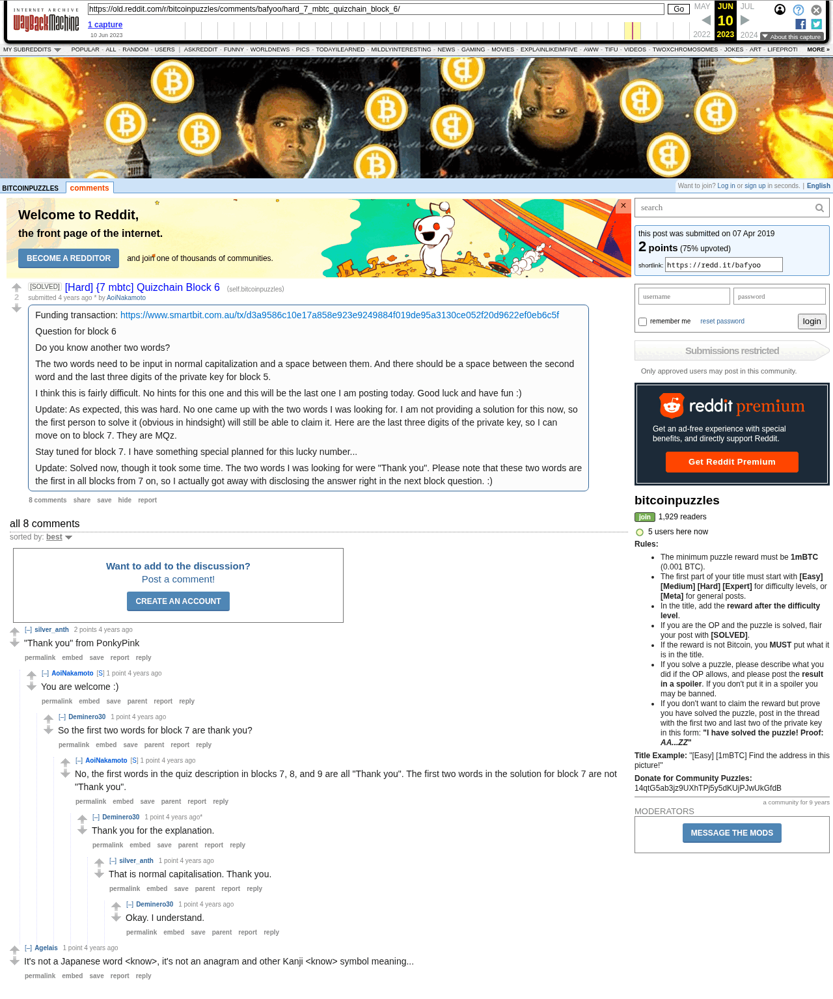

# [Hard] {7 mbtc] Quizchain Block 6

[Original thread](https://www.reddit.com/r/bitcoinpuzzles/comments/bafyoo/hard_7_mbtc_quizchain_block_6/). The `sourceUrl` of the [quizchain/6 record](../../../src/collections/quizchain/6.ts), the source of its three hints, the answer, the funding txid and the last three characters of the key, all in the post itself. The address is not printed; the funding transaction pays it. Neither the entropy hash nor the WIF is printed: the record reconstructs both from the recipe of the earlier blocks and the published words, and the WIF it gets ends in the printed `MQz`. The brace in the title is the author's. The post went up on April 7, 2019, at 12:56:18 UTC, three hours before the funding transaction's block time. Its last edit is stamped April 8, 12:19:33 UTC, 53 minutes after the block time of the claim.

## Historical provenance

The Wayback Machine holds one capture of the `old.reddit.com` URL and one of the `www.reddit.com` URL, both stamped June 10, 2023, 21:33:29. archive.today answered 404 for its timemap on September 25, 2026. Provenance rests on the [old.reddit.com capture](https://web.archive.org/web/20230610213329/https://old.reddit.com/r/bitcoinpuzzles/comments/bafyoo/hard_7_mbtc_quizchain_block_6/), whose HTML carries the post with both updates and all eight comments the thread header counts. Its body was read on September 25, 2026 and matches the transcript below word for word, including the funding txid, the key suffix and the two words. `archive_content: confirmed` on that basis.

The record names none of the commenters. PonkyPink appears only in a comment, and nothing on the chain ties that name to the claim.

## Transcript

> Funding transaction:
>
> https://www.smartbit.com.au/tx/d3a9586c10e17a858e923e9249884f019de95a3130ce052f20d9622ef0eb6c5f
>
> Question for block 6
>
> Do you know another two words?
>
> The two words need to be input in normal capitalization and a space between them. And there should be a space between the second word and the last three digits of the private key for block 5.
>
> I think this is fairly difficult. No hints for this one and this will be the last one I am posting today. Good luck and have fun :)
>
> Update: As expected, this was hard. No one came up with the two words I was looking for. I am not providing a solution for this now, so the first person to solve it (obvious in hindsight) will still be able to claim it. Here are the last three digits of the private key, so I can move on to block 7. They are MQz.
>
> Stay tuned for block 7. I have something special planned for this lucky number...
>
> Update: Solved now, though it took some time. The two words I was looking for were "Thank you". Please note that these two words are the first in all blocks from 7 on, so I actually got away with disclosing the answer right in the next block question. :)

## Comments

**u/silver_anth**, 2 points:

> "Thank you" from PonkyPink

**u/AoiNakamoto**, 1 point, reply:

> You are welcome :)

**u/Deminero30**, 1 point, reply:

> So the first two words for block 7 are thank you?

**u/AoiNakamoto**, 1 point, reply:

> No, the first words in the quiz description in blocks 7, 8, and 9 are all "Thank you". The first two words in the solution for block 7 are not "Thank you".

**u/Deminero30**, 1 point, reply:

> Thank you for the explanation.

**u/silver_anth**, 1 point, reply:

> That is normal capitalisation. Thank you.

**u/Deminero30**, 1 point, reply:

> Okay. I understand.

**u/Agelais**, 1 point:

> It's not a Japanese word <know>, it's not an anagram and other Kanji <know> symbol meaning...

## Screenshot

The screenshot is a render of the archive capture, not of the live page, so it carries the Wayback banner at the top. The "4 years ago" stamps are relative to the capture, June 10, 2023. Capture method and limits: [source archive](../README.md).
