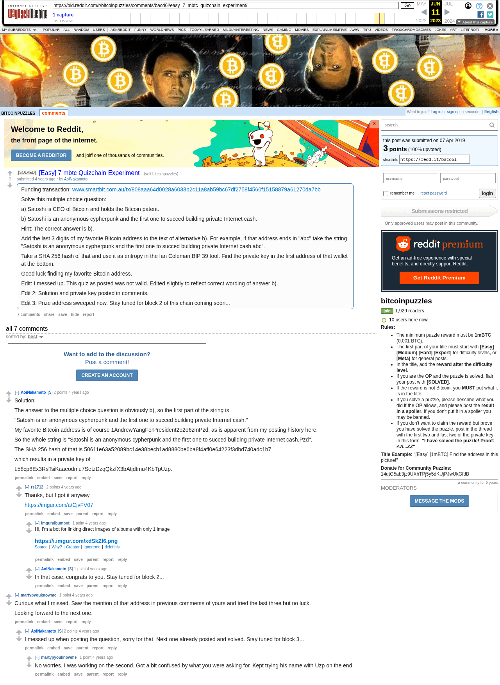

# [Easy] 7 mbtc Quizchain Experiment

[Original thread](https://www.reddit.com/r/bitcoinpuzzles/comments/bacd6l/easy_7_mbtc_quizchain_experiment/). The `sourceUrl` of the [quizchain/1 record](../../../src/collections/quizchain/1.ts), the source of all six of its hints and the funding txid. The [author's solution comment](https://www.reddit.com/r/bitcoinpuzzles/comments/bacd6l/comment/ekaqb0l/) is the source of both answers, the entropy hash and the WIF. The address is not printed anywhere in the thread; the funding transaction pays it. The post went up on April 7, 2019, at 03:32:00 UTC, 23 seconds after the funding transaction's block time.

## Historical provenance

The Wayback Machine holds one capture of the `old.reddit.com` URL, taken on June 11, 2023. The lookup for the `www.reddit.com` URL got no answer on September 22, 2026, a 504 from both Wayback and Common Crawl, and archive.today has no capture of either host. Provenance rests on the [old.reddit.com capture](https://web.archive.org/web/20230611083439/https://old.reddit.com/r/bitcoinpuzzles/comments/bacd6l/easy_7_mbtc_quizchain_experiment/), whose HTML carries the post with its three edits and six of the seven comments. Its body was read on September 22, 2026 and matches the transcript below word for word, including the solution string, the entropy hash and the WIF. `archive_content: confirmed` on that basis.

The thread header counts seven comments and the capture renders six. The missing one was deleted before 2023; the Arctic Shift Reddit archive lists it with `[deleted]` as both author and body, posted at 05:10:21 UTC. The record names none of the commenters.

## Transcript

> Funding transaction:
> www.smartbit.com.au/tx/808aaa64d0028a6033b2c11a8ab59bc67df2758f4560f15158879a61270da7bb
>
> Solve this multiple choice question:
>
> a) Satoshi is CEO of Bitcoin and holds the Bitcoin patent.
>
> b) Satoshi is an anonymous cypherpunk and the first one to succed building private Internet cash.
>
> Hint: The correct answer is b).
>
> Add the last 3 digits of my favorite Bitcoin address to the text of alternative b). For example, if that address ends in "abc" take the string "Satoshi is an anonymous cypherpunk and the first one to succed building private Internet cash.abc".
>
> Take a SHA 256 hash of that and use it as entropy in the Ian Coleman BIP 39 tool. Find the private key in the first address of that wallet at the bottom.
>
> Good luck finding my favorite Bitcoin address.
>
> Edit: I messed up. This quiz as posted was not valid. Edited slightly to reflect correct wording of answer b).
>
> Edit 2: Solution and private key posted in comments.
>
> Edit 3: Prize address sweeped now. Stay tuned for block 2 of this chain coming soon...

## Comments

**u/AoiNakamoto**, 2 points, the solution:

> Solution:
>
> The answer to the mulitple choice question is obviously b), so the first part of the string is
>
> "Satoshi is an anonymous cypherpunk and the first one to succed building private Internet cash."
>
> My favorite Bitcoin address is of course 1AndrewYangForPresident2o2o6zmPzd, as is apparent from my posting history here.
>
> So the whole string is "Satoshi is an anonymous cypherpunk and the first one to succed building private Internet cash.Pzd".
>
> The SHA 256 hash of that is 50611e63a52089bc14e38becb1ad8880be6ba8f4aff0e64223f3dbd740adc1b7
>
> which results in a private key of
>
> L58cp8Ex3RsTsiKaaeodmu7SetzDzqQkzfX3bAtjdtmu4KbTpUzp.

**u/rs1712**, 2 points, reply:

> Thanks, but I got it anyway.
>
> https://imgur.com/a/CjvFV07

**u/imguralbumbot**, 1 point, reply:

> Hi, I'm a bot for linking direct images of albums with only 1 image
>
> https://i.imgur.com/xdSkZl6.png

**u/AoiNakamoto**, 1 point, reply:

> In that case, congrats to you. Stay tuned for block 2...

**u/martypyouknowme**, 1 point:

> Curious what I missed. Saw the mention of that address in previous comments of yours and tried the last three but no luck.
>
> Looking forward to the next one.

**u/AoiNakamoto**, 2 points, reply:

> I messed up when posting the question, sorry for that. Next one already posted and solved. Stay tuned for block 3...

**u/martypyouknowme**, 1 point, reply:

> No worries. I was working on the second. Got a bit confused by what you were asking for. Kept trying his name with Uzp on the end.

## Screenshot

The screenshot is a render of the archive capture, not of the live page, so it carries the Wayback banner at the top. The "4 years ago" stamps are relative to the capture, June 11, 2023. The imgur screenshot a commenter linked is not archived here. Capture method and limits: [source archive](../README.md).
